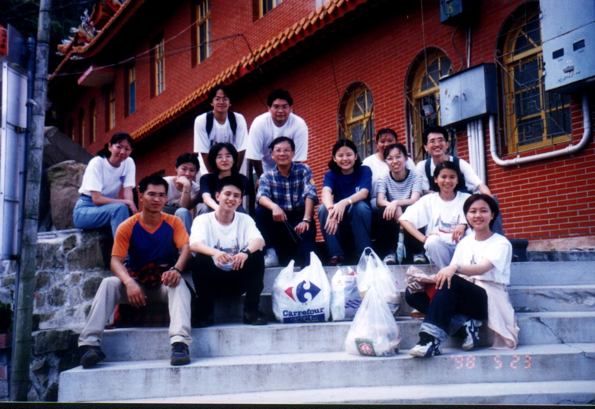
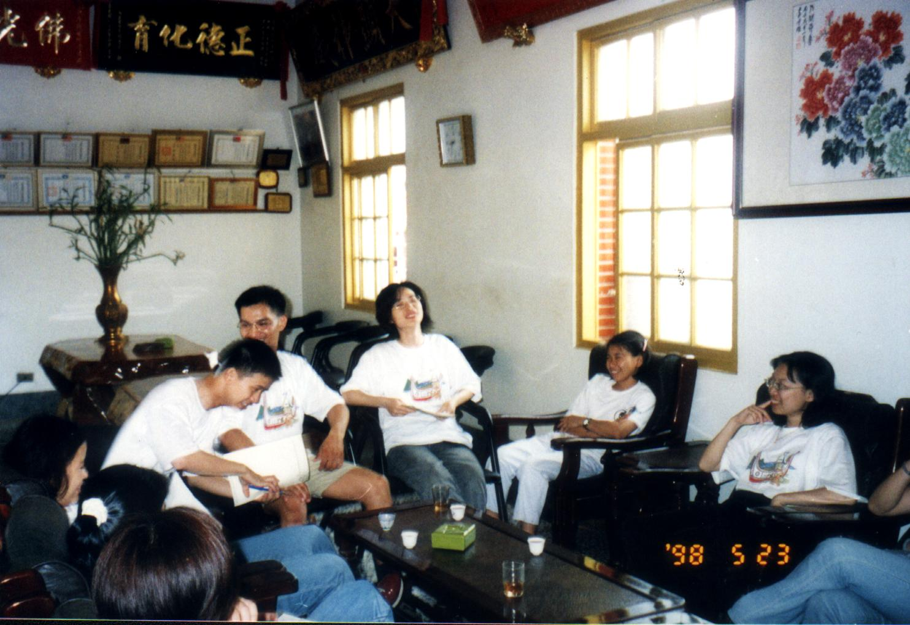
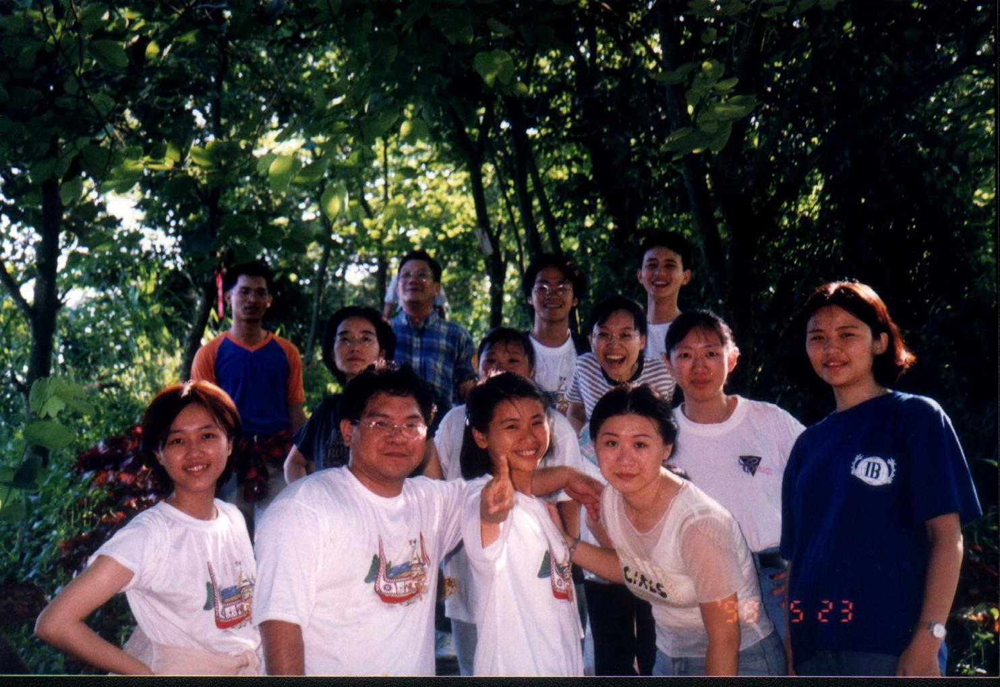

# 烏山

> 民國87年5月

**87年5月23~24日 烏山                                     謝兆光**

這是畢業以後的第一個活動，也好像是老鳥們參加的人數最多的一次，也是為我們下一屆的學弟妹們迎新。

早上和大夥搭上興南客運往南化的車子，感覺上好像回到在學校的時候。午餐後就往山上的大廟出發，國軍弟兄還是不一樣，腳程飛快，像我這種每天吹冷氣坐辦公室的人一下子就望塵莫及，幸好有林總幹事的車子以及Bingo這位勤勞的司機，來來回回把我們這些老弱婦孺載上山，要不然我可能就掛在那條陡峭崎嶇的山路上。

到達之後開了第一次由老師主持的老鳥加菜鳥的會議，這是我們除了吃吃喝喝之外難得作的正經事。在豐盛的素食晚餐後，晚上宵夜前，大夥由老師的帶領下去附近的小徑逛了一下，小徑的路程不長，但沿途為數眾多的螢火蟲卻讓大家歡欣不已。

第二天早上吃完好吃的早餐後，享受了這麼多寺廟的總管又不想收我們的錢，我們總該有點回饋；英明的老師就帶著我們去淨山，走著走著不久就到了最高點，沒想到最高點就是烏山夜登的一個休息點，不過這次的活動和烏山夜登根本就不能同日而語，烏山夜登回去累得跟狗一樣，而這次則像阿公阿媽來山上吃素拜拜，好像不太像20幾歲的年輕人的活動。還記得當天（24日）是五點鐘起床，回家後趕到台北出差，一直加班到凌晨3點，真是忙碌的一天。
