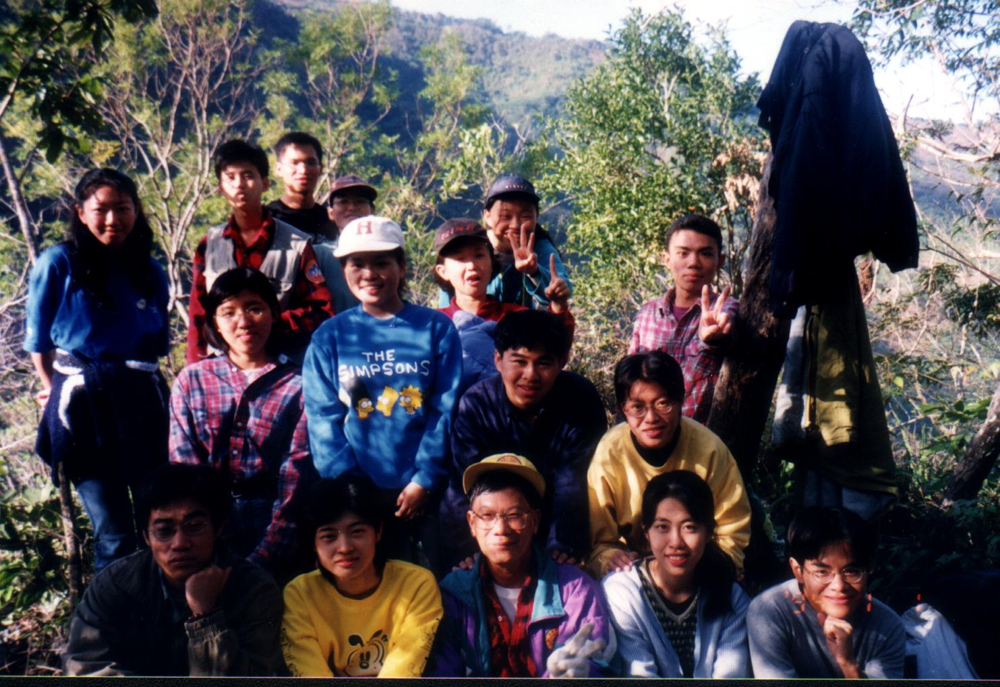
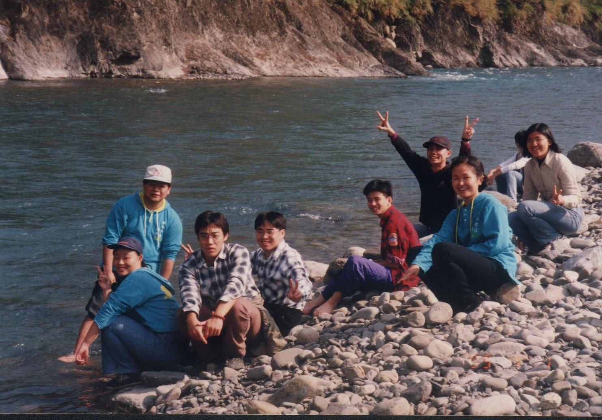
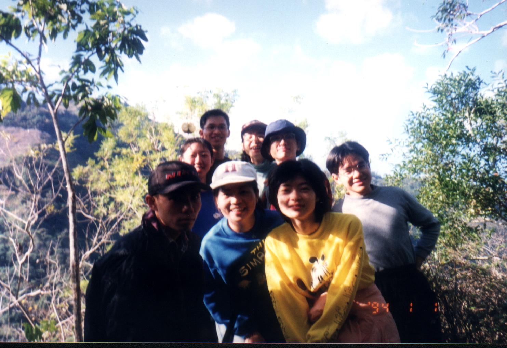
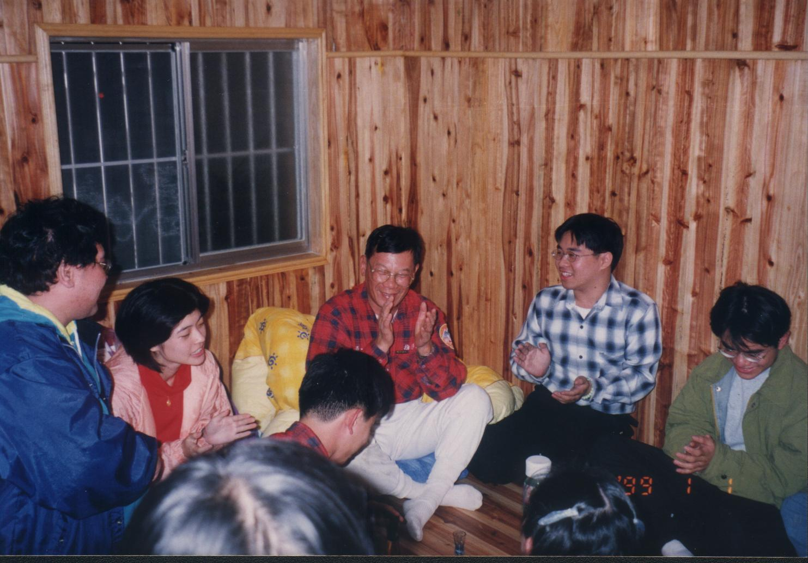

# 石洞溫泉之旅

> 民國88年1月

## 88年1月1~2日 石洞溫泉之旅                               謝兆光

看到這個活動日期就知道是為我們那英明神武、玉樹臨風的老師而辦的，而且每當這個日子也是我們和在校學弟妹一起交流的日子，當然也免不了一些吃吃喝喝的活動。

上了車，看到這些登山社的臉孔就會發神經病樣的很興奮。客運必經之路就是甲仙，到甲仙不能錯過的就是眾多的芋頭產品；但因為客運暫停的時間短促，所以只有買了一些芋頭冰，沒關係我們還會再回來。在寶來午餐之後，我們並沒有急著到石洞溫泉，而是到溪邊去玩水；時間是一月可是天氣還是有點熱熱的，玩水是最好不過的了。到了溪邊為理、Bingo、伯穎等就忍不住脫下鞋子走到水中了，老師則到橋下找到一顆大石頭就睡起午覺來，好一副怡然自得的樣子。

到了山莊之後，大家把背包放下，休息一下，就到溪邊聽說那是溫泉的源頭。沿著小徑下到溪邊，路程有點小困難，但那是值得的。其實講到玩水，從未滿一歲的小朋友，到「成成」這個年紀的哦基桑哪個不愛呢？

在溪邊有人發現有一小攤水是溫泉，大家就光著腳在那泡了起來，四五個人擠在小小一攤水中，也不管有沒有香港腳等。後來有人想到先在溫泉泡一下子，再換到冰冷入骨的溪水中站一下，享受一下足部三溫暖。歡樂的時光過得很快，一月時的太陽總是很早下山，沒關係，先回去吃個晚飯，晚上還有精采的活動。

晚餐後有一小段休息時間，但為理、老昌、Blue及我已經在喝帶去的梅酒了。老昌還發明一種梅酒中泡橘子的新吃法，我們沒拉肚子真是幸運。後來學弟妹有來了幾位一起參加，直到晚上的慶生會開始，我們已經喝了快一瓶梅酒了。

來這的主要目的當然是為了親愛的老師的生日而來，細心的學弟妹們也請山莊的老闆訂了蛋糕。在活動中由幾位OB唸出大家的祝福小卡片，為理則是發揮搞笑的最高境界，當然還有一位號稱代表佳靜第一次參加登山社活動的學妹被我們搞到哭笑不得；在進行途中也有一位好奇的鄰居也來插花喝了兩杯，最後酒喝得差不多卡片也唸完了，大家才帶著笑痛的肚皮及發痠的臉頰肌肉去洗溫泉。

登山社總該爬爬山吧，所以第二天早上由老師帶領我們到一個許久以前老師曾去過的涼亭。山路因為鮮少有人走所以路跡並不明顯，在老師與老昌二老在前面披荊斬棘的開路後，我們好不容易到了那已經破損不堪的涼亭，在那大家照了一些照片，老師還打破了一個寶特瓶，打破後發出令人窒息的味道，不知道是不是有人心虛，想銷毀以前留下的排遺，我們則擔心會不會產生氣爆。

由涼亭下來時我們一開始並不是採之字型的下山方法，而是用最快速的直線方式，但因為坡度太陡，所以根本就是直接滑下來，最後終於找到正常的山徑以比較安全平穩的方式回到山莊。

午餐過後，因為怕趕不到回台南的客運，所以就隨即上路。路上大家幾乎忙著趕路，沒有休息一直到寶來時才停下來，後來上了客運大家就累得呼呼大睡。可是因為是連續假期所以南橫的車子特別多，大家塞在甲仙動彈不得，所以趁這個機會把上次經過沒吃到的都補回來。吃得差不多時車子剛好到，真是來的早不如來的巧。車子到台南車站已經是晚上8、9點了，但登山社夥伴的夜生活才剛開始；但我因為隔天一大早還要補習所以直接回家了，聽說大家還又去吃火鍋和唱歌，可見登山社的山胞們體力有多好，尤其是年紀最大的那個最愛玩。

