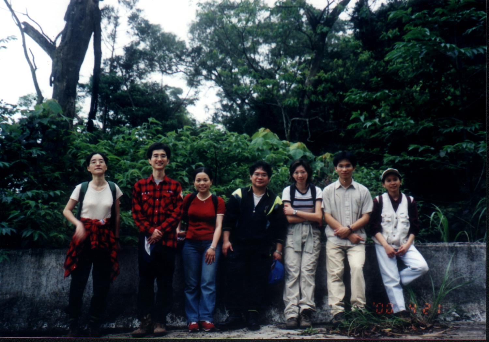
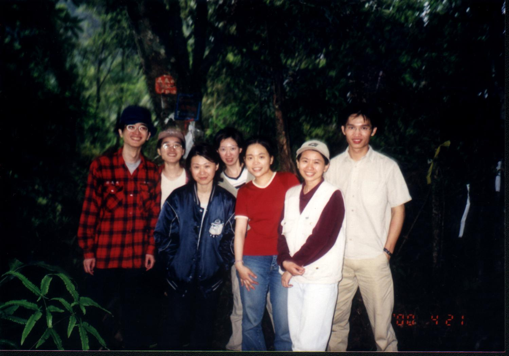
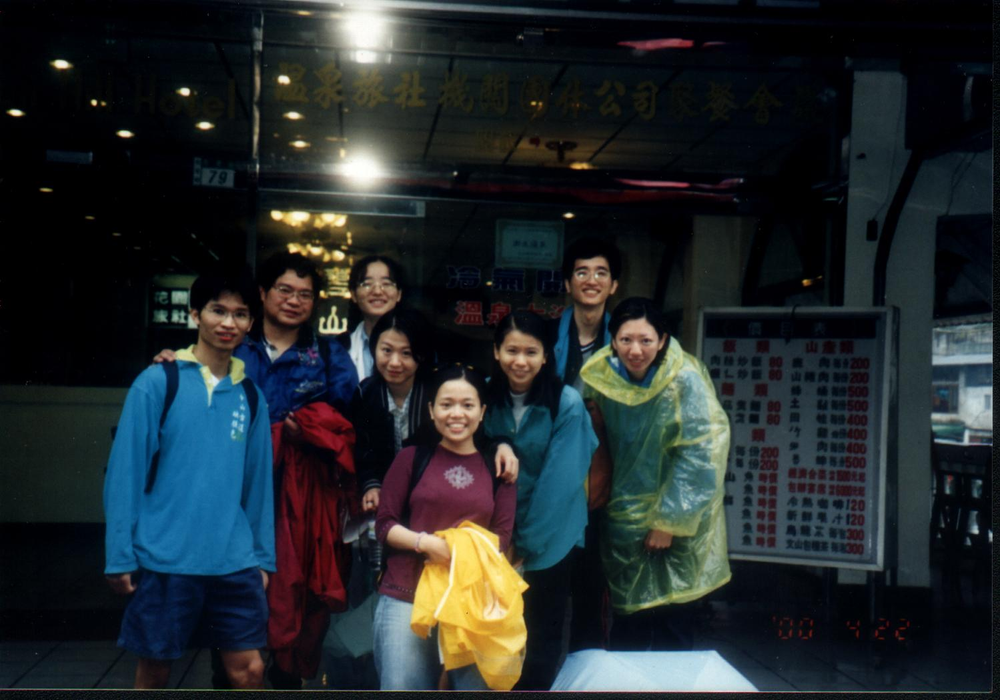

# 桶盤山與烏來山

> 民國89年4月

**89年4月22~23日 桶盤山 & 烏來山                         謝兆光**

當探勘完畢後，Bingo問我這次的活動確定還要走這條路線嗎？我想畢業後就沒爬過這麼過癮的山了，如果不帶大夥“享受一下”那豈不是太可惜了。

來之前手邊只有些從網路上下載的零星資料及標示不清的地圖，還好，下車後有位住在忠至村的小女孩告訴了我們該去的方向。雖然前幾天下過雨，天氣不是大晴天，但看起來下雨的機率不是很高。在一路懷疑及詢問之下來到了登山口。

週休二日到烏來的人一早就讓公車擠得滿滿的。來之前還蠻擔心有幾位女生可能沒有走過這樣路程的山路而造成危險，但是在前一天一個個說臨時不來了而只剩我們這些老山友包括好久不見的青仔，我才安心一點；可是錢又變成另一個難題，因為去的人數沒預期的多，所以住宿費方面肯定要賠錢。在忠至下車的人還不止我們這一隊，另一隊屬於長青組的路線和我們一樣，但他們比較不想玩命，所以他們在大桶山就要下山了。老伯也勸我們像這樣前一天下過雨的烏來山，而且天氣還不太好的情況最好不要過去；可是我們是吳一成的學生，再困難的路我們也不怕，聽起來好像有點匹夫之勇，但我想先走了再說吧。

上山不久就因為Bingo肚子餓所以提前吃午餐。四月初北部天氣還微涼，再加上沒有其他人與我們同一條路線，所以可以充分享受登山踏青的輕鬆及寧靜。剛開始的路程除了有一些惱人的階梯之外其餘都是平坦的康莊大道；不過看到因為要讓登山客更輕鬆而砍伐沿途的樹木，我情願走的辛苦些。經過一連串的階梯後來到一處展望不錯的茶園，經過一陣休息後重新出發，這時才發現鞋子穿錯了，原本的高速公路變成泥濘陡峭狹小的山路，下盤花在防止跌倒的力氣比爬陡坡的還多；還好身上並沒有背負太重的物品，否則這趟可能走不完全程。經過幾番的曲折離奇好不容易到達大桶山頂，因為只有兩個人走，所以時間比資料上的要早些，但山頂的展望不佳也頗令我失望的。

出發前文攻武赫地要大家穿著登山鞋，看來大家都做到了，可是Blue小姐的鞋子不爭氣，還沒上戰場就宣告陣亡了，還好經過大家的妙手回春才勉強走下去。天氣又悶又有點熱使我擔心下午會不會下雨，也使得我們這群許久沒運動的上班族走起來有些吃力；不過不管如何還是要走在長青組的前面，否則不是太遜了嗎。雖然穿上我心愛的登山鞋，但到大桶山頂整段路走起來也還是不輕鬆，可能是前一天下雨造成山路更濕滑吧。儘管大家有點小腹為凸、骨質鬆軟，但還是在預期時間到達，還算是寶刀未老，在大桶山頂稍作休息並用午餐。當大家啃著冰冷的飯團時，娟娟竟然拿出料理界一致公認的美味-----魯肉飯，一時之間所有羨慕與嫉妒的眼光都投注在他身上，不過娟娟仍從容不迫將飯吃完，真是一名狠角色。

在大桶山到烏來山的稜線上除了有人為的謊言還有自然的欺騙：人為的是標示誇張的指標，五百公尺與兩百公尺的距離一樣，五百公尺我只花了十分鐘不到就走完了；自然的欺騙是兩山之間有三個假山頭，一次一次造成我小小心靈的傷害。不過在途中遇到兩位從反方向來的登山客，自己從烏來山下來才覺得他們也是蠻厲害的。經過上上下下幾次終於到了烏來山，森林三角點還是沒什麼好看的，算了，接下來要煩惱的就是下山的路了。依據手邊的資料只知道非常的陡峭難行，可是更不可能走回頭路；剛開始的路還可以應付，但是經過一個上坡之後就沒那麼幸運了，許多地方根本不知從何下手，只有四肢並用才能穩當的下來，而且這樣的情況不止一處而是比比皆是。在途中可清楚的聽到山下有某處在辦團體活動，廣播、敲鑼打鼓很熱鬧，後來才知道那時我們親愛的老師正在其中，而他的兩位學生正在他上方的山頭奮鬥。最後走到山下時雙腳已經無力，下樓梯時腳還會發抖。Bingo更是不得了，他的鞋底沒有任何的紋路還是毫髮無傷的下來，不愧是Bingo。這樣辛苦的探勘當然要犒賞自己一下，所以先到溪邊泡泡溫泉，消除腳底的疲勞，再到烏來街上飽餐一頓，這才滿足的回家。

午餐完見老天爺還允許，所以就往烏來山的方向前進，一路上上下下來到烏來山。到烏來山後我見時間還早所以休息較久，而且接下來的路程並沒有適合大家休息的地方。可是才開始往下走沒多久，老天就戲弄我們，開始下一點雨就停，又下一點又停，使我們雨衣穿也不是不穿也不是；但第三次的雨就不客氣的沒有停止的意思，原本陡峭的路穿上雨衣加上濕滑不堪，四肢並用也不夠用，還要加上屁股才行。一路上雨和我的抱怨髒話都沒停過，走到最後都感覺不耐煩起來，最後原本預計花兩個半小時可走完的路卻走了四個小時，真是慘不忍睹。到山下時有人告訴我們，這樣的天氣最好不要走烏來山，上次就有兩個人因此摔死，看來我們還能平安的走下來真是福大命大。

到旅館後大家開始整理準備洗澡，才發現我們帶了一些朋友下山，整隊八個人有四個人腳上黏上了水蛭，尤其以打頭陣的Bingo最多，整趟走下來也使青仔和Blue的登山鞋宣告報銷；回首整個登山過程可以說是我們畢業後走得最慘烈的一次，不過烏來的溫泉可以彌補一些回來，為什麼每次活動有溫泉時就會不輕鬆呢？
