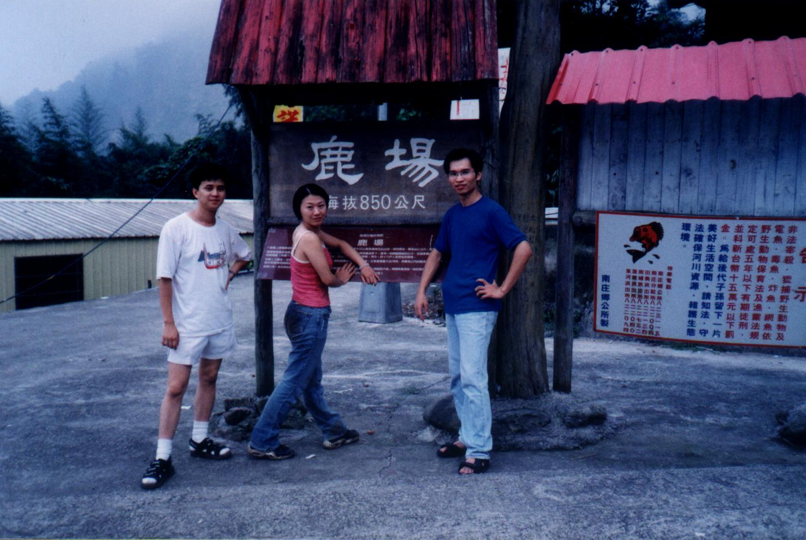
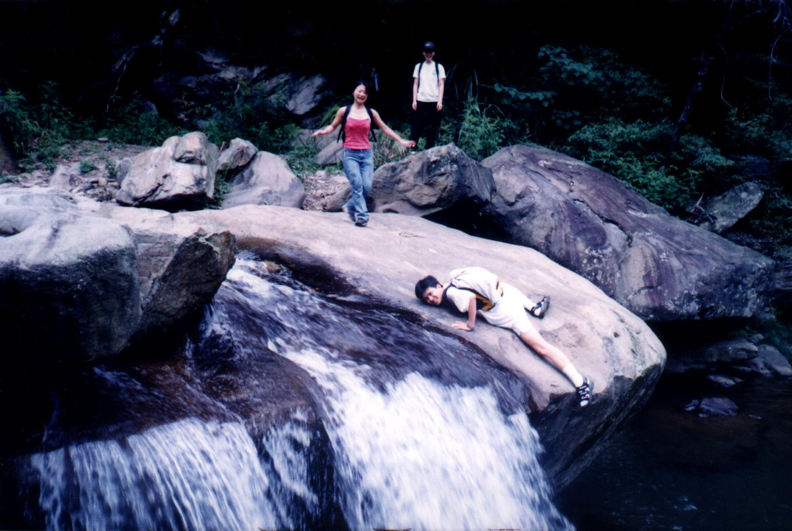
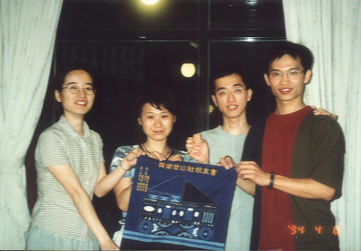

# 加里山之旅

> 民國89年9月

## 89年9月23~24日 加里山之旅                                周其昌

就因為苗栗客運不在苗栗市，使得我們抵達鹿場時已經快接近中午了。剛開始的陡坡及頭上的烈日，讓我們真是苦不堪言；然而辛苦是有代價的，我們到了最令人驚豔的登山口。驚豔？沒錯，我們都不敢相信居然只隔著登山口，裡面就像仙境一般虛幻美麗，有如另一桃花源似的，令人是豁然開朗。除此之外，途中還有風美溪流經，可供我們休息、戲水、洗澡？(如果需要的話)

這的確是座累人的山，難度不輸給八仙山。當天晚上我們就將活動行程規劃好：第一天從南庄走15公里至鹿場；第二天爬加里山，回程搭拖拉庫至南庄。這次活動包括了健行、爬山、涉溪、坐拖拉庫，真可謂是山社活動的精華版。然而我們心理想的卻是：操死他們，尤其是阿光與BINGO，以報烏來溫泉之仇，哈哈哈。

本片開始

真是老天眷顧，颱風在上禮拜就離開我們，讓我們今天有個晴朗的好天氣。我們一行15人，搭公車到了南庄，開始15公里的健行。當我們自信滿滿，帶著愉快心情開始行走時，就有位好心的運將桑，問我們是否要搭便車，為了能夠節省時間，我們也就接受。運將桑把我們載到東河，時間也快接近中午，於是我們就走到三角湖休息用餐。用完餐後，好玩的我、丸子、芒子就跳入三角湖裡玩起水，直到被催著上路才肯起來。

原本心想：「從東河到鹿場應該剩不到10公里，大家輕鬆走下午5點前一定會到達。」沒想到越走越不對，一路的爬坡再加上炙熱的烈陽，讓我們走沒幾步就得休息，隊伍越拉越長，大伙都以懷疑且略帶火藥味的口氣，質問我這資深專業又沒有不良紀錄的嚮導：「我們七點到的了嗎？」。我以自信又略帶顫抖（註二）的聲音說：「開什麼玩笑！我保證六點前一定到達鹿場，否則會長換人做。」當場大家鴉雀無聲，背著背包就沒命地往前衝，比什麼照相、木瓜牛奶有用多了。

最後「集團隊伍」（註三）到達風美橋時，已是四點出頭了，大伙已疲憊不堪到腦筋不正常，只要是看到卡車就興奮的狂叫，好像卡車是來載我們似的。嘿！還真的有輛卡車停了下來，於是我就上前跟他們交涉，原本這對夫婦是要在風美橋下玩水的，晚點才去鹿場；於是我只好裝的很可憐的樣子並指著不遠的地方說：「求求你們載我們一程，否則我會被那群面惡心惡的人給丟到風美橋下的。」果然大家猙獰的面孔是有用的，不是啦，我是說我的苦肉計還是有用的。最後這一公里的陡坡真的比好漢坡還好漢，比哭坡還要哭；總之大伙若真的用走的，那我也別想活著到鹿場了** ……**。

小插曲

晚上會員大會中場休息時，我原本是要確定隔天卡車來接我們的時間，沒想到卻被熱情的女主人拉去喝酒，可憐的BINGO也被我拖下水，這時我的心裡一直想著如果老師有來，我跟BINGO也就不用喝的這麼辛苦了**……**

起床總是辛苦的，尤其在三點半。清早的涼意讓我們走起來還算滿舒服的，一個小時的時間就到了登山口，比預計的時間還快許多。我們十點左右登上山頂，途中BLUE因身體不適而由佳靜護送下山。我們就趕緊掏出最重要的傢伙－－「火爐及泡麵」，很悠閒的看著泡麵吃著風景，喔不，是看著風景吃著泡麵。突然之間我們看到鬼了，不，我的意思是說我們看到不可思議的人爬上來了－－那是「佳靜」**……**。原來BLUE途中跟我們分開的地方離山頂還不到半小時的距離，所以佳靜聽了後來的山友建議，才跟我們來會合。

站在加里山頂視野真是廣闊，真不愧是一等三角點。每每站在山頂看見那遼闊又美麗的山景，還有一群共患難的夥伴陪著，一切的辛苦也都值得的。

回到吶善嘛固民宿是下午二點四十分，有的先去洗澡，有的在整理背包，有的已累的不行癱在那裡，而我卻著急卡車到底會不會三點來接我們呢？緊張緊張、刺激刺激，各位看倌到底卡車會不會三點準時到來呢？我能夠現在活著發表這篇遊記，大家也應該猜到了。沒錯！卡車它終於來了，它不聲不響的來了。大家興奮的趕緊收拾行李要離開這裡，就連在洗澡的也顧不得穿衣服衝出來，沒有啦，我是說顧不得洗澡就衝出來，當然有穿衣服喔。

坐上卡車，大家的心情是穩定而坦蕩的；時而聽到大家話說當年、時而聽到大家談笑風生，其中不時還夾雜著一些話語：「喔！」「喔，MY GOD！」「喔！我快受不了了。」（咦 ~大伙可別想歪了，這是因為我跟阿光坐在靠著車尾的地方，只要有小小的顛頗，我們的背就會很痛。 ）然而就在此時我聽見了一句最感人的話：「感謝老昌帶我們來這麼棒的地方。」**……**

註一：為增加文章笑果，有部分為純屬虛構。

  註二：「顫抖」一方面是太操了，另一方面是怕被毒打。

  註三：最後「集團隊伍」的人要注意啦，要好好鍛鍊身體囉。

註四：特別感謝曾經幫助我們的卡車運將。
