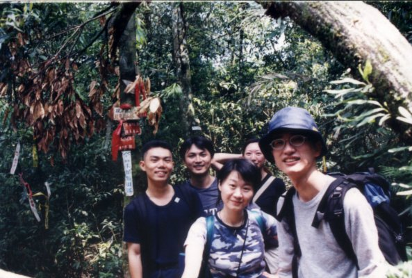
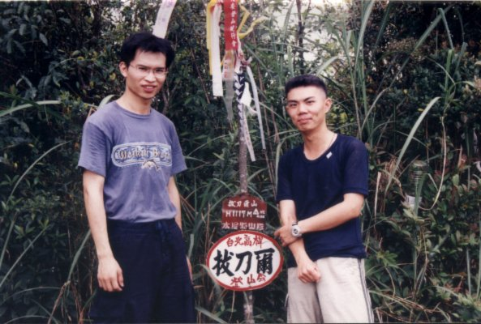

# 拔刀爾山

> 民國90年4月

**90年4月28~29日 拔刀爾山                                      林文彬**

拖著昨日加班到23:00的疲累，拼著沒吃早飯的體力，在遲到了將近一個小時，身為嚮導之一的我─Bingo，終於趕到了集合地點—新店捷運站；面對迎接我的「拳打腳踢」、「言語唾棄」、「冷眼責難」、「白眼相向」，我也只能坦然接受；畢竟，能看到久未謀面的各位同學、學弟妹們，所有的屈辱，我都可以甘之如貽。不過，本人還是為我的遲到，在此向各位山友道歉，真的是非常的給他“歹勢”啦!!!!!

烏來的活動，OB會已經是第二次辨了，第一次的**「大桶山縱走烏來山」**，參加過的山友想必是給他**印象非常的深刻**；此次的**「拔刀爾山」**由本會的新任會長—**謝兆光**先生（晚上才佈達）籌劃、包辨，小弟Bingo我，只奉命協助探勘及帶隊、壓隊；此次活動結束後，各位山友若有啥不爽的，儘管找會長抱怨or報仇，不要客氣，我會助各位一臂之力的。

卡車〈又是卡車〉送我們到登山口時，比預定的時間慢了約半個小時，幸而老天爺幫忙，天氣一掃前幾天的下雨，放起晴來了，只是不知雨後的烏來拔刀爾山路況如何，而…螞蝗又有幾何？稍微整裝及行前教育後，便往今日的目標：美鹿山、高腰山及拔刀爾山前進。

此次活動參加的壯丁比我們以前所辨的活動都來的多，預估應該會成為輕鬆走的路線；事實上，在進入美鹿山之前也是如此，但是，在進入美鹿山後，大家的蜜月期也跟著逐漸消退了。由於前幾天下雨，再加上往美鹿山的路上有一、二段小陡坡，而隊中，有一部份人是只走過人工登山步道or 第一次登山的，所以只見到犁田者不絕於途，只聽聞慘叫聲不絕於耳；待到達美鹿山時，已比預定的時間遲了大約半個多小時。原本打算在美鹿山喘口氣、多休息一下，只是不經意的瞄了地面，即看到數隻在探索熱源的螞蝗正搖擺著「動人」的身軀尋找著他們的有緣人；剎那間，人心惶惶，也顧不得喘息，只見大家奪路而跑。

由於怕錯過與司機約定的時間，經過「90年度長榮登山社OB會拔刀爾山第一次隊員臨時會議」決議，決定此次活動不攀登「高腰山」，以免被放鴿子。原本以為出了美鹿山後會比較順利，但沒想到在吃完午飯後，剛走沒多久，**我們偉大的精神領袖—我們的頭號嚮導—我們的現任會長**〈雖然要到晚上才佈達〉就宣佈了「**告全隊隊友書」**，其內容如下：

「各位先生、女士，我不行了，雖然，要一個男人在眾人的面前承認自己不行是一件多麼丟臉、屈辱的事情，但是，我還是提起勇氣要告訴各位，我真的不行了，因為…我的腳…真的好痛、真的不行了。拔刀尚未完成，登頂仍待努力，接下來的路程，就由Bingo代替我，繼續帶領各位，攀向生命的顛峰。」

如此的因緣際會，Bingo—我終於躍上了檯面；只是，這個消息對各位隊友來說，並不是一件好事，因為隨著時間的流逝，烏來山區的氣候也變得詭異起來，好像隨時都會下雨一樣。所以，我只好秉承光同學的訓誨，帶著大家**努力**的往拔刀爾三角點前進，剎時間，「Bingo ～到了沒」「快到了」，中間還夾雜著「我們準備要拔刀了喔！」的威脅聲浪此起彼落；最後終於在「到了」的結尾聲中，踏上了拔刀爾的山頂，只是一路上都沒有休息，苦了各位隊友，真是不好意思。

回程時，順道將阿光及草莓pick up，還好光同學的狀況還可以，我們便尊照「90年度長榮登山社OB會拔刀爾山第一次隊員臨時會議」之決議「過高腰山而不入」，直接往登山口轉進，此段路頗似往「大鬼湖」的山腰路，不過林相頗為優美，只是亦不甚好走，秀逗所帶的同伴多半都走得戰戰兢兢，深怕掉到紅河谷的谷底。不過也還好，都平平安安的於16：00前到達登山口。

下到烏來後，照例泡湯、吃飯、逛街、開會、睡覺，好像也沒別的事可做，只是要特別向大家推薦**泰雅美食**…真的很好吃喔！若還有去烏來，一定要每次都造訪。另外，開會的同時，也舉行新舊會長的交接典禮，典禮大致上順利，只是在從舊會長老昌的手上接過社旗及社印要交給新會長阿光的同時，老昌似乎還很戀棧權力似的抓著社旗及社印的手有點緊，不太好拿得下來〈與**燈灰**大哥很像〉；交接時也由小弟代替「**跩跩成**」帶來了對OB會及新任會長之關懷及祝福，大體上滿感動的〈雖然有幾個錯字〉，But，還是謝謝啦！也希望「**小成**」能多多參加OB會的活動，雖然在校生比較年輕貌美，不過也不能以「他們第一次去玉山」的這種爛理由來拒絕OB會吧！

休息一晚，第二天大夥到露天溫泉區走走並看看瀑布、風景後，便結束了此次的拔刀爾山的登山活動。中午時部份隊友相約到台北市吃慶功宴，席間，見到了我久未謀面的KiKi夫婦及首次見面的KiKi子，而且也不小心的嚇到他，這應該是此次活動中，我的最大收獲吧！希望他能記著我，並陪伴著他一起長大………。

在此，也謝謝參與此次活動的夥伴，也希望往後的活動大家都能攜手一同參與。謝謝！

《P.S.：此次活動中，**扁兄**—李瑞玲、**阿肥**—不知名〈忘記名字了，歹勢啦！〉的表現不俗，希望光社長能好好栽培，以期該兩位能成為“龜、鴨二人組II”之接班人。》

  編按：“扁兄”、“阿肥”??小名叫得有點給他過分吶!!人家只是骨架大、有點小圓而已，芳名是：陳昱蓉〈是裕隆，不是BMW喔!!〉
