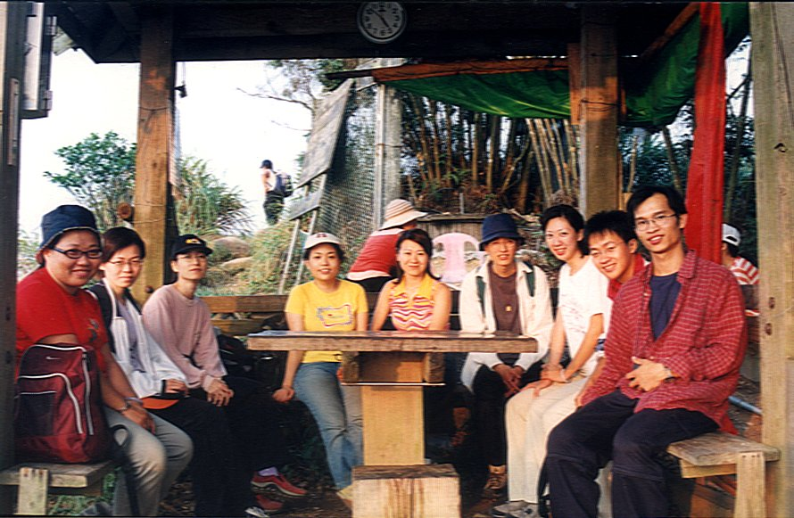
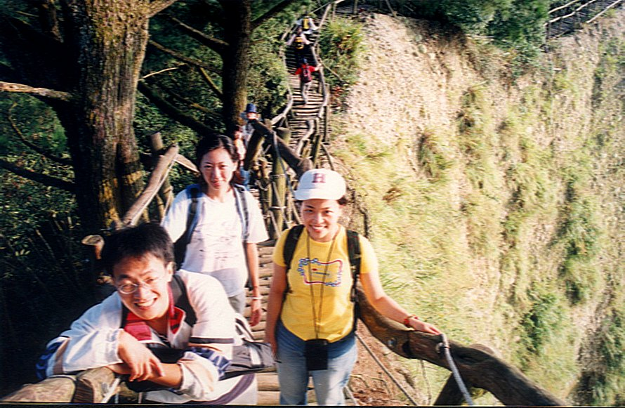

# 頭嵙山

> 民國90年10月

**90年10月13~14日 頭嵙山                               蔡娟娟**

10月13日起了個大早，從容不迫地搭了頭班自強號列車，來到這個我只熟悉車站，卻對市容陌生的台中市。

首先映入眼簾的是春燕、丸子、老昌，然後是依舊百變動人的草莓。草莓先領著我們去吃台中的名產－火燒，再帶我們去品嘗可口的肉羹，此時阿光正好趕上了，加入我們的行列。逛完德安百貨，填飽五臟廟後，陸續與BLUE、秀逗、秀娥會合後，就開始往山上駛去，開啟今天的重頭戲－大坑頭嵙山之旅。

剛開始就來個下馬威，是一段長長的柏油路。夥伴們都知道，柏油路走久了比泥土路還辛苦；就有人抗議，怎不把車直接停在入山口？但答案是，這是一條「必經之路」我們要先苦後甘，把車停在下山口，下山後就可直接驅車離去，所以現在只好忍、忍、忍囉！可萬萬沒想到，秀逗、草莓又補了一句，此山會讓我們印象深刻、永難忘懷，雖知他們是「好心」叮嚀，不過是否暗示著此行不妙。但既已騎虎難下，不容臨陣脫逃，只好硬著頭皮上囉！

啃完火燒、漢堡的大夥，就抱著壯士斷腕的精神，向前邁進。最後我才發現呈現在我們眼前的，是數不盡的階梯，遙遙望去無盡頭，一山還有一山高。當下心就冷了一截，真的是要「登」山，登上一個又一個的階梯？據我所知此處有5條登頂路線，而我們此行要沿第２號路線上山，經過５號線，再從第４號線下山，因為這種走法的沿途風景最是宜人，聽說還有第6條路，其景色更甚於前，但仔細端詳路線圖，卻不見其影，只好有賴曾來探勘取徑的領隊們了。

頭嵙山的階梯有個特色，全程從頭到尾都是由一根根的長圓木頭搭建而成的，可以想像這得花費多少人力、物力、氣力與心力。陡峭處階梯兩旁尚有繩索可供扶持，大體說來，一路上是很安全無虞的，只是，對於我們這群許久未伸展筋骨，長期窩居在高樓叢林中的都市人來說，其累可想而知。「登」沒幾階，就得休息一下，但畢竟是「老」骨頭了，僅管體力不濟，速度不快，從前的功力仍保留幾分，所以整體行進時間的控制都尚在掌握中。

當天天氣很好，陽光不很大，且山上的風徐徐吹，趕走了熱氣疲累，舒服極了！從山上我們可以俯瞰台中縣市的房屋棋子及９２１地震過後的山崖，黃禿禿的一片，只餘幾許蒼翠點綴其上。轉個彎另一面的山貌是山巒起伏的壯闊意象，使人心脾舒暢，頓忘煩憂。有人說，若下一場雨會更好，或許是吧！但凡事豈能盡如人意呢？

造路者善解人意的表現處，是沿途一座座的涼亭，使人久旱逢甘霖般得以歇腳。利用這小憩時間，大家開始「算帳」。由於偽鈔氾濫，造成人心惶惶，使得大家彼此教授如何辨別真偽。除此之外，亦商討今晚要舉辦的會員大會。因害怕黨國元老的諄諄教誨有如長江之水，滔滔不絕，有人竟不怕死的「捋虎鬚」，令大夥兒由衷感到佩服、佩服。

最後為免晚上不得好眠，會長、副會長決定以「認錯」來應萬變。

在山頂上「僵硬」地合照後，就要往有小「萬里長城」之稱的「瘦稜」前進。由於此段路之稜線蜿蜒起伏之後可媲美萬里長城，才得此一稱呼。真得身歷其境才能感受出其巧奪天工。走在瘦稜上，兩旁視野遼闊，但因下坡階梯走得令人腿軟，害我無暇去體會近在兩旁的山光。

許是自恃時間充裕，卻忽略已是深秋時節，天色暗得頗快，因手電筒不足，後來大家一直在趕路。這時可望見山下萬家燈火，看到「好夜」的景色。而我只是期待，希望趕快踩到「土地」上，不，應該說，是踩在踏實的泥土路而非虛空的木頭上。最後在經過只容得下二人通行的吱嘎吊橋後，我才真的確定，我們已離車子不遠了，此時天已昏暗。

**後記：「黑色小金鋼」傳奇**

*行前草莓已囑咐我們要嚴防「黑色小金鋼」，是一群你不會去注意，除非你睜大眼睛才看得見的小黑蚊。絕不可小覷其「小ㄎㄚ」，因其威力毒狠，春燕在山上已深受其害。而我們是在夜宿「利巴嫩」教會時才親身體驗其厲害，一不小心，就會紅腫如包。可與炭疽熱並駕其驅而毫不遜色，在此提出作為警告。*
