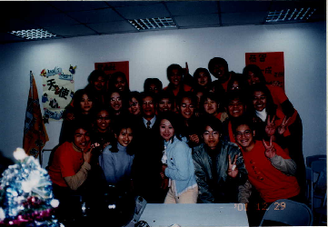
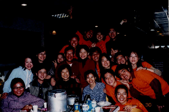

# 老師慶生與回娘家

> 民國90年12月

**90年12月29~30日**                                                 **春燕**

**12月22-23日**

一大早，二台車浩浩盪盪的從台中出發，老師這兩天由於全國山嶽鐵人競賽的活動，人都會在廬山，所以我們決定號召眾家伙伴，大家一同上山找老師，順便到清境農場遊玩，如果時間充裕的話，還可以繞道奧萬大看看楓葉。我們從台中行經埔里地理中心碑，一路直上霧社，再那裡稍作休憩，就直往清境國民賓館與老師會合，在那我們享用了當地頗富盛名的牛排大餐，一行人即步行至步道口，上去踏一踏那片翠綠的草皮，途中一處開滿了紅的、白的梅花，謀殺了大家不少底片，尤其老師更是個搶手貨，大家爭相與之合照，不知道的人可能還以為是哪個大明星出現了呢！延著山坡向上，來到了「青青草原」，由於適逢佳節期間，那位表演綿羊秀的紐西蘭人，也同大家一樣返鄉過節，所以，我們隔個山頭，遠眺山頂上皚皚白雪及草原上悠閒的牛、羊，並買票入場，大家避開牛嗯嗯，隨意的坐在草皮上，吹風、聊天、看風景，我們戲稱這是一趟豪華吃吃喝喝之旅，風景一流、吃的一流。

傍晚，我們到了一個溫馨雅緻的木屋農莊用餐，木屋的建築、裝潢一一透露出主人的巧思，據草莓告知，這是一對兄弟，去加拿大學習木工，回國後自己一根木頭一根木頭慢慢建築完成，不禁令人感動，每個地方都有許多不知名的小人物，用自己的方法，實現自己的夢想，但是回想自己，卻覺得有絲汗顏，自己的夢又在哪呢？

吃完晚餐，我們回到廬山活動會場，從山嶽鐵人競賽活動開始到現在也才12個小時左右，已有三隊隊員完成任務，返回終點報到，其中不乏體形嬌小的女隊員，而活動不僅考驗耐力且又要溯溪、又要垂降，真是令人佩服。之後，我們還到廬山溫泉的源頭享用風味獨特的溫泉蛋，深夜才返回霧社街頭住宿。

隔天，大伙從容的睡到自然醒，用了湯圓早餐，就開車送老師回會場，剛好踫上海鷗正在山裡營救一位骨折的山友，原來昨天有位參加競賽活動的隊員，摔落山谷造成開放性骨拆，我們大家盯著山腰處，隱約看到盤旋的直升機降下擔架，但並不能確切的看到是否有將傷患順利的送上直升機，直到看到直升機飛走，聲到指揮人員的對講機傳來，救援成功，海鷗會將人直送台中榮總，老師才鬆了一口氣，陪我們到廬山吃了桌豐盛的午餐，便各自踏上歸途。P.S. 感謝草莓及大姊頭提供交通工具，及事前的規劃，讓我們有了這次美好的回憶。

**12月29-30日**

週六中午，我和秀逗搭草莓的車由台中一起出發到台南，感覺有點像是要回娘家，在高速公路上走走停停，總算順利在6點抵達台南交流道，前往學校的路漸漸熟悉，這是我睽違了二年之久，才再度回到長榮的校門口，有種近鄉情怯的莫名情緒。我們在校門口的香榭大道與學弟妹聚餐，學弟妹看起來親切且誠摯，大家找話題開始我們第一類接觸。

飯後，我們前往社辦，學弟妹特地先行去準備，等到我們到時，樓梯旁點著一盞盞的小蠟燭，進到社辦，滿桌的小點心、飲料，佈置的十分溫馨，看著學弟妹的用心，心中一陣感動。大伙看看幻燈片、翻翻照片、聊聊天，學弟們訴說著社團的點點滴滴，我們也分享彼此的經歷，似乎時間就這樣一直停留在這一刻，直到十一點多，我們才依依不捨的回到老師家，因為明天還有更重要的活動。

早上八、九點匆匆梳洗好，先陪老師、師母到安平去推拿，據說老師大概因為要與山社聚會，太興奮了在家中不小心跌了一跤，所以筋骨有點給他酸痛。到了慶生的地點，學弟妹們早已在門口列隊歡迎，桌上已分配好火鍋料、啤酒，只等老師一聲令下，大家就可大快朵頤，講到吃，登山社第一要件就是要會吃，只見筷子此起彼落，一大鍋的火鍋料立刻清的一乾二淨，連菜渣都不剩，大約吃到八分飽，正式進入今天的重頭戲，蛋糕推出來，分配好人手一支拉砲，將老師和師母圍在中間，開始唱生日快樂歌，「~~~~~祝你生日快樂!」，開始拉砲，只見老師滿頭彩帶的傻笑，我們比照往年，玩親親，老師親師母，師母還高歌獻唱了一曲。我們準備了相本送給老師，裡面有我們老、中、青不知幾代的照片及賀詞，希望當老師想我們時就可以看看大家的照片，而學弟妹們也送給老師一個有相片的杯子，看到大家一張張的笑臉，今年的慶生會 – 大成功！期待來年更美好^_^

P.S.謝謝學弟妹給我們美好的回憶，你們的用心我們看到了！以後一定要加入OB喔!
