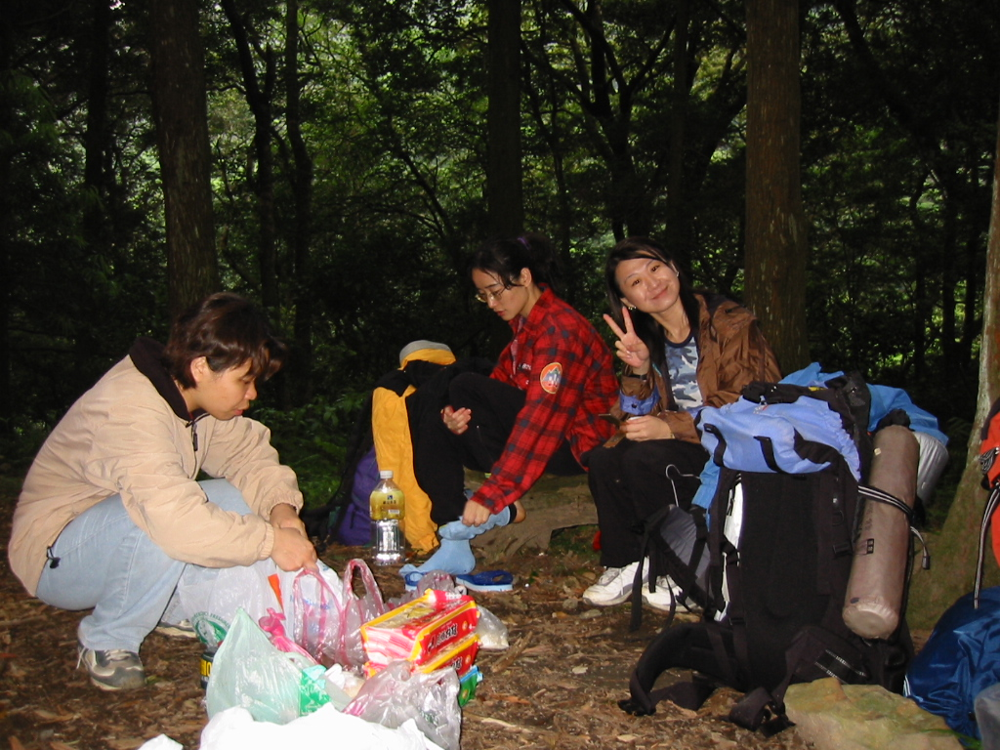
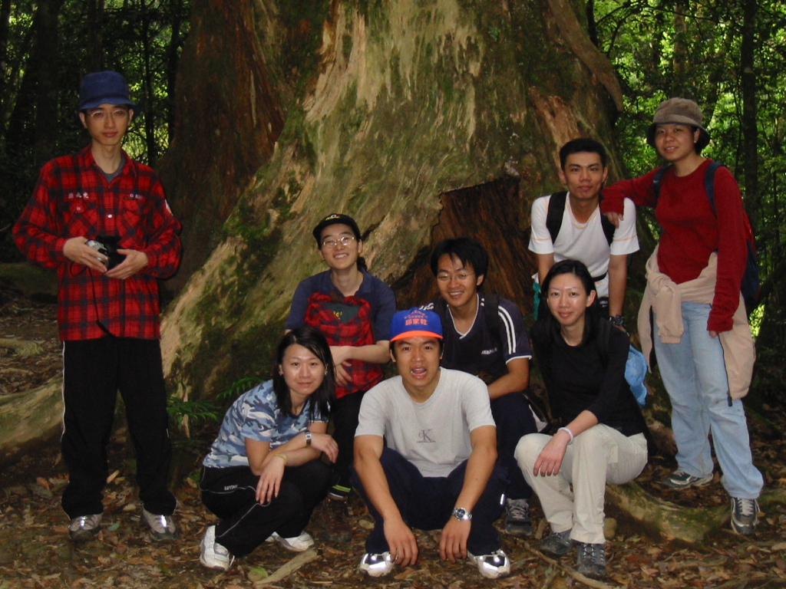
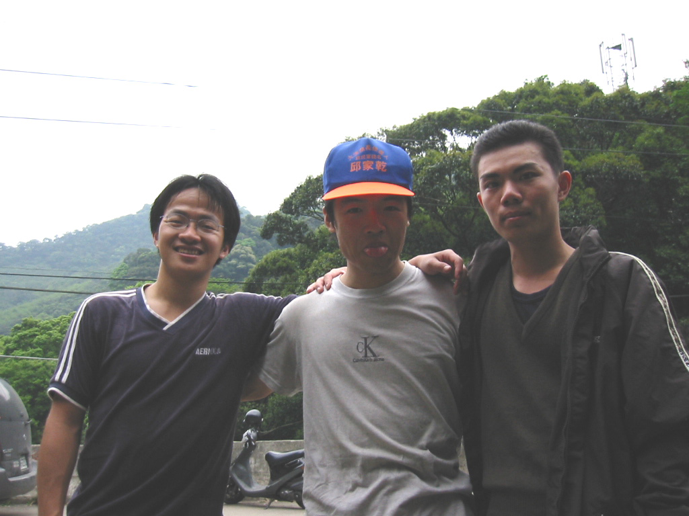

# 北插天山

> 民國91年4月

張惠雯

其實參加活動真的是一時衝動，丸子打電話給我時剛下班，正心情愉悅的等回家的公車，丸子的電話來的正是時候，於是我一口就回答：「好哇！」可是回家後想一想，時隔5年，真是人事依舊，身材全非，每天坐辦公室裡，吃好好睡飽飽的我真的還有體力嗎？現在的身材大概沒有人背得動我囉！行前一天晚上，我還在士林夜市奔走想買睡袋、手電筒及背包，幸好有BINGO 熱心贊助睡袋，感謝你囉！

夥伴們5年沒見了，大家幾乎都還是老樣子，草莓、阿光、丸子、伯穎、秀斗、BLUE、芒果還有他女朋友，已經開始有人攜眷參加了耶！搞不好下次就有人帶老公參加，板橋火車站集合後大家便開始分配公糧，一分配我們才知道原來為了我們這次活動阿光可是煞費苦心，菜單之豐富，還沒開始爬山就開始期待晚上的宵夜及晚餐了。好啦！公糧也分配好，可以出發去，我們先搭公車到三峽，上車後大家便開始聊起來了，我將昨晚在士林夜市買的冷光手電筒拿出來獻寶，可當頭燈使用又可自由調整角度、耗電量小，誰知道阿光也拿出一支幾乎一模一樣的手電筒，他只花了我不到一半的價錢，當場讓我後悔的不得了，說說笑笑間已到了三峽，用完午餐後再搭車到目的地，下車後我們踢馬路到園區門口，大家提起上次周其昌辦活動居然叫大家踢15公里馬路後再爬山，講到大家都連聲同罵，真是可憐的老昌，不過你也太過分啦，還好大家有攔到便車可搭。

步行到園區內，因為天氣太好大家已經曬到汗流夾背，滿月圓園區門口的瀑布正好給大家休息消暑，伯穎還閒不住，朝瀑布向上爬去，丸子、秀斗和我也跟上去，上去後別有洞天我們居然爬到人家後花園去，一片大草地，排列整齊的樹木，看來煞是美麗，也虧得園子的主人有這份心，休息後大夥開始要向上爬，剛開始時大家還有說有笑，經過一連串的險昇坡，背上的背包開始顯得沉重，也開始有人出現狀況，草莓吐了(編按: 草莓在此一定要稍加聲明，是午餐好吃貪心吃太多才吐的)，BLUE抽筋，連一向體力不錯的秀斗也臉色蒼白，我心理也開始唸起丸子，說是OL路線，我看這是女金剛路線吧，一路上我們遇到不少下山的人，原來竟然有人把北插天山當散步的地方，真是令人佩服，還好後半段還算平坦，大家總算抵搭紮營地點，五點半我們開始煮飯，豐盛的料理讓大家都吃得讚不絕口，辛苦的廚師就是我們的阿光社長，為了替大家準備滷味還經過一番實驗，成功後才帶來給大家吃，真是勞苦功高，就連周其昌也貢獻一己之力了，，鍋具一套，雖然他人沒到但是心意也到了，他設計精良的湯匙，會自動伸縮，讓人不知不覺連手都差點一起煮進去，周其昌你在家一定覺得耳朵很癢，大家都在罵你。沒想到這晚餐一吃竟然吃到9點半，我們一直吃到睡覺為止，銀耳蓮子湯及一大堆零食，把大家餵得飽飽，想上山減肥的夢想當場破滅，也罷！只有寄望明天囉。

凌晨5點起床的時間大家趕快理鍋做飯，準備上山，把行李藏妥當後大家背著輕鬆的小背包上山，跟昨天簡直不可同日而語，踏著輕鬆步伐前進，晴朗的天氣，翠綠的樹木，清新的空氣讓大家都精神奕奕，一開始平坦的山徑還蠻輕鬆輕鬆，但後面開始爬樹根，連續的陡坡就開始讓大夥辛苦起來，阿光、草莓一直向上衝好像永遠不會累，後面一群拼命的趕路，但90度的坡度一直要用繩索爬樹根，上帝啊！我們只有靠休息時用零食慰勞自己，一路上見識到北插天山之友的驚人衝勁，好像在平地走路，陡坡及樹根對他們的似乎完全沒影響；在手腳併用的爬樹根時，芒果的小女朋友最興奮，一路上聽到她開心的尖叫聲及笑聲，我拖著老太婆的腳步向上慢慢爬著，累得說不出話，到11點多時我們還差一個山頭就登頂了，但是顧慮到下山時間及公車車班，我們不得不往回走，下山的速度就快了，草莓及伯穎一路當先，速度真是驚人，秀斗跟我在後面追趕，阿光因為腿傷及鞋子不合適變成殿後，一路衝下山，我們12點多就回到營地，享受完豐富的午餐，大家收拾背包打道回府。

回程的路多是下坡，一路向下衝，很快的我們隊伍分成2個集團，前面是伯穎、草莓、秀斗跟我，後面是阿光、丸子、BLUE、芒果，一邊向下衝，一邊跟正在往上爬的山友們加油鼓勵，很快的我們就到了山腳下的滿月圓森林遊樂區，炎熱且無風的天氣，看著溪畔清澈的河水，好多戲水烤肉的人群，真想也加入他們跳下溪谷，吃一塊冰涼的西瓜再來一瓶清涼的蘋果西打，想到冰涼的汽水滑下喉嚨的快感，腳下的步伐就又不停的加快，下午2點半領先集團就抵達公車站牌，終於喝到了渴望已久的汽水，唉！人生如此真是夫復何求，把身上溼透的衣服換下來後，全身真是為之一鬆，眼皮便開始沉重起來，阿光他們隨後趕到，一群人坐在雜貨店前擺龍門陣，等著小巴士來接。

小巴士載著我們一群人回到三峽，我們在三峽分贓將裝備帶回去，阿光帶著一大堆裝備要回板橋，秀斗、草莓、BLUE及我同車跟阿光回板橋搭捷運，丸子、伯穎、芒果要搭車回新竹，周其昌的裝備也要請伯穎帶回台中，誰知道伯穎他們上車後竟然沒帶老昌的帳棚，草莓及秀斗只好帶著帳棚一起上車，草莓一路上碎碎唸，還打電話給伯穎坳到一頓好料，才總算心甘情願的背帳棚回家，誰知道車子開到鶯歌，竟然又遇到在鶯歌等換車的伯穎及丸子，我們又把帳棚丟下車給伯穎，真是人算不如天算啊！

爬了一下午，車上的人早餓翻了，望著窗外一家又一家的餐廳，口水直直流，又餓又累的大家一致決定10年內不會再來爬北插天山！
