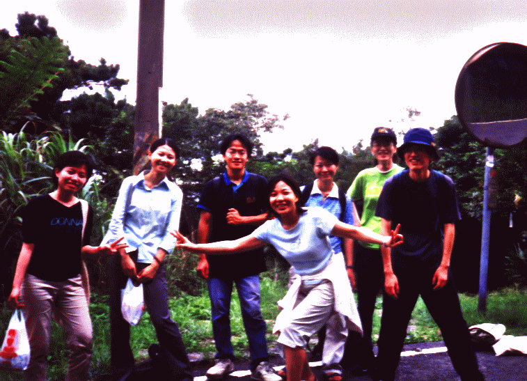
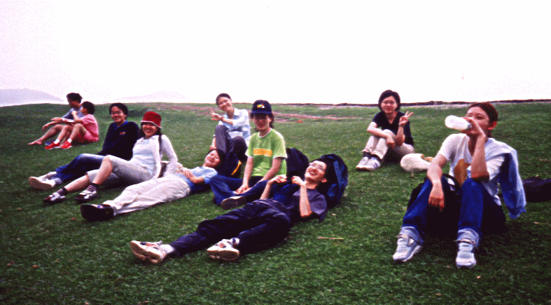

# 陽明山東西大縱走

> 民國91年7月

**陽 明 山 遊 記**

## 廖怡斐

今天一大早起床，準備去爬山囉！一想到這心中不自覺高興起來！大夥約7:30在士林捷運站集合，我雀躍的提早到了！等著等著....終於一夥人浩浩蕩蕩約8:30才搭小巴上山....(等有點久說)

我們在聖人瀑布下車…天啊…領隊阿光學長用很平常的語氣說咱們要從聖人瀑

布坐“11號公車”到~~~擎天崗?! 聽的我心理是一陣晴天霹靂！擎天崗！好吧，都來了，就當作是跟學長姐“搏感情”的成本吧。

約莫中午，我們終於走了一半的路程，我早已開始疲憊無力，但看到學長姐樂在其中，我不禁要佩服他們一下，希望哪天我也能這樣，我們約在下午3點才到擎天崗，徒步上山的感覺真的很奇妙，一路上不但邊走邊和學長姐認識，也漸漸體會到：爬山真的是很不錯的運動！尤其是當我拖著疲累的身軀好不容易才看到大草原時，頓時覺得身心都解放了！這跟之前開車上擎天岡的感覺可說是截然不同！

這是一趟健康之旅，以後若和友人提起擎天崗，我想我一定會告訴他們：『我曾經徒步上過擎天崗！』

  春燕小感：

*活動記錄：*

*08:00 捷運士林站出發坐小18至*

*聖人瀑布*

*08:30 聖人橋*

*09:40 風櫃口(休息)*

*11:00 頂山*

*12:10 草坪午餐*

*12:50 出發*

*13:10 石梯嶺*

*13:40 擎天崗*

一看到“陽明山”三個字，還以為是郊山路線，就一時忽略了，帶隊人…社長大人阿光的等級畢竟和我們不一樣，活動的抬頭是「陽明山東西大縱走」，我們就真的從聖人瀑布一路走到擎天崗，平時自己開車上山，只需坐在車裡，看看風景，一下子就到了草原上，從來不知道上個擎天崗可以把自己搞得這麼累……我們整整走了五個多小時才抵達，一路上，心裡不停的咒罵，看下次爬山不能用山的難易程度來區分，要從帶隊人的程度才是上策（例如：阿光的初級山，我們要自動換成是中級山，就算阿光說都是緩坡，我們也要換算成好漢坡吧！），不過還好擎天崗美麗的風景，翠綠的早原，看著成群的牛媽媽、牛爸爸帶著牛小弟，我們就決定原諒阿光了，我想下次還是會不由自主的被山社騙上山吧…：）
