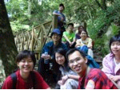
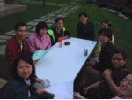
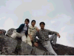
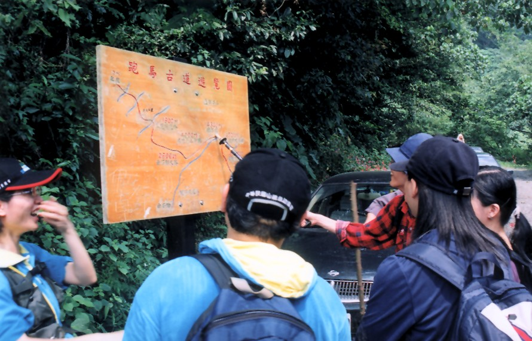

# 稍來山-鳶嘴山縱走

> 民國91年10月

## 鳶嘴、稍來山遊記

佳靜

從長榮畢業已經堂堂邁入第五年了，想起來真的有點可怕！四年的時間都足夠再將一所大學念畢業了！而長榮OB登山社也在老昌和阿光二任社長的帶領下成長了四歲！這次的活動除了例行的爬山活動之外，更重要的使命是決定未來社團的發展**！**

這次爬的鳶嘴、稍來山，是由中部的幹部們 --草莓、秀逗和老昌所籌畫的。為了這次的活動他們甚至探勘了兩次，細心的安排所有活動的細節！而我這個身在台北的社員卻只盡了參加活動的本分，享受大夥細心的付出！

星期五晚上（10/25），台北的一行人 --阿光、Bingo、春燕、我、還有久未碰面的青仔相約在國光號西站，準備前往台中的秀逗家。阿光和Bingo的裝配齊全，不時引來其他旅客的側目；春燕、青仔和我則是裝備過於輕便，一點都不像登山客倒像是郊遊踏青的插花隊員！由於是星期假日，車站滿是人潮，幸好老天爺幫忙，總算搭上不算太晚的班車前往台中。雖然不算太晚，但是到台中秀逗家也已經是晚上十二點多了。也許是受登山的熱情的影響，也許是久未碰面的興奮，大夥一見面居然毫無睡意，東一句你好不好？西一句你現在過的怎樣？也就不知不覺的聊起來了！直到秀逗發出最後通牒，大夥才乖乖就範準備睡覺！

星期六〈10/26〉一大早八點，準時由秀逗家出發前往東勢大雪山森林遊樂區，展開第一天的行程。由於主辦活動的草莓秀逗和老昌，為了不要讓讓我們這些有點年紀又整天窩在辦公室的老骨頭太辛苦勞累，這天的活動安排就簡直就是貼心到了極點，讓大家在邊走邊聊天、邊走邊照相之下逛完了第一天的行程—小神木、大神木及天池。雖然只是小走一下，但是也許是大家真的太久沒運動了，因此也就在前往當晚的住宿地點 --丸子的表哥家時，在車上睡得東倒西歪。

丸子的表哥家是在東勢山區的一個山谷邊，一到晚上四面無聲無息就只有我們。而我們就在這山的懷抱下，進行了我們兩年一度的社務會議。毫無意外的，當然是由老昌擔任我們的第三任的會長。由於丸子表哥的熱情招待，讓我們有機會享受居住在山間的快活情趣，晚餐更是不得了了，又是雞又是魚，滿桌的美味帶走我們不少的疲憊與倦意，大家也就不顧形象地開始狼吞虎嚥吃了起來了。可想而知，後果當然是杯盤狼藉囉！！晚飯過後，大夥梳洗完畢之後，便紛紛就寢，養精緒銳準備第二天的行程。

由於行程的安排，第二天(10/27)在天還沒亮時，三部白色的小轎車便載著大家，穿梭在黑壓壓的山間向登山口出發了。就像是每一次的爬山，大夥走著走著，永遠有聊不完的話題、聊不完的回憶，不知不覺已經到了我們吃中飯的地點。吃中飯是件享受又快活的事，正當我們的食物開始烹煮時，食物的『香味』將所有的記憶加速地一一喚回，曾經，我們曾一連四、五天在山裡吃相同味道的食物呢！

接下來可是這次活動的重頭戲---攀岩。走著走著，抬頭一望我見到了岩壁，整個岩壁光禿禿的，只有繩索由山頂上往下垂，我想我真的可以上得去嗎？想著想著手腳都軟了。但是，總得爬過鳶嘴山的岩壁才可以回得了家啊！所以囉，不爬也得爬，就是這股動力，一步一步慢慢的爬，終於也給我們爬到了頂點了。

到了山頂，所有的一切都是值得的，眼底盡是收不盡的美景。但是，難題又出現了--上了山總得下山，腳下又是一片光禿，這時，心理上的壓力可真的就無法言語了。於是，大家又得沿著繩索，踩著謹慎的步伐緩步行走，深怕一個不留神就滑進了山谷。想歸想、說歸說，大家的膽識與毅力也是不容小覷的，一行隊伍，十個人就這樣靠這互相的扶持與鼓勵成功地下了山。

下了山之後也已經是傍晚時分了，大夥也在不捨的情緒下依依道別，離開了台中，各自回到自己的工作地點。

這次的山雖然不高，但是充滿了刺激，尤其是很多地方都是要由四肢手腳同時並用，甚至連平常少用的平衡感也都用上了呢！回家之後全身上下足足痛了一個星期才逐漸恢復呢！！

