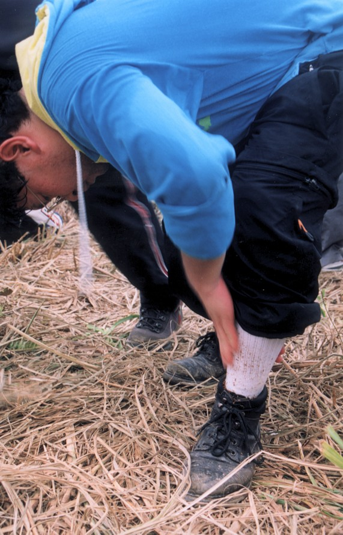
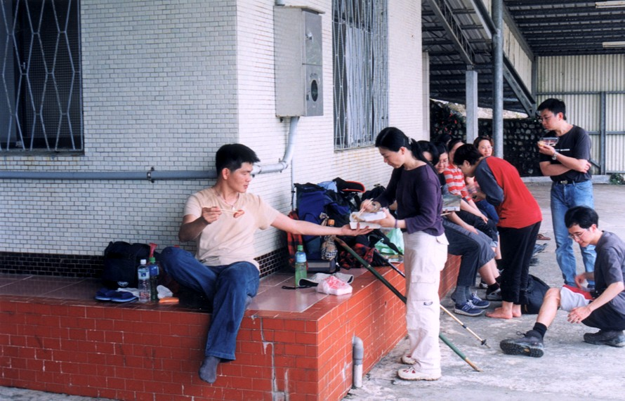
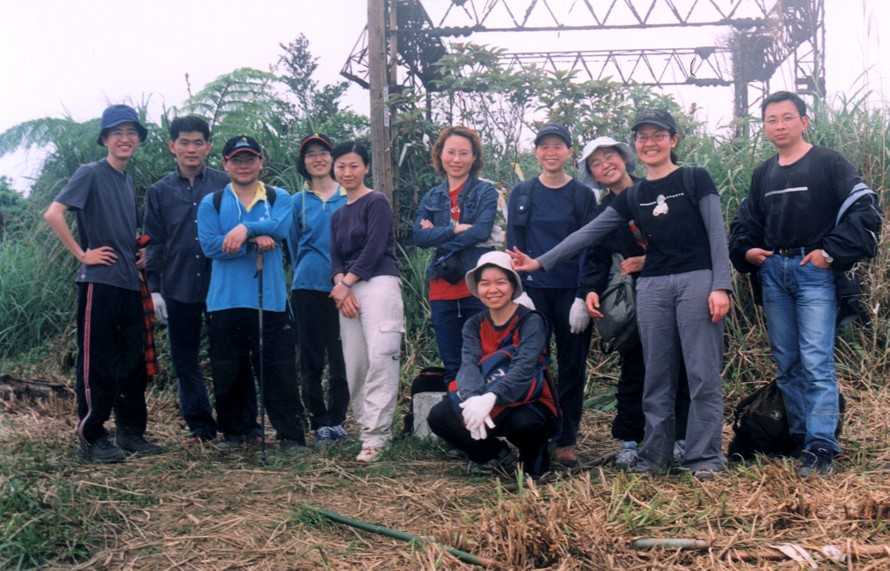

# 跑馬古道

> 民國92年4月

心  情                                          黃吉益   2003/04/22

前一陣子去了一趟礁溪，尋訪了"跑馬古道"及"鵲子山"。雖過程有點的累，但感覺還不錯，尤其是登上鵲子山山頭的那一剎那，汗水淋瀝後的滿足感。我想，這也就是為什麼有這麼多的人熱愛登山的緣故吧！有空多出去走走吧!相信妳會有不一樣的收穫的！

摘錄自楊錦聰先生之「櫻花雨旁白」:

~ *迷* ~

*生命中   有些迷失   是可以微笑看待   令人感動的*

*就像那個迷走梅林的冬日   彷彿一片鋪天蓋地的白霧*

*讓人忘卻身世   只記取眼前驚心動魄的漂白*

*何必害怕迷失*

*迷失    未嘗不能發現意外的美景*

遊    記                                                                       阿敏 (黃惠敏)    2003/04

「龜龜~ ~快，我們要來不及了!」終於在火車開動前5分鐘，趕到集合地點!看到了一群熟悉的面孔，似乎又回到七、八年前，參加登山社的日子。想想自從上一次參加，”長榮 登山社” 要過夜的行程，畢業至今，再也沒參加過。其實參加此次行程前，心理蠻掙扎的!記得從前登山社每次辦過夜行程，十次恐有七次半，不是下雨，就是非人行程。現今的我僅有”OL”(Office Lady)體力的人，豈敢參加!要不是經過，再三跟阿光、彬哥求證，確認此次行程是完全確認為”OL”行程，否則說真的可能看過會訊後，馬上就自動刪除了，還號召了”龜龜”、”美女”與”雅智”參加，不但要背負著可能會因”蒙騙”之嫌被推下山谷的風險，還要被恩斷義絕!

到了”礁溪”，阿光跟交情好的旅社老闆娘，商借地方先讓大夥放下部分裝備，減輕大家的負擔，帶著愉快、郊遊的心情上山，正式展開我們”OL”行程!

其實，走在跑馬古道上，跟走在陽明山散步山徑上，是沒啥兩樣的輕鬆。但絕就絕在，阿光帶著大家進入不知從哪冒出的小道上，才是爬山的開始。兩旁的芒草，再加上不明的山徑小路，開始覺得有點喘了，心裡只想著，何時才會到吃飯的地點!還真的是在柳暗花明又一村後，走到午飯休息的山間寺廟。在午飯邊吃邊休息的當兒，定少不了，龜龜帶來的餘興節目，熱心的阿光還為大家準備比開水還稀的熱咖啡，為下午的行程提神。

在爬鵲子山時，由阿光帶領大家攻上三角點。在連續爬坡路段時，那真的是令我想馬上往回頭走，爬得上氣不接下氣，都快喘不過氣來了。真是愈爬腿愈軟，都快跪下了；就在這當時，後方突然給我一”拐子”，鞭策我!原來不是，是老昌其實他自己也腿軟了，拿樹棍已不太穩，插到了我的腳，實在是太”○X※＃…”，真想罵他幾句，不過已無多餘的力氣回頭狂罵他一頓。唉…..!許久不見的老昌，是不是因為被小學生虐待，導致功力大減，才會這樣?!我記得他以前是”粉猛”的啊。就在我快斷氣之際，終於到達了三角點，差點倒在山頂上。在三角點，大夥休息了20分鐘，也繼續踏上，回程的路。

其實，這才是恐怖與刺激的開始，根據壯烈的先人-阿光大失血的經驗，回程的路會有”螞蝗”出現，而且還是神出鬼沒，吸人血在不知不覺之中。出發前，阿光特別拿出香煙，別誤會，阿光不是要藉著抽煙平撫恐懼的心，而是要大家將煙草塗在褲管上，以對抗”螞蝗”，聽說是山腳下廟裡的阿伯教他的。回程是一連續的下坡，不只要小心路滑與路陡，還要戒慎”螞蝗”得出現。一路上，龜龜的慘叫與滑壘聲，真是不絕於耳。好不容易終於到達，離開鵲子山的寺廟，一到，大家就趕緊，巡視是否身上有螞蝗的蹤影。還好，”螞蝗”只黏在我的褲管上，還來不及吸我的血，就被我們弄到地上，施以煙草實驗。事實證明，”螞蝗”不怕煙草，怕白花油，我們在想可能是現在的”螞蝗”都是抽”大衛杜夫”，故不抽”白長壽”，才會有此結果。

【接下頁】

回到了旅館，恐怖的事發生了!那…..就是”美女”被”螞蝗”咬了，而且一次還兩隻，吸飽了血的螞蝗，真的是又圓又大隻!移除螞蝗，美女的傷口還是不停的出血，還好傷口不大，所以流的血也不多。為了除去一身的疲憊，大夥決定先泡完溫泉，再用餐!泡在溫泉裡，豈是一個”爽”字了得，真是通體舒暢。晚餐阿光經由老闆娘的介紹，大夥到一家海鮮餐廳用餐。在用餐的同時，也因此次行程，有新夥伴，老昌的二名朋友，與我的朋友，大家開始自我介紹，在介紹的同時，龜龜同時擔起紅娘角色，不忌諱地訊問新夥伴有無男女朋友啦!有多少不動產啦等等，大家自我介紹的莫不開心。一上菜時，大夥也展現長榮本色，一掃而空，嚇的餐廳老闆，還以為我們是不是剛從”某”個地方被放出來!用完餐，龜龜略盡地主之誼，帶著大夥血拼宜蘭名產去。

第二天一早(大約是8點半)用完早餐，經由旅社老闆娘介紹，約走15分鐘就可到”五旗峰瀑布”走走運動一下，來回正好可以搭上10點多的火車回台北。信以為真的大夥，也高興的往五旗峰邁進，走走走，走了約30分鐘後，發現連五根棋子也沒看到!想，老闆娘應是開車15分鐘吧!就在大家，決定要努力趕路回旅社之際，龜龜使出其本色，抬出他的龜腿，不，是奶油龜手，在路邊”攔到”一台小發財車，而且開車的司機還是一名年輕的帥哥!我們一行十多人，馬上登上小發財車，此時，年輕的帥哥一看到我們一行十多人，臉都快綠了!沒辦法，遇到我們這群土匪，他也只好認了!不過，說真的龜龜的功力，還真的是不減當年，太猛了….!

當然，我們也趕上火車，為此行畫下完美的句點。此行，我們一行人的結論是，此非”OL”行程而是”FL”(Factory Lady，簡稱：女工) 行程，有點累又不會太累! 在此真的也要謝謝阿光、彬哥、秀逗、老昌、草莓等登山社夥伴的辛勞，讓我又存檔了一次長榮登山社美好的回憶；唯一的遺憾是沒見到”跩跩成”，我跟龜好想他喔，也好想他每次提供”過期”的點心!(PS:原本還有好多小插曲要寫，與大家分享，但因，我手好酸，眼好累，就此作罷已!)

