# 馬拉邦山

> 民國92年9月

## 秋季活動－馬拉邦山登山手札     資料時間2003/09/27-09/28

故事的開始，是在仲秋的清晨時分。一群登山的同好者，集結於豐原火車站，準備前往此行的目的地－馬拉邦山。車行約一個多小時，在經歷無數次蜿蜒的山路與髮夾彎之後，我們終於抵達了目的地。

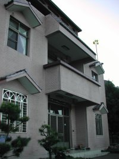

首先映入眼簾的，是今晚夜宿的地點 -- 錦雲山莊。大夥在稍事休息及整理行囊後，隨即展開了今天的登山行程。行程一開始，是一段段陡降的產業道路．不知是太興奮了，還是被悠閒的景緻所吸引。在下坡健行的路上，大夥的心情倒也愉快。殊不知，咱們偉大的老昌社長，正一步布帶領著我們，朝向痛苦的深淵邁去。

步行約莫一個小時的光景，咱們抵達了第二停車場，也就是馬拉邦山的登山口。在此地稍事休息、午餐以及簡單的社員自我介紹後，大夥隨即開始＂力爭上游＂-- 朝馬拉邦山的三角點前進。起初登頂的路上，是一段段陡升的產業道路。間或著陣陣微涼的秋風，以及兩旁翠綠的山林景緻，讓已經開始微喘的我們，仍能保有一絲攻頂的毅力與決心。只是....＂路是無限的寬廣，越過一座山，卻...還有一做山吶！＂

行經某一轉彎處，正當大夥被一整片翠綠的橘園所吸引的同時，眼尖的夥伴們，卻發現了一項足以證明造山運動的證據！那就是 ...一顆滿佈枯黃雜草的頑石！嘿 ...可別小看這顆毫不起眼的石頭喔！在褪去覆蓋其中的雜草之後，隱然呈現的，是佈滿石面的貝殼化石哩！試想想，我們現在所駐足之地，在數萬年之前，卻曾經是個滿佈無數海洋生物的海底世界耶 .... 在驚奇之餘，也不禁要再一次的讚嘆造物者的神奇啊！

繼續前行，隨著產業道路的蜿蜒與看似毫無止境的峰迴路轉，此刻的我們，已經開始顯露疲態了。突然有人傳出，在前行的不遠處，有個販賣冰涼飲料的攤販！此語一出，威力果然驚人，大夥的戰鬥力霎時提升了百倍以上，除了加快腳步外，並由腳程較快的夥伴先行前往，一探究竟。期待的心情是興奮的，但結果卻令人失望不已，大夥引頸期盼的冰涼飲料攤販，竟然沒開！？OH…

MY GOOD！....我朝思暮想的冰涼飲料啊....

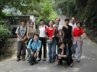

收拾起失落的心情，大夥緩緩的繼續前行。在行經一潭不知名的水塘與一戶熱情寒喧的人們之後，一群人佇立在一個登山告示牌前，仔細的觀看著。上面標示著：距離馬拉邦山2.1KM。那時我們心裡想著，也才不過2100公尺的距離而已嘛！Piece of a cake！殊不知，本次最艱難的登山路程即將由此展開....

【接下頁】

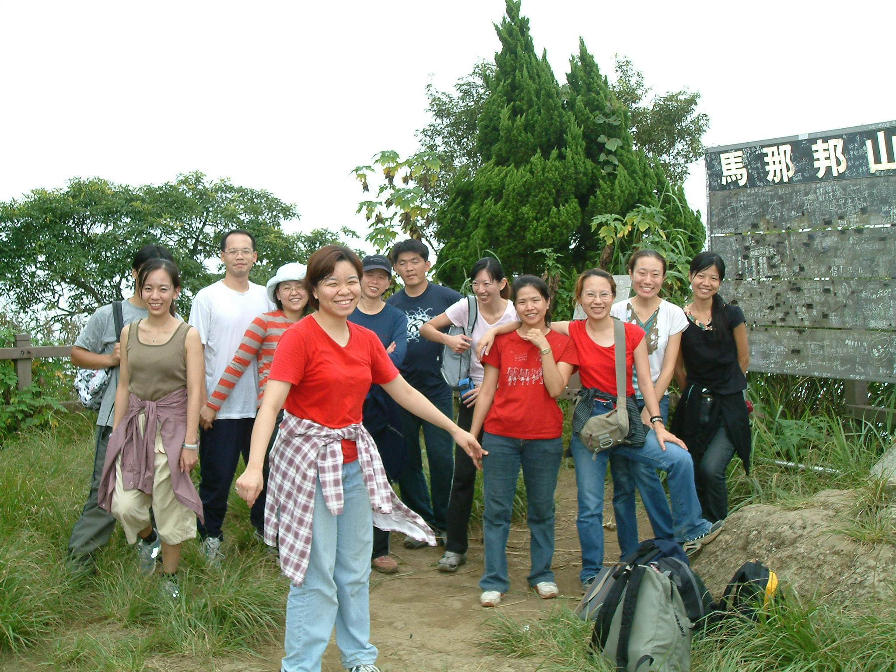

離開產業道路後，眼前盡是充滿泥濘的山間小徑，行走其間，不免有點難行。兩旁的闊葉類植物，密密麻麻的攀附其中，為我們遮去了大半的陽光，也憑添了幾許的涼意。老實說，在剛開始攻頂的路程上，其實還蠻愜意的。只是..…好景不常，越向上行，路就越難走。不僅濕滑的路面、長滿苔蘚的石頭，再再的影響了我們前進的速度，更誇張的是那幾乎50-60度的陡坡，非得要我們手腳並用才勉強能上的去。不到一半的攻頂路程，就已經讓大夥汗如雨下、累的氣喘如牛而疲憊不堪了。經過長達一個多小時的煎熬與掙扎，終於順利的登上了馬拉邦山的三角點了。原本懷著興奮的心情、期待能飽覽一番群山遠景的我們，卻被眼前這片白茫茫的景象給打敗了。搞啥麼東東嘛，白茫茫的一片，啥都看不到，突然有種被捉弄的感覺耶...順便一提，馬拉邦山山頂有許多＂吸人不眨眼＂的＂飛行小黑＂-- 蚊子。打不完，也趕不走。誠心的建議大家，下次如果還想再來馬拉邦山，防蚊液是一定要帶的啦。

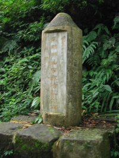

回程的腳步是輕盈的，心情則是愉快的，因為啊 ... 終於可以休息了嘛！大夥三步併兩步、飛快的往錦雲山莊直奔而去。途中經過了石門古戰場、紀念碑等地，除了緬懷先人外，也趁機讓早已不聽使喚的雙腿，好好的休息一下。而且啊，我終於能夠體會為什麼日本人會在馬拉邦山傷亡慘重的原因了。大家知道為什麼嗎？想一想嘛.......那就是啊......光爬山都爬到腿軟了，哪還有什麼力氣可以打仗呢？！笨喔........

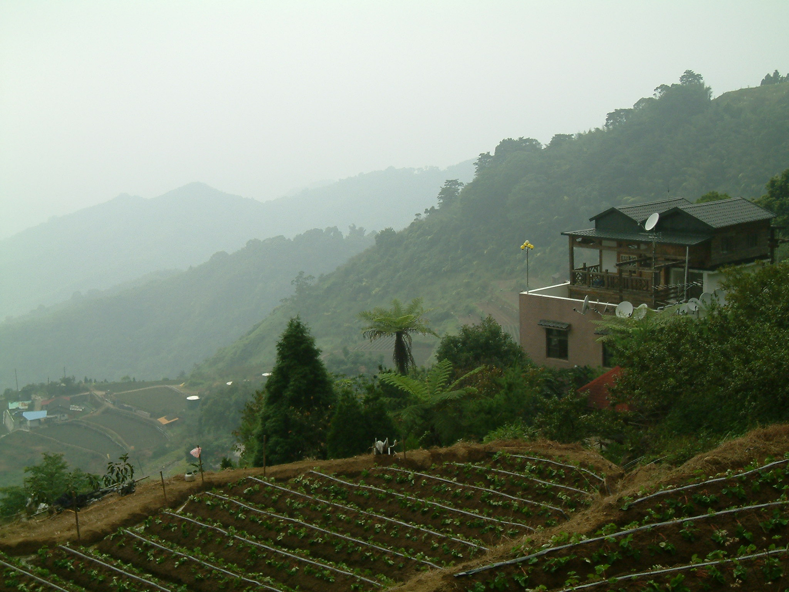

在將近四點多的時候，大夥終於全部都下了山，抵達了錦雲山莊，碰巧此時一成老師一行人也剛好抵達，熱鬧寒喧的氣氛不在話下；在山莊主人熱情款待晚餐之後，隨即召開了一年一度的社員大會，會中達成多項的共識，包括更改社團名稱、幹部遴選與社團未來動向等等，值得一提的是，原本因工作關係而無法參加此次活動的BINGO，意外的抵達了錦雲山莊，他對社團的支持與參與的熱誠，著實令人感動！

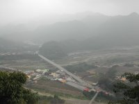

隔日，大夥起了個大早，在享用完山莊主人款待的豐盛早餐後，便開始了今天的旅遊行程。首先呢，第一站就是山莊主人大力推薦的法雲寺。可別誤以為這是個＂俗夠有力＂的寺廟喔！這兒的景色優美、建築典雅而又不失莊重，尤其是在廟前的廣場，可以鳥瞰整個大湖溪與汶水溪交匯形成的沖積扇平原，亦可以遠眺耀婆山與南勢山連綿一線的狀闊景緻！徜徉其中，讓人有股海闊天空、心曠神怡的暢快感呢。

【接下頁】

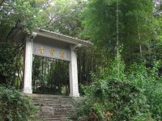

接下來參觀的是雪霸國家公園管理處。此處的建築風格獨特，且館內關於雪霸國家公園的各項地理資訊齊全，而且啊！還有精采的短片可供遊客欣賞哩。不過，請不要問我那天播放影片的內容為何？因為啊，我一直昏睡到影片播放結束後才醒來，真是不好意思呵......

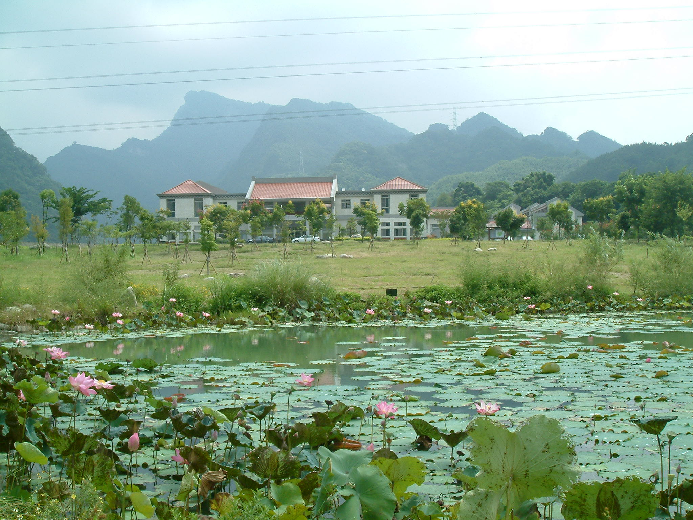

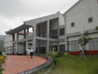

最後一站，也就是大夥最感興趣的－泰安老街豆腐嚐鮮之行。在草莓＂不小心＂的路線導引之下、驚險的穿越人潮眾多的泰安老街後，我們終於平安的抵達了目的地....呼.....謝謝老天爺啊！在品嘗了各式各樣的豆腐、祭完大夥的五臟廟後，我們帶著愉快的心、與滿滿的回憶，滿足的踏上了回家之途。

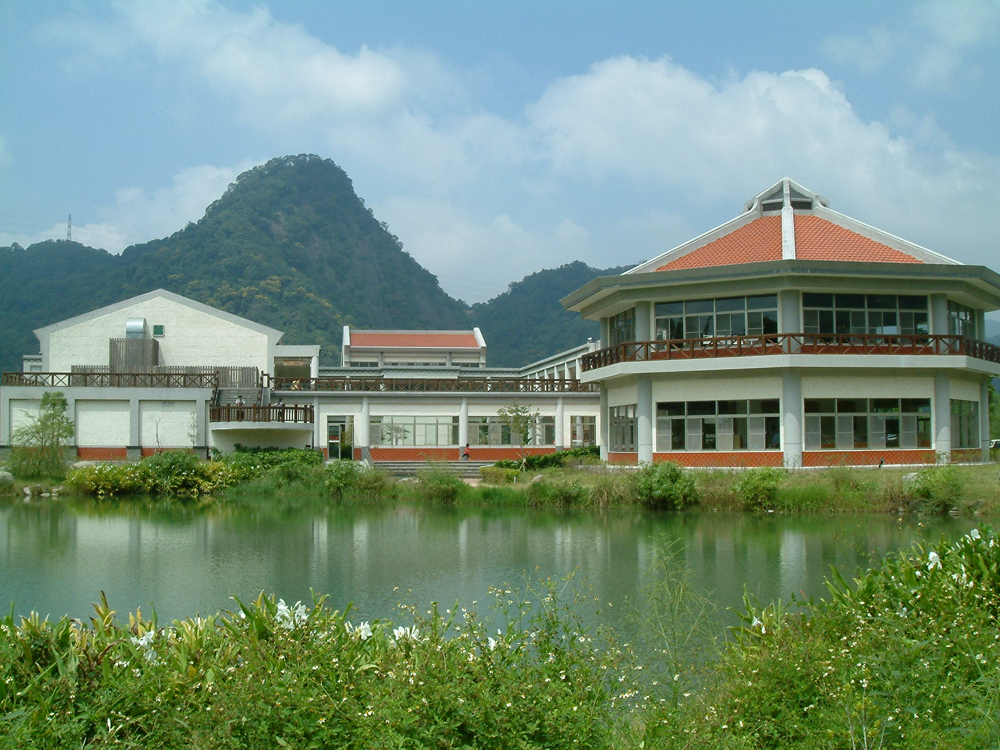

後記：感謝社長大人費心的安排，讓我人生中精采的印記，再添一筆；也謝謝各位夥伴們細心的照顧與包容，讓我深刻的感受到熱情與生命的活力！很高興能與大家相識，僅以此篇手札，聊表我的感謝之意。

～吉益～

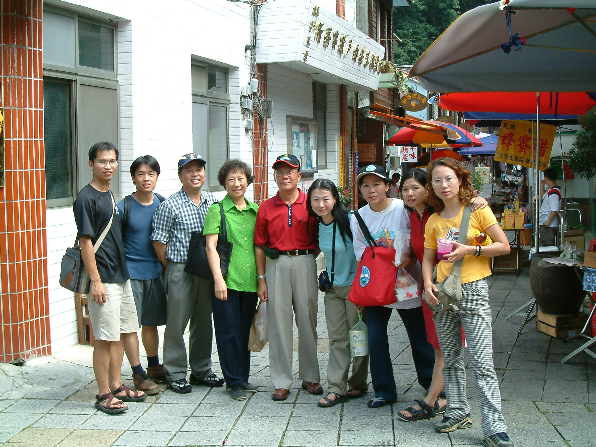
