# 合歡北峰-天巒池縱走

> 民國92年10月

## 合歡山北峰－天巒池縱走遊記    資料時間2003/10/10-10/12

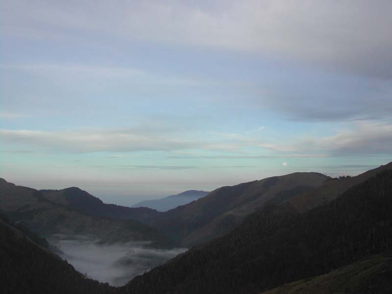

將身旁的事告一段落之後，我就迫不及待地與草莓聯絡，詢問山社活動事宜，想參加睽違許久的山社活動並見見夥伴們。在魚與熊掌不可兼得的情況下，我選擇參加「合歡山北峰--天巒池縱走」的活動。因為顏彤說「妳不來會後悔！」，為了不讓自己後悔，於是乎，就有了這篇遊記的誕生囉！

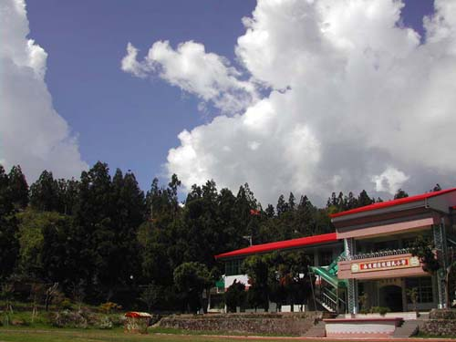

由於我是實際上南區僅存的「保育類社員」，所以我於十月九日星期四就提前到顏彤家借住一宿，當晚，還有名義上南區的社員「吉益」。十月十號一早，等草莓接到芒仔與其女友JILL、還有BINGO、再加上秀逗、顏彤、婷婷、吉益還有我，一行九人，兵分二車，就往合歡山出發了！

往清境的途中，會覺得清境不再是「清境」了！因沿途旅館、民宿、咖啡店不斷增建中，房屋蓋的美輪美奐，頗具特色，代表觀光事業很是興盛，號稱「小瑞士」。但在我眼中看來，總覺得有點雜沓，大家各行其事，過度開發。中午，我們在清境小學遠眺青山浮雲午膳，真是一大享受啊！

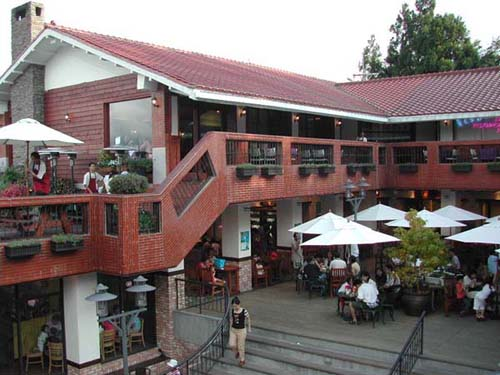

為了怕遇到塞車，捨棄了造訪台灣最高的7-11，就逕往合歡山駛去，但我們最不願意遇到的事情還是發生了。但也正因如此，讓我這個暈車女王得以下車透透氣，山上的空氣真的很與眾不同，清冽、舒爽！後來得知肇因是有一輛車子爆胎，造成雙向車道的癱瘓，多虧吉益的鼎力相助，才使這個困境得以解決。但遺憾的是很多人都袖手旁觀，結果只是大家皆動彈不得的窘境。接下來小塞一下之後，就很順暢地到達合歡山了！

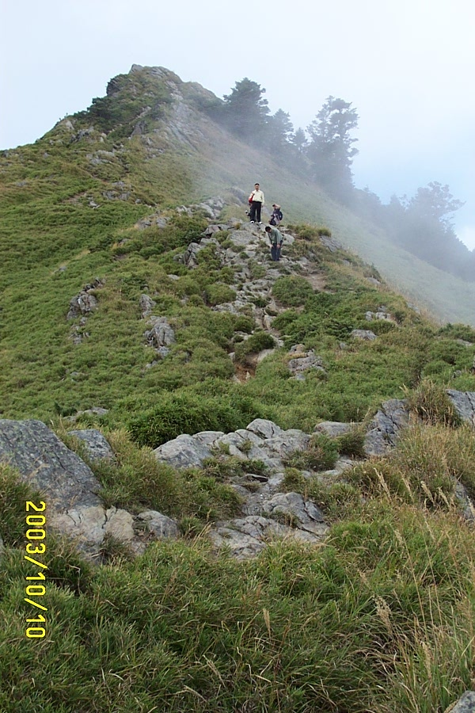

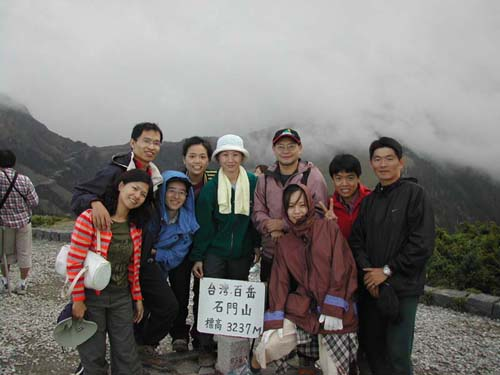

山上氣溫冷颼颼，下著綿綿的霧雨。大夥兒趕緊將塵封許久的大衣拿出來亮相，整裝完畢，就即前往合歡尖山。今天對我們來說，算是郊遊日，是明日嚴厲行程前的暖身。一開始是一口零食、一腳前進，到後來技術沒那麼高超了。畢竟我們都是四肢遲鈍的社會人士，沒多久就氣喘噓噓，直嚷著要休息。在走走又停停的情況下，我們還是順利地征服了合歡尖山。

然後我們選擇從合歡尖山直接下殺到石門山。這段路比較陡直，有些路段落差極大，所以儘管小心翼翼，仍是會不小心地小滑一下，所幸皆能及時站穩腳步，並且若無其事的說「沒事！沒事！」到了石門山登山口，就輕鬆多了！因為石門山是號稱全台灣最易手到擒來的百岳。前人為我們舖下【接下頁】

一條康莊的步道，讓我們得以悠閒地享受這好山好景，而不必戰戰兢兢足下是否踩空或滑壘。這時顏彤突然召開社員大會，神秘地宣布臨時動議後，只見大家的頭都不自覺地往下瞄。毫無意外地，我們輕易地就散步到三角點。身處群山四處眺望，很是愜意。

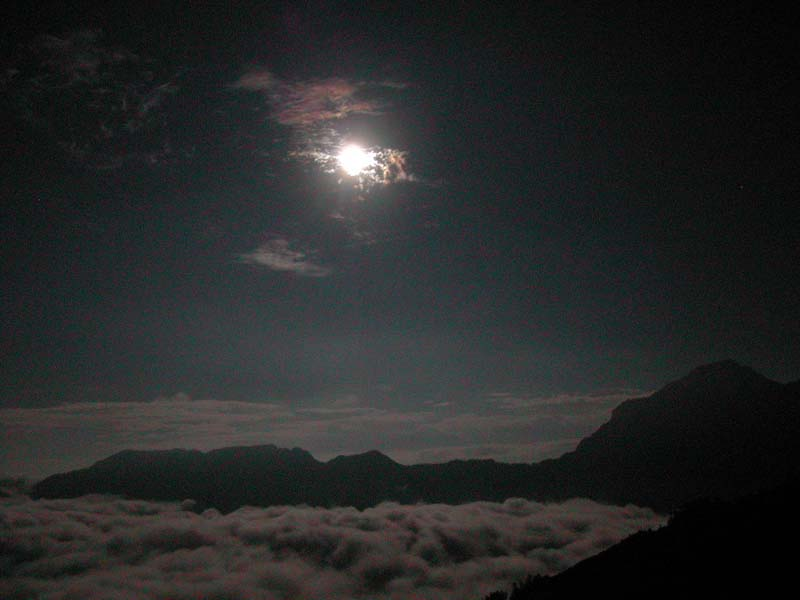

晚餐將食物掃個精光後，大家齊聚看台上看月亮。當天是望月，月色極亮，極美，在月光的照映下看雲海，別有滋味。尤其是夜晚的奇萊山更是讓人感到陰森恐怖。這時突然發生了一件事情，BINGO在草莓對他說出「我們之間終究有道阻隔」這類的話後，身受打擊、精神恍惚之際，又受到顏彤的驚嚇而被絆倒。見血了！令眾人神色緊張、呼天搶地，驚動旁人貢獻一整盒的面紙，謝謝他的善心。草莓、JILL捐出止血帶(髮帶) ，才稍微減輕BINGO的傷勢。回到落腳處，BINGO因草莓那句話而傷心過度急欲自殘，表演「剝皮」的噁心鏡頭給大夥看，又造成此起彼落不少的驚動聲。

前面提及社長突然召開社員大會的原因，是為了給即將出國的芒仔舉辦一個歡送會，每個人要送給他一個小禮物作紀念，所以當時大家才會紛紛地往地上尋寶。當芒仔念著我們在手電筒燈光下蹲著所寫的卡片時，當事人就遞出其禮物。有社長夫婦「心」留「台灣」的石頭、有草莓的方巾、吉益的優質頻果一顆、有陪伴BINGO數年參雜斑駁血跡的綁腿帶、有秀逗補充電解質的元氣包、還有我用了一半的萬金油。(不是我沒有誠意，翻遍包包，覺得「它」最實用了，有家鄉味喔！)最後在秀逗的禱告下，結束了今天的行程。

十月十一號星期六凌晨，大夥從小風口整裝待發，首要目的地是合歡北峰。為了這一次的縱走，我特別添購了登山鞋、護膝、登山杖，希望對久未運動的我有所助益，因婷婷說「想到就皮皮挫」，已經讓我有可能會很慘的最壞打算了。每個人也因為得到事先的警告而準備齊全，以迎接此次的挑戰。正所謂的萬事具備，只欠東風。我想這個「東風」就是老天爺保佑、阿彌陀佛、阿門！

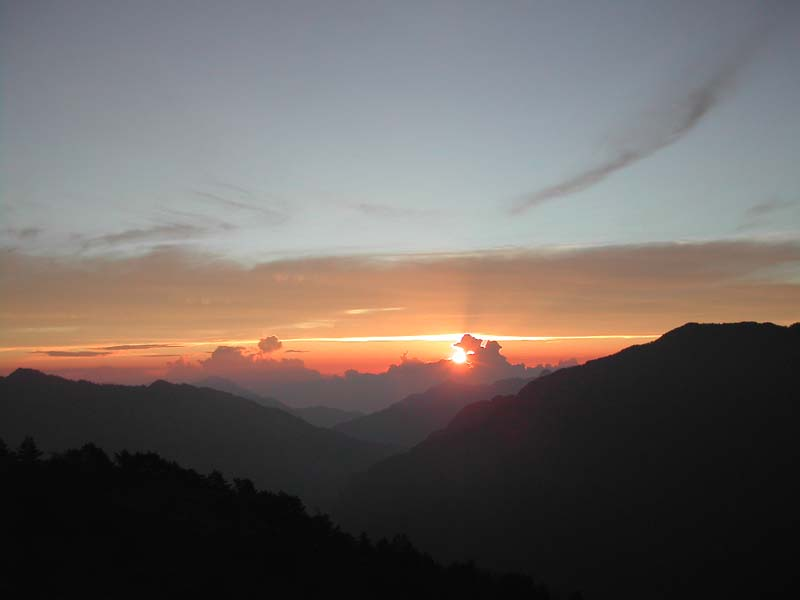

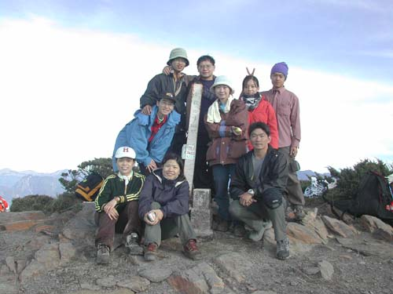

這時顏彤、BINGO二人須將一部車開往另一個登山口，以利大夥下山的接駁，其餘七人先行出發。隨著大地甦醒之際、萬籟俱寂，只有我們的腳步聲及喘氣聲，在休息的片刻鳥瞰整片山群，雲海瀰漫其間，隨著曙光的出現，幻化成萬千的色彩。我們趕不及到北峰看日出，但在半山腰上欣賞已經很壯觀了，儘管在許多照片裡看過日出的美麗，但我想只有身歷其境才能感受出那股神聖的光輝，是如此溫煦、無與倫比。

在此次活動中，最讓我留戀的食物就是蝦味先了，總是在我最飢餓轆轆時溫暖我的胃。補充完能量後，又得展開步伐向前爬行，時間過的很慢，「我不知道何時能走到目的地，我祇知道我已經走在往目的地的路上」。終於，看到反射板了，就像打了一劑強心針，合歡北峰應不遠矣！大家的步伐漸快，這時顏彤、BINGO追上我們了，就這樣大家一同登上合歡北峰。

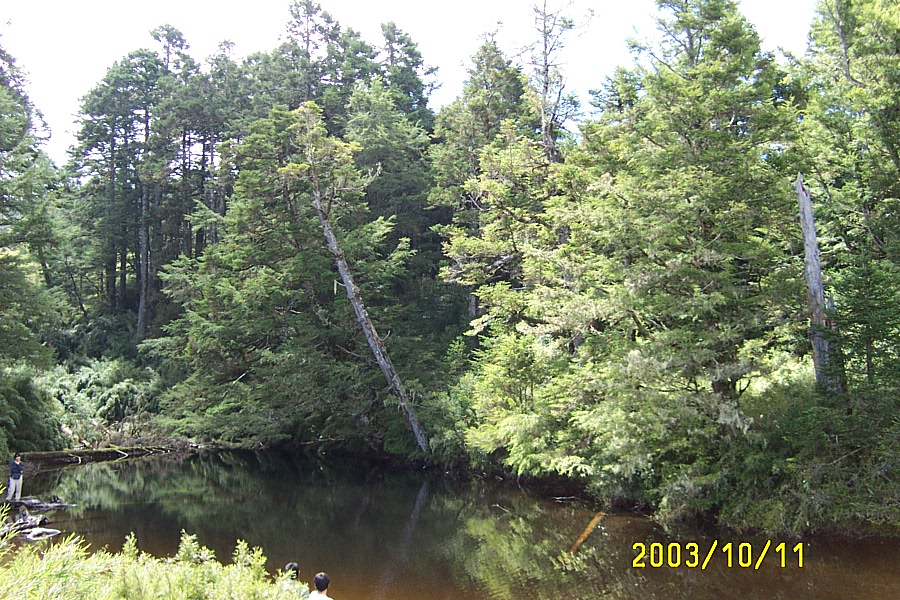

在北峰休息完畢，大夥就開始抱著戒慎恐懼的心情前往人跡罕至的天巒池。因為接下來的路段皆是下坡，路況濕滑難走也就罷了，但沿途會有許多寒帶植物松柏、箭竹有如仙人掌般的「葉」像針刺的你措手不及，這樣的大刑伺候讓人手忙腳亂、驚叫連連。一方面要注意腳下的陷阱，是否有落差、斜坡、大洞，以防失足；一方面要眼觀四方，怕被兩旁的「綠林兵」攻擊的傷痕累累。只見大夥此起彼落的尖叫聲，尤其以昨天的傷兵BINGO叫得最大聲。本來想說走在較後面，可以藉由前面的身先士卒以提醒自己更加小心避免落得同樣下場，但我錯了，「綠林兵」是四面埋伏、萬針齊發、無一倖免。我們只能苦中作樂地比較著誰的「紋身」較美、誰的「滑壘姿勢」較帥。我們走在迷林裡，想像著自己是先民們在開荒拓土；走在林蔭小道上，幻想自己是古代的俠客，千山我獨行般的瀟灑，哈哈哈…。

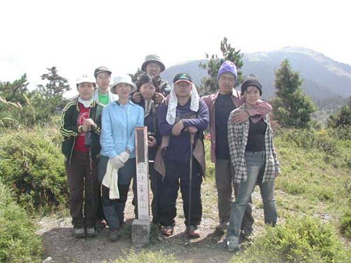

就當我們已經放棄，不想再做無謂的抵抗時，天無絕人之路，腳下所踏的土地，大隻的螞蟻到處亂竄，我們知道水源地就在不遠處，果然，天巒池就近在咫尺，亦宣告著我們苦難已結束。中午飽餐一頓，瀏覽寧靜的天巒池後，就步往武法奈尾山。這裡像是遺然世外的「靜地」，背倚北峰，視野遼闊，風徐徐吹，太陽當空照，蜜蜂擾人眠。讓人感覺很舒服，舒服的想打個小盹，冥想或只是單純的發呆。此時秀逗、草莓、吉益已先行下山去開車，其餘六人則帶著雨後天晴般的心情繼續未完的行程。

終於看到公路了，真是令人雀躍！尤其在看了一大片的蘋果園時，簡直讓人忘了剛才的疲憊。紅通通的蘋果，其香味漂浮著，讓我跟婷婷忍不住流連駐足，並留下不少的倩影，我看BINGO快受不了了！但對於喜歡清秀佳人這本書的女生，應該抗拒不了這樣如圖畫般的景色吧！

晚上夜宿福壽山農場，吃著熱騰騰的羊肉爐、蔬菜鍋，慶幸這次任務的順利圓滿，可能是秀逗的禱告發揮其效用。隔天一早，到傳說中的天池參觀，可惜我沒有靈性，感受不出它的磁場。然後來到夢幻中的花園，一大片的波斯菊呈現在眼前，好美！內心響起連連的驚嘆聲。儘管已畢業多年，但少女的浪漫情懷被喚起，相機喀擦聲不絕於耳。這次的活動就在大家的滿心喜悅中於花海裡劃下了完美的句點。

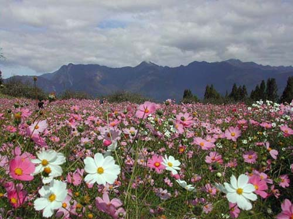

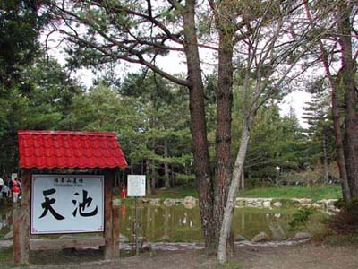

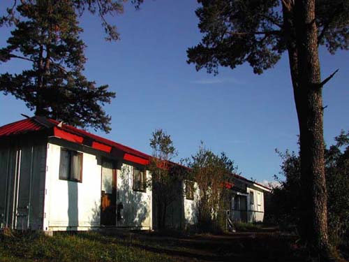

撰稿／蔡娟娟　圖片／黃吉益

合歡北峰 -- 天巒池探勘後記(一)            楊婷婷2003.8.31

這次有幸和老昌、草莓、秀逗一同去探勘，回來後有些心得想和大家分享，也可以算是大家行前的心理準備吧。

出發的前一天，我和秀逗先到老昌潭子的家和他會合，而忙到晚上十一點才就寢，隔天一早三點就得起床準備出發了。三點半出發到逢甲接草莓，四人都到齊後就一路飆往合歡山了，因為老昌說原本這是兩天的行程，而我們要在這一天走完，預估來回路程至少要花十二個小時的時間，所以得早點到合歡山。一路上雖然大家都睡意很濃，可是坐在自認當地人的老昌車上，每個人都成了搖擺娃娃，晃來晃去根本睡不著，坐在前座的我則是嚇的根本不敢把眼睛閉上。不久，在老昌神乎其技的風火輪下，我們五點半就到合歡山莊了。

雖然現在是炎炎夏日，可是清晨的合歡山氣溫然非常低，大約10度C左右，所以上山還是最好帶擋風的輕巧風衣以免凍得吱吱叫；但爬山時，也別帶太厚重的衣物，因為太陽一出來，加上登山運動後所大量產生的的熱能，馬上就讓你覺得夏天又回來了。

我們整理好裝備後，約早上六點半從小風口出發，要上北峰前約兩小時的陡坡讓剛上三千公尺高山的我們感到有些吃力，所以在剛開時的這段路程，大夥最好不要操之過急，先調整好自己的呼吸和步伐以免身體不適，而我每次走這段路時都會覺得眼睛很乾澀、很痛，所以下次我會學聰明，準備帶眼藥水減緩眼睛的不適。大約過了一個小時，爬在這陡坡上就比較不那麼吃力了，不過8點後高山上的艷陽直射，開始曬得令人皮膚快燒焦了，所以別忘了要帶遮陽的物品。

講了那麼多，好像爬這山挺辛苦的也沒什麼樂趣，錯了！當你沿途看著這雄偉的大山在你眼前鋪展開來，看到滿山遍野的綠茵和沿途可愛的高山植物，就像來到阿爾卑斯山一樣。雖然爬山很喘、很累，可是身邊吹來的卻是沁涼的山風，讓人感到十分舒暢，這合歡山的冷氣不只免費而且開得挺強冷的，所以夏天爬高山最好了，不會有擾人的小黑蚊，也不會讓人感到溼熱難受，那沿途壯麗山色之美就更不用說了。

我們約一個小時四十分就到北峰了，不到兩個小時就能登上百岳之一，挺值得的，而且在北峰就可以遙望到福壽山農場喔！稍做歇息後，我們這先鋒隊急忙啟程前往天巒池，原本以為到天巒池的路上，也和上北峰一樣好走，可是再走了半個小時後，我們開時陡下，沿途雖未到披荊斬棘的程度，可是看到箭竹林可以長到變成綠色隧道，讓我們在裡面行走，也讓一直以為箭竹就是矮不攏咚的我開了眼界，我們在箭竹林中不斷往下走，我突然覺得我好像變成一隻山羌，走在羊腸小徑裡穿梭尋找水源。有時我不禁要質疑，我們沒有走錯路嗎﹖這時老昌都會說沒錯，地圖上的位置就是這麼畫的。

好不容易經過幾次有驚無險的滑壘，三個多小時後我們終於抵達天巒池，這時我才真的相信老昌沒有騙我們。天巒池雖然比不上大鬼湖，但是身處在這深山也別有一份高山湖的靜謐。好不容易可以大休一下，吃完美味的拉麵道後，我們便繼續動身前往下一站「武法奈尾山」。煮中餐時老昌已先去探過路了，所以我們很順利的就找到了路，這座山聽起來挺不偉大的，可是當我爬上山頂看到如此棒的視野後，我發覺今天早上的辛苦是挺值得的。視野到底有多棒﹖等你自己親自來看吧。

合歡北峰 -- 天巒池探勘後記(二)

走到武法奈尾山，按照老昌原來的計畫是還要再原路走回去小風口，經過一個早上從北峰直下到天巒池，我心想下來就那麼累了，要我再原路走回去，那不得走到晚上七點鐘，我們幾個建議試試繼續往下走是否有路，老昌說「根據地圖的上的標示有，可是不知道在哪﹖」後來我們還異想天開的打電話問老師，感謝中華電信的無遠弗界，我們聯絡上了老師，可惜他老人家也不知下山的路在哪，只告訴我們往下走就對了。為了不走回頭路，最後我們只好遵照老師的指示往下走，很神奇的我們真的找到往下山的路。下山的路比之前的陡坡好走多了，心想到走兩個小時就可以到公路又不用再長途跋涉的走回小風口，腳步不禁輕快許多。

走了約一個半小時，我們終於出了登山口，心想一定可以很快到公路上，沒想到又得走過那長長的下坡水泥路，雖然沿途的景色也挺不錯的，從結實纍纍的蘋果樹下穿過，挺像在加拿大的感覺（不知各位是否看過清秀佳人這部片子），可是一整天的下坡路，讓我的腳已經快廢了，而走在這硬梆梆的水泥路上，更讓我痛的受不了。我這時決定採取以上坡姿勢倒著走的方式來走，ㄟ！這方法還挺不錯的，腳果然比較不疼了，後來越走越有心得，腳程也越來越快了，老昌也起而效尤，最後連草莓和秀逗也加入了倒著走的行列，這樣的姿勢挺好笑的，好像一群人在表演倒帶動作似的。

過了半個小時，約下午四點鐘，歷經千辛萬苦，終於到達我們的希望之站「公路」，老實講我們並不知道自己到底在哪﹖不過據我們推測我們應該是在大禹嶺通往梨山的路上，這時也不管那麼多了，現在最重要的是搭到便車，趕快送我們回小風口取車。可是在公路旁攔了好久，約莫過了半個小時，總是不見善心人士願意停下來載我們這群看來狼狽的登山客，最後我們不願再枯坐空等，決定動身走往大禹嶺，邊走再邊攔車。沿著公路越走越生氣，心想台灣人被國際人士讚譽是最熱情的人民嗎﹖怎麼我卻一點也感受不到。也許老天爺聽到了我們的不滿，這時神蹟出現了，一輛九人座的廂型車出現在我們後方，我顧不得心靈已受挫幾次，為了回家我急忙招手，感謝老天，車子停下來了，而且車上只有司機一人，太好了！和司機閒聊之下才知道原來他是一位在梨山工作的果農，正準備到大禹嶺載他今天請的工人，我們請他先載我們到大禹嶺，到那我們再想辦法攔往合歡山的便車，至少在那搭到往小風口便車的機會應該更大了。

到了大禹嶺，草莓攬到一輛幾乎滿載一家子人的廂型車，拜託人家空出一個位子載老昌回小風口 ，這家人挺有愛心的，願意挪出位子載我們的司機老昌回小風口，再讓老昌開車回來接我們，耶！我們終於可以回家了。雖然人還再這兩千多公尺的大禹嶺，但我知道我們終於可以靠自己的力量回家了。

等我們下到清境都已經七點半了，在松崗「魯媽媽小吃」吃晚餐，看到那麼多的遊客，真有點不習慣這喧鬧的俗世。最後回到台中時都已經九點半了，而且從清境下來的山路還塞車，送完草莓回家，回到潭子已經晚上10點鐘了，老昌已經累的快趴下了（這一天，走了一整天的山路又得開7個小時的車，真的很累人），秀逗也還得再騎20幾分鐘機車回家，我想這晚大家都特別好睡。

合歡北峰 -- 天巒池探勘後記(三)

看完以上文章後可別不敢來參加這次的活動喔！當然經過這次的探勘，我們也給老昌許多的建議（想想大家都已經是朝九晚五的老骨頭了），但是為了秉持老昌的一貫作風不磨不成器與兼顧喜愛休閒輕鬆風格的老骨頭們，最後活動的主軸--「北峰到天巒池」行程不變，不過我們也將自己曾經去過，很值得向大家推薦的景點納進這次的活動。這是山社第一次大膽的嘗試舉辦三天的活動，因為這裡的美景真的需要這些時間讓您細細去品味。秋天到了，不知你是否也想像落葉一樣四處飄蕩，想要遠遊，不要再遲疑，背起行囊，讓我們一同走入深秋的山林，體驗台灣之美。

ps：要走這段路得膽大心細，無膽勿試：得有堅強的腳力，或至少要有鐵打般的意志力。
