# 關山越嶺古道

> 民國92年12月

## 冬季活動－關山越嶺古道遊記       顏彤  92 / 12 / 27~28

鈴 ~ ~，天啊！是凌晨三點半。好不想離開這溫暖的被窩，可是已經報名參加活動，又是身為社長的我，只好把婷婷、秀逗挖起床。在前往台中接了草莓之後，我們就直奔集合地點 – 台南火車站。

到了台南火車站正好趕上集合時間，在搭上20人小巴士並接到Bingo、老師一家人，我們就前往關山越嶺古道之中之關。這次的活動除了學弟妹和我們OB的夥伴之外，還有老師一家人以及未來的親家。

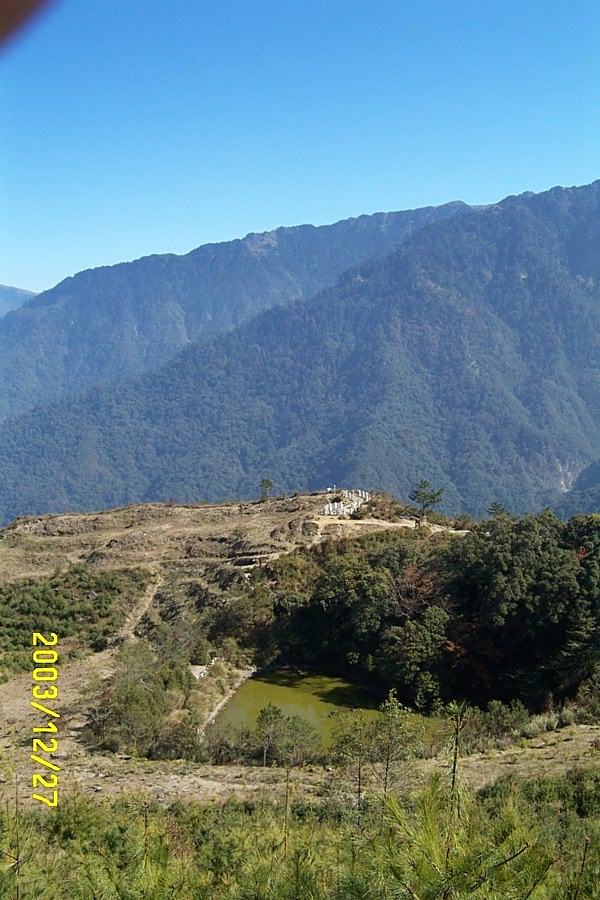

經過3個小時的時間我們終於抵達今天登山的起點 – 天池。一來到天池，我、Bingo、秀逗、草莓都回想起8年前的那段痛苦回憶 ……。記得在我大二的寒假 (84年)，我們辦了一個南橫健行的活動，傻傻的我們也不知天高地厚，就跟著老師踏上南橫之路。第一天我們在台南市搭乘興南客運，到達最後終點站 – 天池，這時已經是中午了。那時天空下著不大也不小的雨，氣溫也非常的寒冷，英明的老師於是下令就在長春祠的涼亭煮中餐 ……。沒錯，就是那座涼亭，開啟了我們痛苦的南橫健行之旅。

*▲天池全景*

今天的天氣真是晴朗，熾熱的太陽將我們身上厚重的衣物都給蛻了去，身上只留下單薄的長袖外衣。爬上了幾十個階梯，再穿過一段小徑，眼前見到的是一潭渾濁綠色的池子，旁邊還有焚燒過的痕跡，這樣的情景對我來說是非常的熟悉，幾乎是所有山上容易到達的湖潭都有著如此共同的劫難，真令人同情啊！越往高處走，整個天池的形貌都展現出來，像一個愛心的形狀，靜靜的躺在因之前慘遭森林大火的枯黃土地上，更顯得她的美麗與偉大。

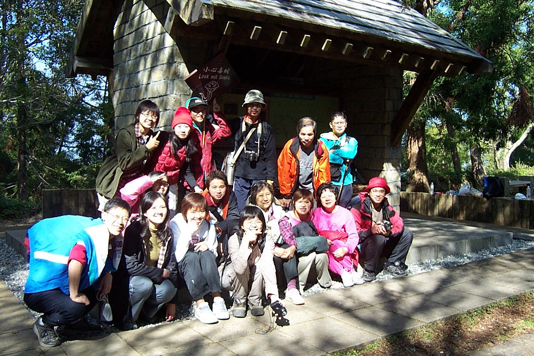

不久，我們到達了最高點，是由大小石塊堆砌而成的小山頭，像極了鳶嘴山的山頂，站在上頭才感覺到登泰山而小天下的氣勢。由最高點往前，就進入較為寒冷的背陽地區。由一路上艷陽高照的步道進入到樹蔭密佈的小徑，身上會不由的打了哆嗦以調節體溫，就連我的手也開始漸漸變的冰冷，以保持住我身體的體溫。

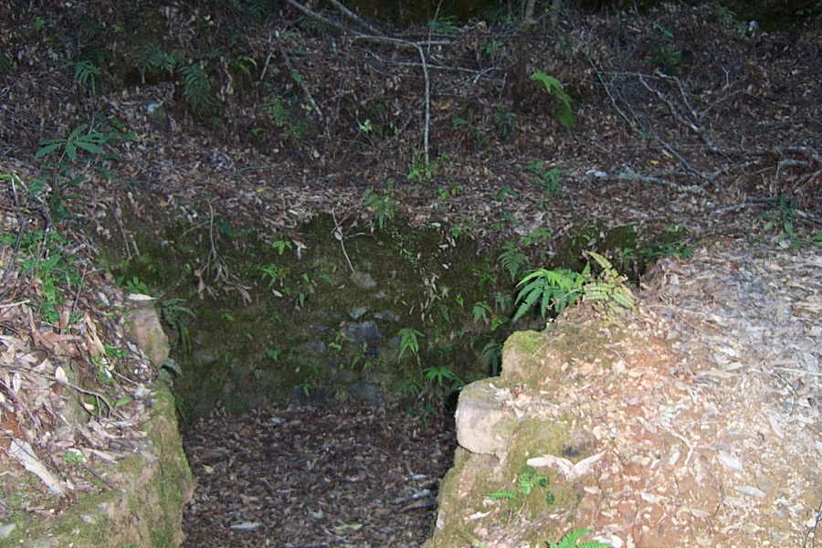

*▲木炭窯*

*▲涼亭前的合照*

這條小徑很原始，有著很複雜的生態，不過也有日據時代遺留下來的古蹟，增添著這條古道的意義及價值。我們一路上談笑著，偶爾也因為美麗的風景而駐留拍照；不過因時間的關係我們還是必須趕路。在經過一大片的咬人貓，我們到達一處有解說牌的亭子。在這裡我們休息、拍照順便欣賞這美麗的…咬人貓。天哪！這裡也太多咬人貓了吧。

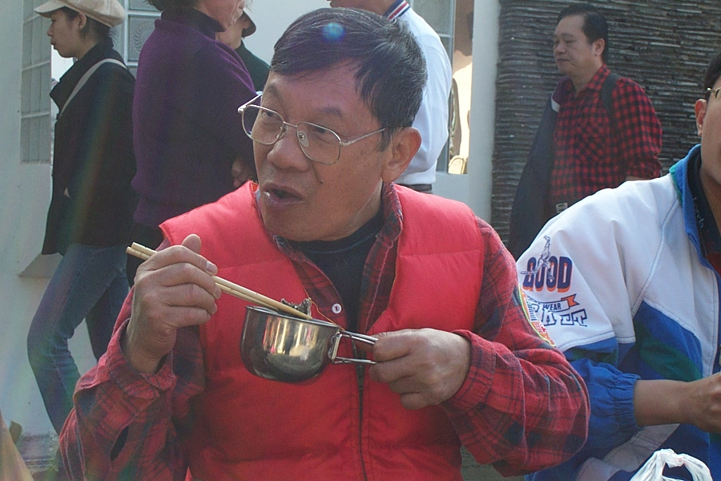

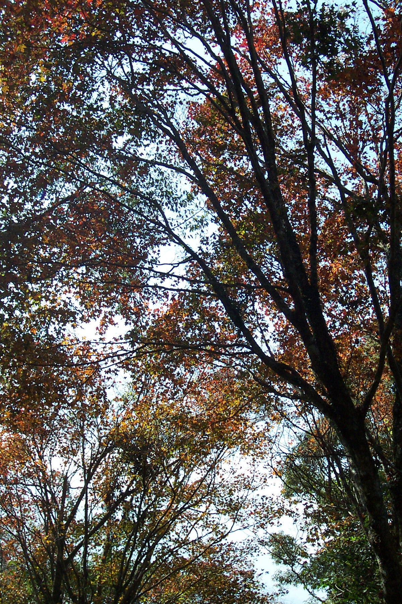

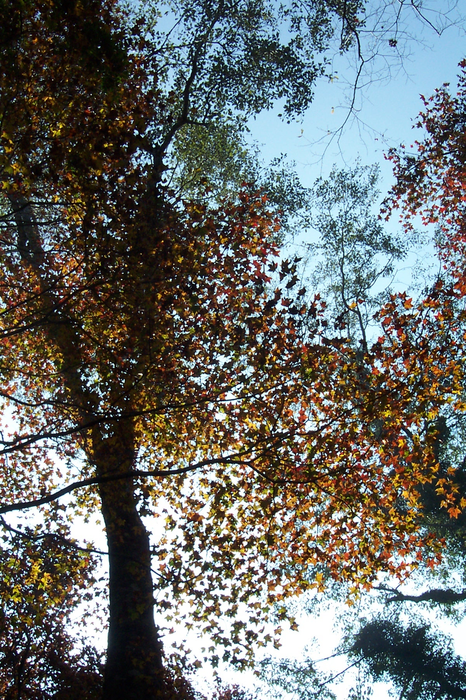

*▲仙境楓樹*

*▲仙境楓樹*

休息夠了，大夥兒也就上路；可就在這時候，老師偷偷的帶我們幾個到一處隱密的仙境。這個仙境正好是跟下山的路相反，是一處壟起的小高原。外面盡是荒煙漫草，還有些倒塌的樹幹，但只要往上走幾步路，就到達這意想不到的仙境。這裡的腹地並不大，但周圍都被楓樹圍繞著，正好現在是冬季，因而此時的楓葉呈現出紅、橙、黃、綠的顏色，在這樣五彩繽紛的世界裡，讓我們彷彿覺得這仙境並不屬於關山越嶺古道的一部分，而是我們誤闖了另一個時空的禁地。我們在這裡待了許久，差點忘記了我們此行的目的，等我們回過神來，大夥兒都已離我們遠去，於是老師就催促我們趕緊上路，不過貪戀「美色」的我跟婷婷卻沒注意到老師他們已經離我倆而去了……

*►  趕快吃不要被他們搶走喔!*

到了中之關的停車場，就見到學弟妹們已經拿出傢伙煮大餐了。真好，能夠在這有點寒冷的山上吃到泡麵是我們登山者的幸福；然而沒想到走上前去一瞧，天哪，你能相信我們眼前所看到的是什麼嗎﹖是一鍋20人份的羊肉爐。喔，真是讓我們感動的痛哭流涕了。

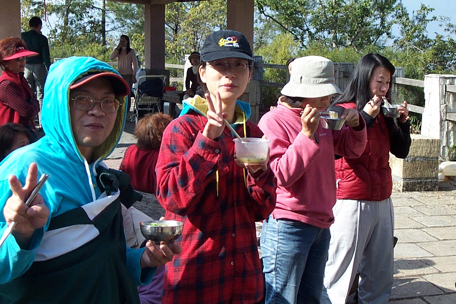

*▲終於搶到吃的了，勝利。*

就在我們等待羊肉爐出爐的時刻，社長俞方突然拿出盆子及爐子，她說她要為我們煎香腸；Oh，my god！(我們都不得不把珊綾的口頭禪給拿來一用)真是太神奇了，真是讓我們覺得太幸福、太感動了。經過幾分鐘的時間，煎香腸所散發出的香味已經蓋過羊肉爐的味道，就連其他遊客都被這香味吸引過來，還以為我們是在賣小吃的。這香腸真的就如俞方所保證的那樣好吃，可惜一人才只能分到一條而已。吃完了香腸，羊肉爐也差不多好了。這羊肉爐真是料多實在又美味，我們每個人吃的又飽又滿足，肚子裡都充滿著學弟妹的用心 ，讓我們感覺是既暖和又幸福。

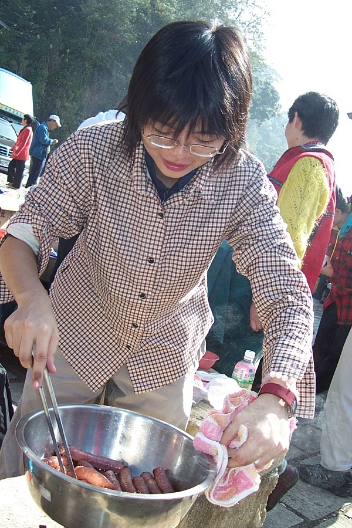

*▲香腸西施*

在飽餐一頓之後，自然睡意就跟著而來，就在我們還迷迷糊糊的情形下，車已開到了甲仙。早上經過此地時，我們最期待的「可口冰店」竟還沒開始營業，讓我們錯過了它的芋頭冰，因此我們來到甲仙就直奔「可口冰店」。我們發現衝在最前頭的居然是跩跩成，沒想到最期待吃芋頭冰的居然是老師，真是跌破大夥兒的眼鏡。大家就像蝗蟲過境般的一人拿了一球芋頭冰大快朵頤，這時突然冒出一個聲音：「我要一桶芋頭冰。」是誰這麼狠，回頭一看原來是我那愛吃冰的老婆 – 婷婷。她說要和我合吃一桶芋頭冰，不過最後這桶冰還是有很多人大家一起合吃，算一算吃一大桶的冰要比吃一球一球的還要划算呢。

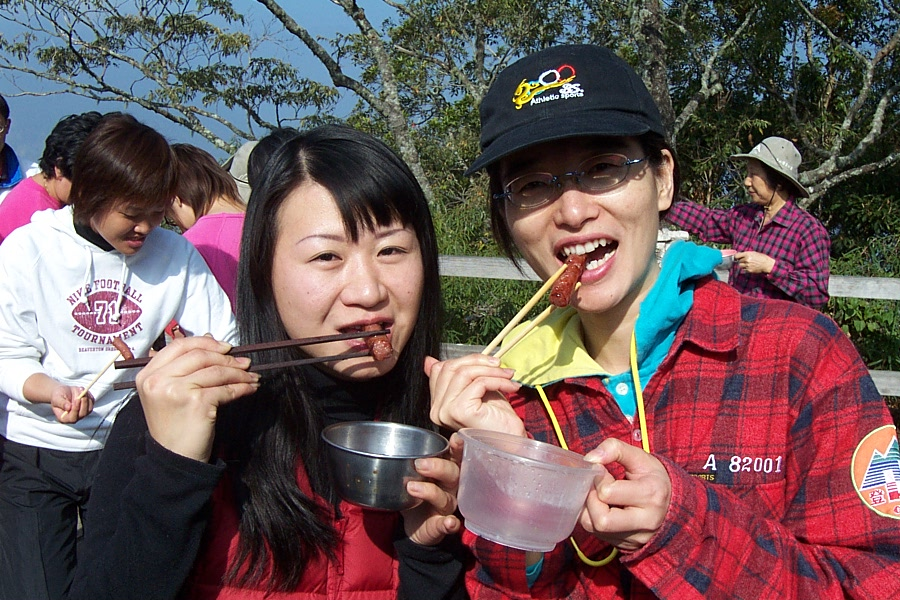

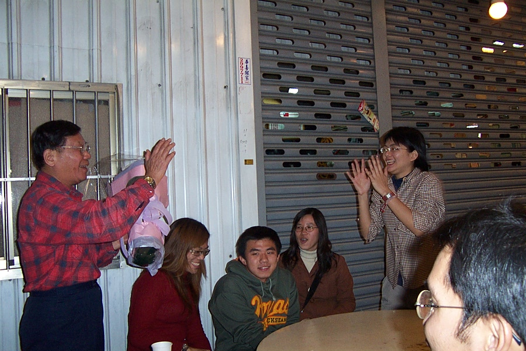

*▲香腸好吃*

終於很滿足的大吃芋頭冰，大夥的精神也因此被喚醒了，於是我們就展開車上的娛樂節目 – 卡拉OK大賽。剛開始大家還不大好意思開口，後來經由社長俞方的激勵，大家都開始展現自己的歌喉，而老師也再度拿出他的招牌歌曲「友情」，這時是大夥唱到最High的時刻，而親家公及親家母也被我們的氣氛感染，也展現他們美妙的歌喉，我們就這樣一路唱回了台南。

*▲ 學弟妹獻花給老師*

晚上，學弟妹選了一家距離老師家不遠的薑母鴨店為老師慶生。因為人數的關係，所以我們分坐兩桌，可後來老師覺得這樣子好像有隔閡，因此就叫我們合桌而坐，雖然是擠了些，但感覺上才像是一家人。等大夥都吃了差不多，學弟妹就送上蛋糕、花束及為老師慶生。老師好像每年許的願望都一樣：希望我們社團能越來越好、大家能找到好的伴侶…

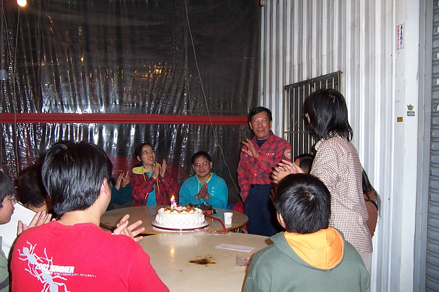

*▲ 老師正在許願*

慶生完畢後，學生弟妹就驅車回宿舍，而我們幾個才要跟老師痛飲。一到老師家，老師二話不說就拿出朋友送他的私釀高粱酒，不過就只剩下三分之一而已。大夥不一會兒的功夫就喝完了，於是老師又從冰箱拿出冰酒 (ice wine)，我們也將送給老師的草莓酒給打開來，可是愛喝酒的老師及酒鬼Bingo對這種低酒精濃度的酒根本不覺得那是酒，於是酒鬼Bingo就慫恿老師到地下室拿出陳年好酒。老師拿出了他的押箱寶---好幾十年的陳年高梁，Bingo一直要老師開來喝，可老師視之如玉寶，根本不理會Bingo，害得Bingo盯著陳年高梁直流口水；不過老師為了安慰他，拿出私藏多年的「酒鬼」，只不過這「酒鬼」的味道有點怪怪的，於是我們就把它到倒不喝了。我們邊喝酒邊聊著以前一起登山的回憶，不知不覺夜已深了，於是我們就帶著不知是醉意及睡意，回房間睡覺了……

感謝學弟妹們這次所舉辦的活動，不只是成功而已，更令我們感動，相信社團會在你們努力之下越來越好。
