# 梅峰農場自然生態體驗營

> 民國93年8月

～寫在前頭～

由於本次的活動是在颱風過境後不久舉行的，再加上七二水災的陰霾、土石流、坍方等種種不利因素環繞，讓這次活動的舉行憑添不少的變數！但，本社團秉持著冒險犯難、勇往直前的精神，再加上參加的社員們個個義無反顧、捨我其誰的大無畏勇氣下，本次活動終於得以如期進行、順利圓滿完成，特此銘謝規劃與參與活動的社員們，讓我體驗了這截然不同的自然生態之旅。

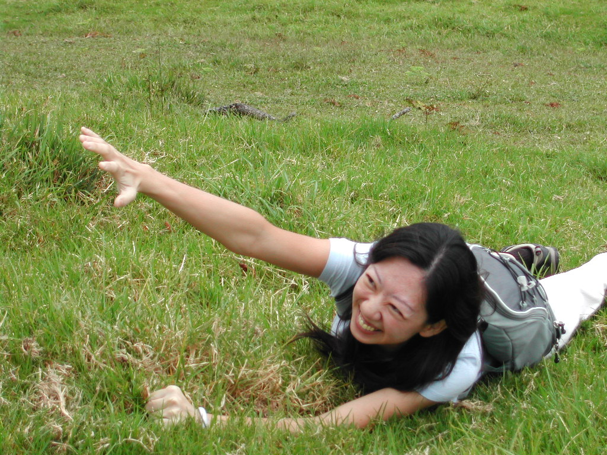

*搞笑中的BLUE*

七點多集合完畢後，一行人浩浩蕩蕩的、懷著坎坷不安的心情往梅峰農場出發囉。行經埔里鄉間，舉目所及的，盡是土石流肆虐後的殘破景象，真是令人怵目驚心，惶恐不已呀！還好今天天氣已經放晴，坍方的路段也已搶通修復，再加上上山遊玩的人少，所以一路上車行還蠻順暢的，不一會兒，就已經抵達清境了。在驅車途經清境農場，眼見離入園時間尚早，所以大夥索性先下車到清境農場逛逛，舒活舒活一下筋骨

，也順便重溫這清境的美好。

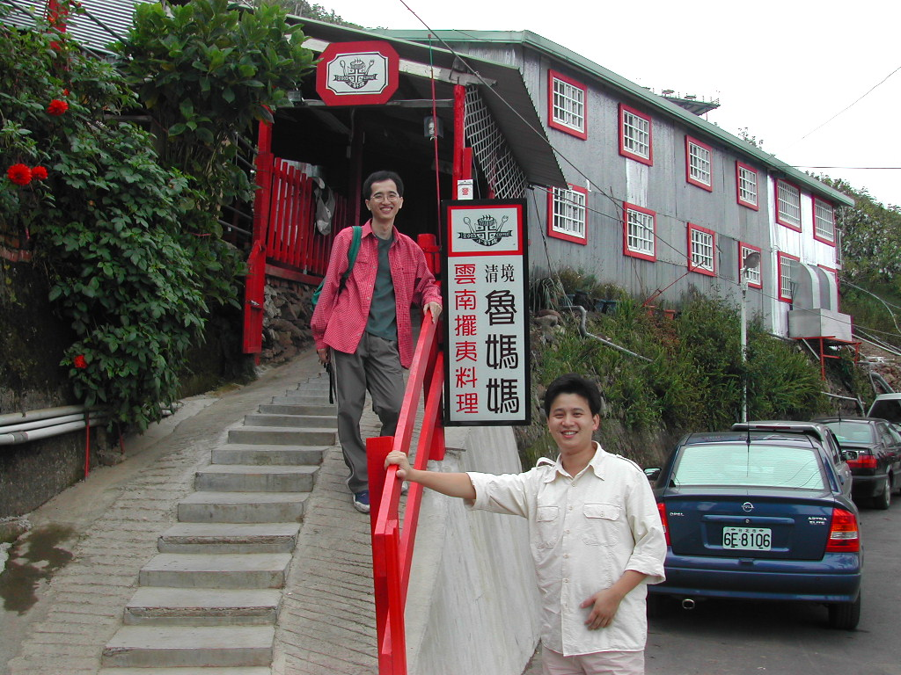

肚子已經咕嚕咕嚕的提醒我們，該吃飯囉！中午我們吃飯的地方

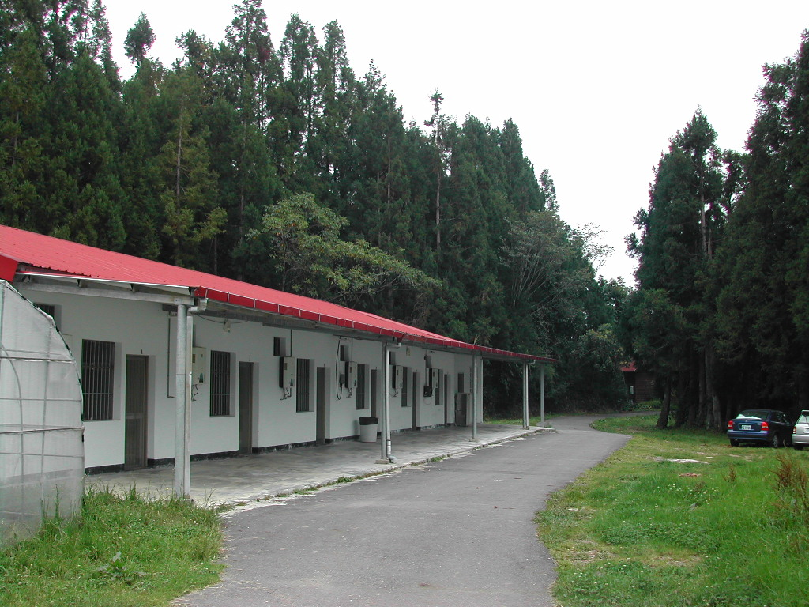

*雲南擺夷料理魯媽媽*

，是社長大力推薦的＂雲南擺夷料理－魯媽媽＂，這是清境著名的雲南擺夷料理，也曾有許多名人與藝人在此用過餐喔！或許是我吃不慣這種口味的料理啦，老實說，我個人覺得這裡菜餚的口感，是名聲大於實際啦！

*舒適的小木屋*

用完中餐後，隨即向梅峰農場出發。不過是十分鐘的路程，在峰迴路轉處，終於抵達了梅峰農場嚕！這裡就是我們夜宿的地方囉！可別小看這醜醜的鐵皮屋喔，它可是麻雀雖小、五臟俱全哩。每個房間內各自有兩張雙人上下舖的木床，還有獨立的衛浴設備喔！晚上有熱呼呼的熱水澡可洗，也有暖暖的棉被可供安眠，這對過慣刻苦登山生活的我們來說，無異是五星級的享受哩！

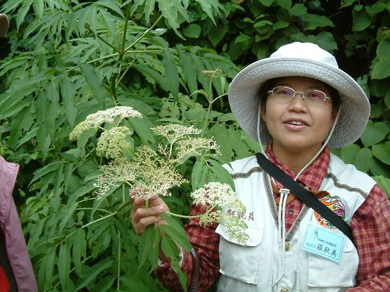

你知道＂梅峰＂這地名的由來嗎？由於這裡的地形狀似山谷，又剛好位於背風面，長年風勢較小，所以當地人便稱這裡為＂沒風＂（台語發音）。以此類推，那霧峰勒？就是＂有風＂囉（台語發音）！別打我～這是＂莎嘛＂姐告訴我們的呀！（我也有種被呼嚨的感覺 *_*|||）

*解說員羅秋美小姐*

當日下午，便開始了園區內植物生態的解說行程，這是我們的解說員，親切的＂莎嘛＂姐（羅秋美小姐）。羅姐對園區內的各類動植物知識非常豐富，而且非常細心的對我們一一解說，可惜不才的我只顧著貪戀自然美景與芬多精的滋養，依稀只記得像彌猴桃(野生奇異果)、羊蹄草(中國強)等植物的名稱，呵～我真是個不受教的遊客呀。

翌日大夥起了個大早，在天露曙光之際，開始了今天早晨的賞鳥行程。由於天候不佳，早晨的山林裡，空氣中瀰漫著昨夜未竟的濕意

，枝葉上殘留的是滴滴晶瑩剔透的晨露，遠眺層巒山際，籠罩著的是濃的化不開的潔白與來不及竄逃的夜黑。

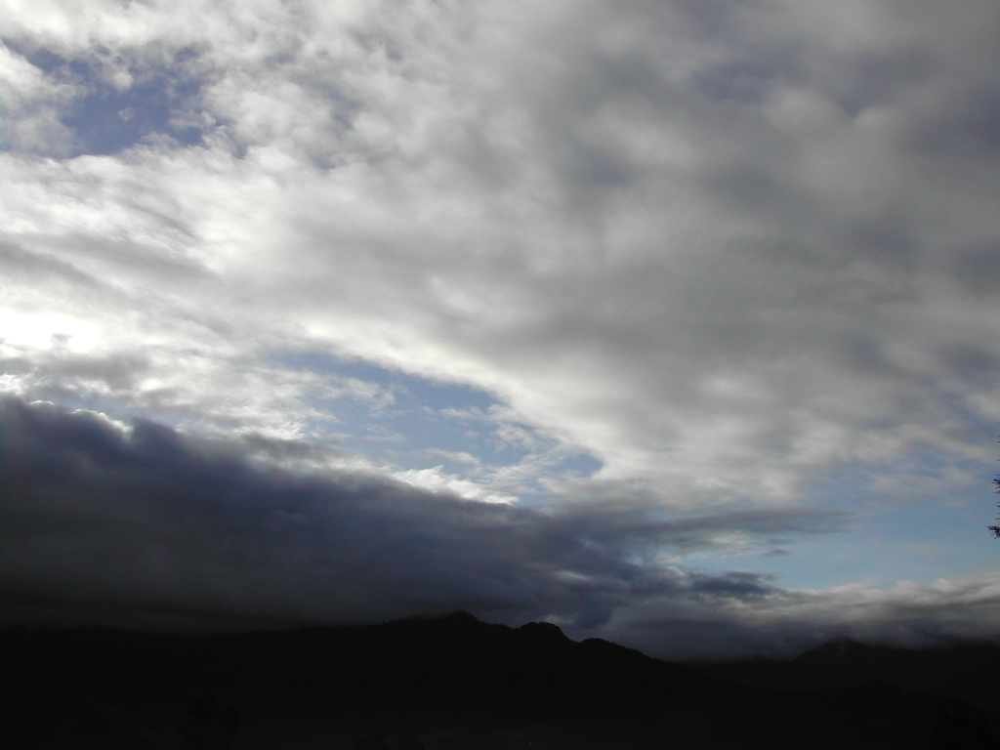

順著鳥啼聲，大夥興致勃勃的四處張望著，期盼能與深居山林的鳥兒們，有著第一纇的視覺接觸。突然間，天空像破了個洞般，抑鬱許久的光明，以千軍萬馬之勢，奔灑而下，大地，自此甦醒。

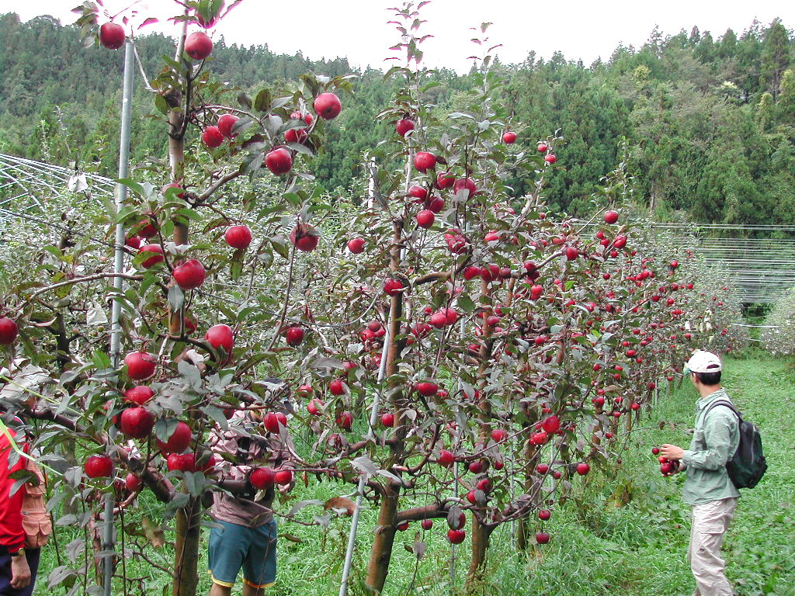

*採蘋果大盜*

嘿！你們幾個，路邊的＂野花＂哦～不、不、不，是＂蘋果＂不可採喔！這裡是林場裡德國頻果的種植園區，怎麼樣？是不是也像我們一樣，垂涎欲滴呀！

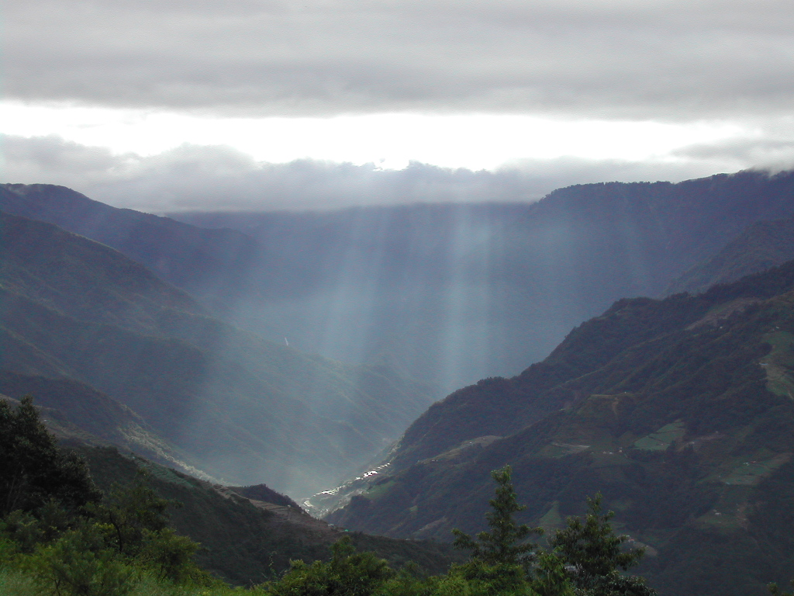

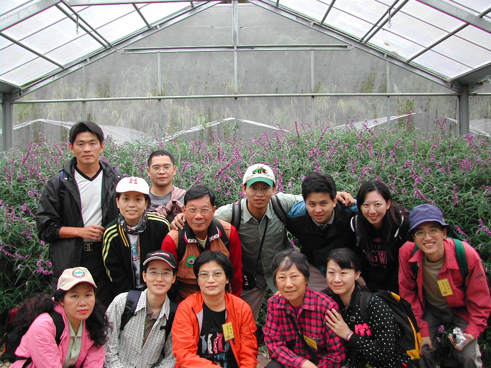

這裡是園區裡的乾燥花房，各種乾燥花卉豐富且充滿著濃郁的花香，不僅女人為之瘋狂，也讓男人為之心動不已。

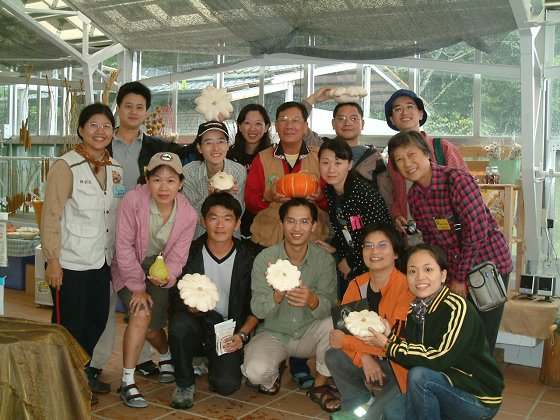

*員工福利社合影影*

園區裡的溫室花圃面積廣大，栽植為數眾多爭奇鬥艷的花卉，徜徉其中，彷彿置身花海，讓人精神為之一振，也因此謀殺了我們不少的底片哩

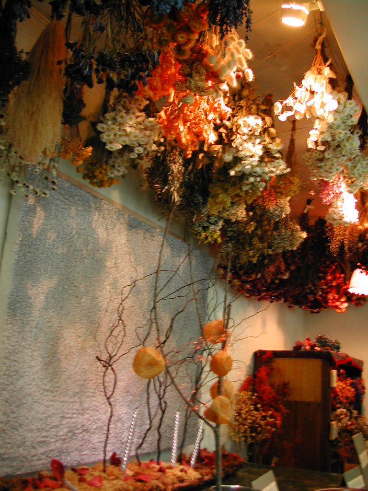

。

這是暮夏清晨時分的白楊步道，乍看之下是否像極了＂冬季戀歌＂裡的景緻，漫步其中，伴隨陣陣迷霧繚繞，伸手便可觸及的沁涼，洗滌著每個塵封已久的心靈。

*乾燥花房*

這是活動結束時大夥與”莎嘛”姐(羅秋美小姐)的合影，瞧大家天真俏皮的模樣，不難發現，我們已深深的眷戀上了梅峰！

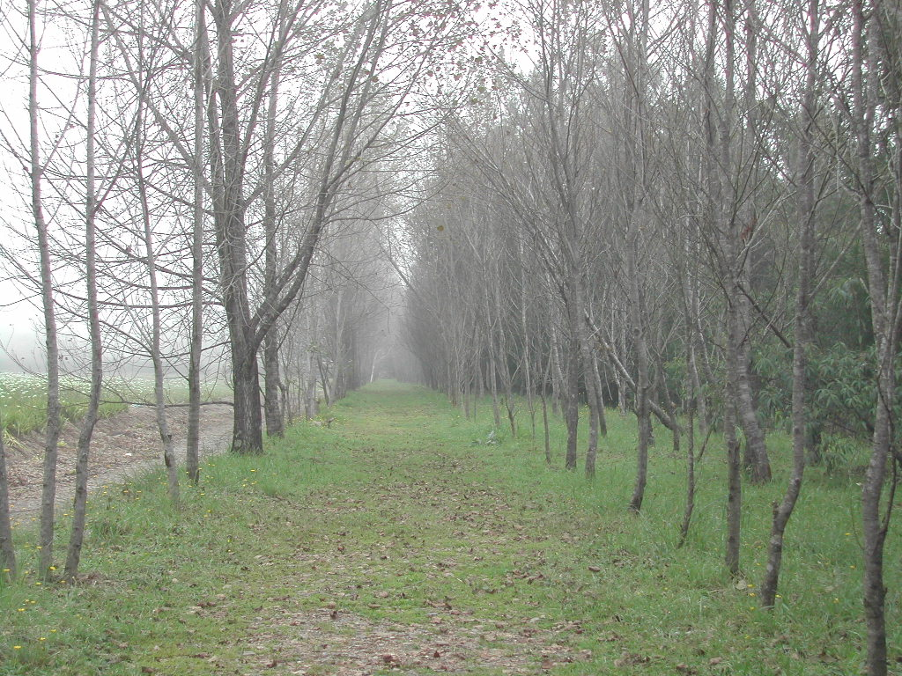

*溫室花圃合影*

*白楊步道*

後記：梅峰農場裡種植許多頗具藥性的植物，羅姐在解說時也會熱情的請我們嘗試一下，根據我的親身體驗後，衷心的奉勸大家不要隨意品嚐藥草，尤其是同時服用多種藥草！依稀記得活動結束那晚的凌晨，我被翻絞的胃給痛醒，接著是拉了一整夜的肚子喔！！還記得＂神農氏＂死前說過的最後一句話嗎？！「這～這～這個有～有毒」！！人吶，還是不要太好奇的才好喔！！

撰稿／吉益　圖片／吉益、草莓
