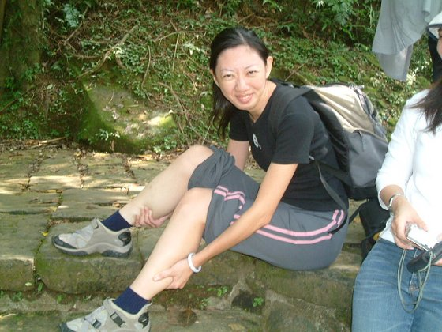
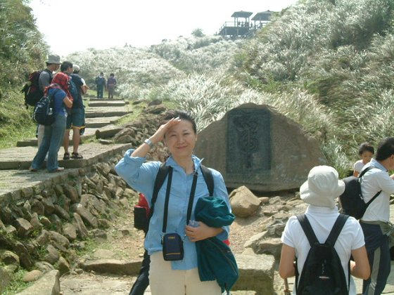
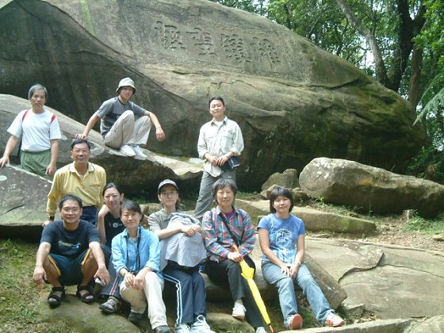
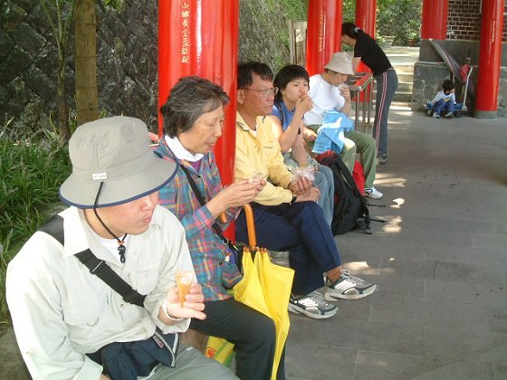
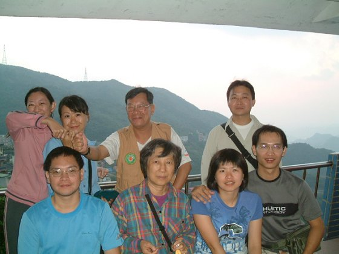
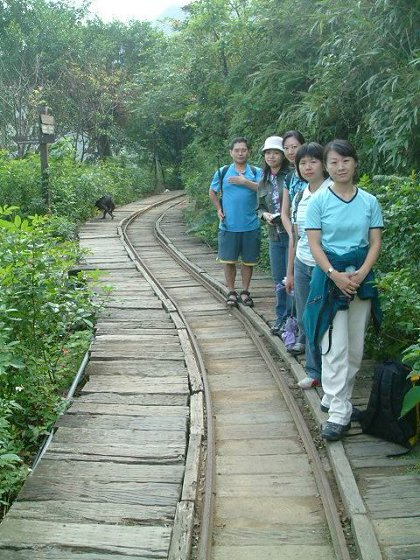
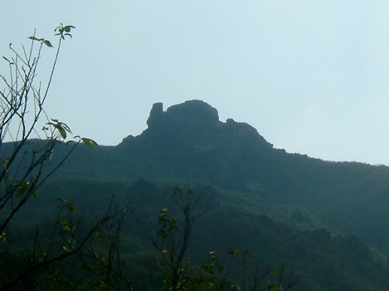

# 草嶺古道

> 民國93年10月

10月9日的凌晨4:30，仍在睡眼迷濛中，就必須為了趕早上7:00在台北火車站南三門的集合時間，而和秀逗、老昌、婷婷一起搭上了巴士前往台北…一路上就只好拼命補眠囉!!

在台北車站附近吃過早餐到達南三門後，就看到各個夥伴也陸續出現在集合地點囉。這次參加的夥伴有我、秀逗、老昌、婷婷、Bingo、Blue、Blue的五專同學(碧珍)、吉益的同學(志祥)、老師、師母，以及親家公等共11人。時間一到，就趕火車到貢寮囉!!

從台北車站到貢寮下車，一下車大夥就在站前的出租店租腳踏車準備騎上登山口，但很不湊巧的，今天上山健行的人很多，老老少少的，有人連小狗狗都帶上山了，除了我們也有其他登山者租用腳踏車。因為租車的人太多，所以我們一行人中就有人只能租到小孩騎的小型腳踏車，當然這騎起來也比較費力一點的，而老師、師母和親家公就直接搭租車店的車子上到登山口!!

腳踏車準備完畢，社長也發了好吃且預備當中餐的貢寮便當後，大夥兒就騎著自已的車開始朝登山口前進，一路上上坡的路段也不少，平地時騎著腳踏車是較輕鬆快速的，但上坡時卻反而更顯費力點，結果…騎到一半的路況後，Blue就有些不適了，等慢慢騎到三分之二的地方時，她的腳就真的抽筋了!!!一看到這情況，大夥兒也很替她擔心，大家都很熱心的要幫她舒緩不適，所幸，租我們腳踏車的老板很熱心，馬上就表示要幫忙用車載她到登山口等我們。等大夥兒到登山口會合時，一行人又朝著原訂的路線前進。

一路上，清風徐徐，好不涼快，路程走來也算輕鬆，偶爾的上坡也倒還不算辛苦，經過 “雄鎮蠻煙”的大石頭碑，再前往 “虎字碑”前進。一路上就一直聽到一個60好幾的老頭兒在那邊喊 “什麼時候可以吃便當，什麼時候可以吃便當的”..叫得大家都快餓了起來。在快到虎字碑的路上，一路上芒草叢生，在陽光的照射下，芒草發出微微的金色光芒，隨風飄揚，好不漂亮，讓大夥兒都稱讚不已，沒想到滿山的芒草竟然能造就這樣的美妙景像。不過，說真的，山谷的風真的是太大了，所以大家的眼睛都邊走邊瞇起來了，這也是為什麼這地方叫“虎字碑”，因為 “雲從龍，風從虎”，劉銘傳當初的提字就是希望能提個虎字鎮管這裏的大風，而且聽說這個“虎”字還是隻母虎吶..呵呵，雖然看不出它是怎麼分辦公母，不過倒挺有趣的。但在到達虎字碑時，Blue的腳抽筋又再度發作了，基於安全的考量，大夥兒決定，將原本要走到大溪方向的較健腳行程，改為走向大理的輕鬆行程。

走大理方向的行程，路途就短多了，從虎字碑往下走，不一會兒就到一片看似廢墟的地方，老師說這可是以前淡蘭古道路途中的小客棧原址，人來人往的，也是古人在行經淡蘭古道中途會停下來歇腳的重要客棧。但如今..唉..歲月流逝，時光不在，所剩下的就只是一堆殘墟廢土罷了。而這也是我們午餐的地方囉，一邊緬懷古人，一邊吃著美味的便當。當然，其實緬懷思幽只有一下子啦，接下來大夥兒的心思其實就全都在便當上囉..^^。

大啖完好吃的貢竂便當，緊接著往下走沒多久，就到大理的天公廟了，也就是這一段路程的終點了。行程果然輕鬆，下午2點多不到就完成了今天的路程，還真覺得不夠過癮吶!!在天公廟裏，有小販在賣著宜蘭的名產 “潤皮花生粉冰淇淋”，在潤皮裏包上花生粉+冰淇淋，果然很不錯，大家也是人手一支的。而接下來，因為已到了終點，第一天的行程也算是結束了，所以大夥兒就決定直接前往今晚的住宿地 --- 九份。而秀逗因有要事在身就在此和我們分手，老師的親家公原本也只打算參加一天的行程，也是先行離開了。

到了九份，先進我們今晚要夜宿的“龍門客棧”，今晚的住宿點是民宿，免費車可接，也省了我們一趟去程的車錢，房子就在九份的半山坡上，倒也有些登小高而望小遠的山海景可看。因為到達的時間大約在下半午，還算早，所以大夥兒鳥獸散的各自到鎮上最熱鬧的小街巷弄中，逛各自愛逛的小攤囉。沿路逛、沿路免費試吃，下午的點心也就這樣吃得差不多了。沒多久，太陽也快下山了，一行人就在山壁邊上的涼亭裏，看夕陽漸漸西下，這景也算是一美的，但後來有聽當地的人說，其實這裏的夕陽美景算還好，最美的是日出的時候，聽說美到連阿里山的日出也比不上的吶。可惜，要咱們早上三點多、四點就起床，再走個一、二十分鐘去看日出，這雖然是聽來很浪漫的提議，但大家還是有些懷疑的，因為很怕當地人老王賣瓜自賣自誇，再加上今晚還有開“會員大會”這件艱辛的差事，不知會拖到多晚，所以，浪漫終究還是扺不過想多睡點覺的誘惑，早起看日出的事一下子就被全面的否決了，還是睡大頭覺來得舒服囉….。看過夕陽之美後，又有一位夥伴“吉益的同學”要先行回台北，也就此搭公車下山離去。

此時晚餐時間也到了，大家又鑽回老街中尋找食物。吃飽喝足後，為了消化過撐的肚皮，又懷古思幽的逛了一下早期拍“悲情城市”的場景，接著就打道回府的回到住宿地開始今晚的重頭戲 --- “會員大會”。開會一事，內容在此就不再詳述，但也搞到晚上十點多才結束，得以終結了我們活動的第一天。

在今天的九份閒逛中，我發現，九份已變得蠻商業化的了，幾乎沒有剩多少純樸的感覺存在，這倒是真令人有些遺憾。雖然商業觀光帶給當地人的收入也是可觀的，只是可惜了那種珍貴卻不易保留的古香古氣之味道了。

到了第二天一大早，老師和師母因為有事也先離開了，剩下來的就是我、老昌、婷婷、Bingo、Blue和Blue的同學。因為人數也不多，也即然難得來到這地區，就決定搭公車再往內，到金瓜石走走，順便去爬爬“無耳茶壺山”。

來到金瓜石，真的是令人印象深刻的。和九份比起來，這裏的簡樸顯得濃厚得多，一到金瓜石就給人一種回到五、六十年代那種時光裏。山景的遼闊和海景的映襯，給人感覺很輕爽又舒服，懷古思幽的意境在這裏就真的能感受得到。
