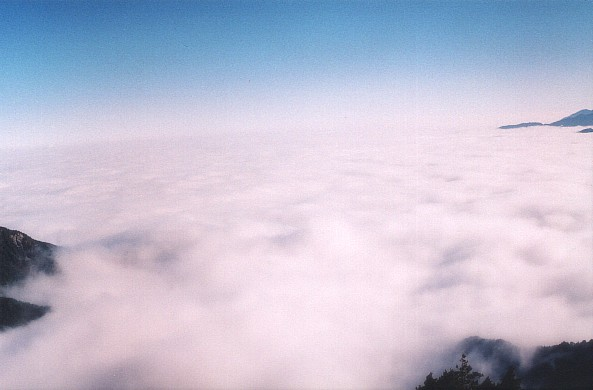
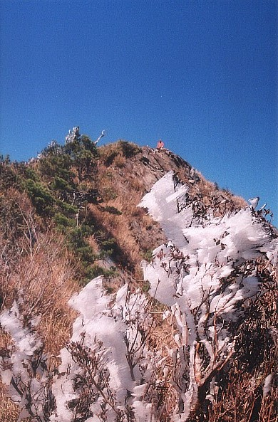
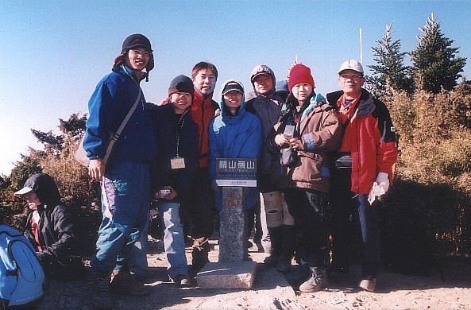
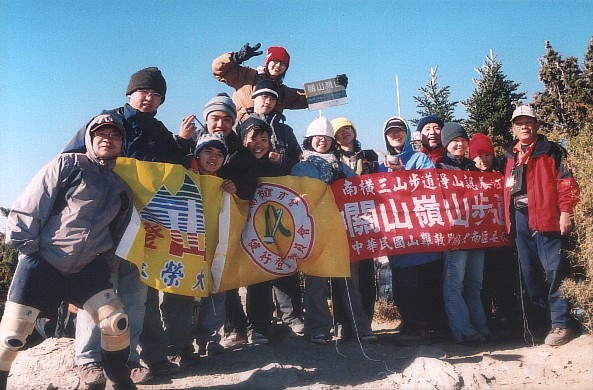
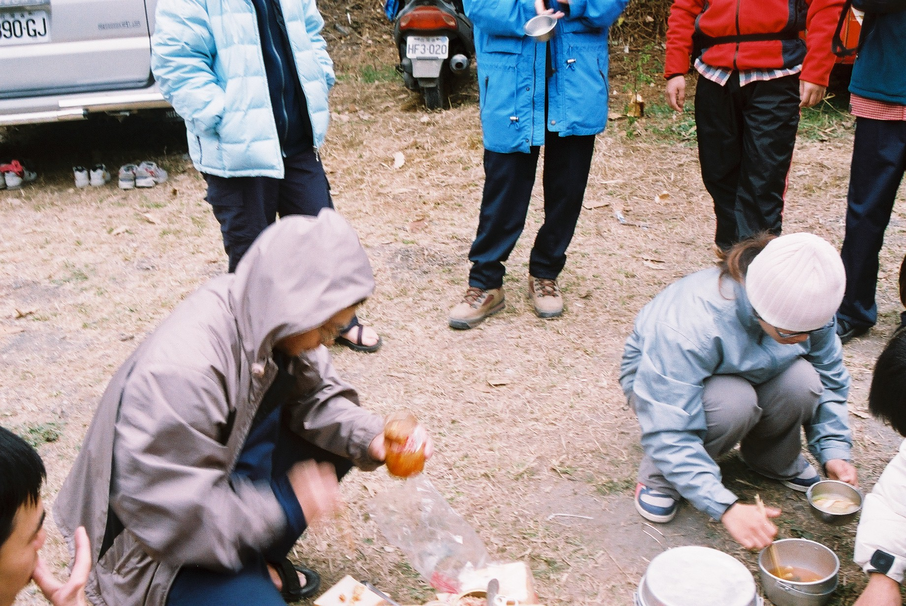
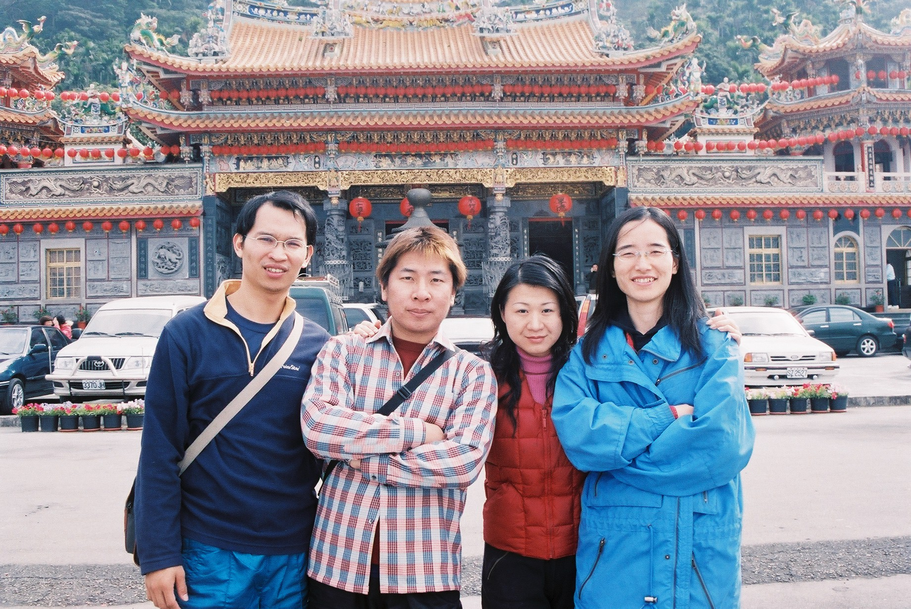

# 關山嶺山

> 民國94年1月

## 關山嶺山 + 石洞溫泉遊記               顏彤  94 / 1 / 1~2

又將近新的一年，除了回顧過去與展望未來外，每年都有這個特殊的聚會 — 幫老師慶生，以及與學弟妹的交流。

就如去年我們一樣從台中起個大早，早上還不到七點鐘我們已經到老師家了。迎接我們的居然是阿光等台北的夥伴，才知道他們昨晚就已經先到老師家過夜了；不過看到他們還愛睏的臉神，相信他們昨晚已經先跟老師把酒話家常了。

過沒多久我們坐上學弟妹租的二十人巴士，另外阿光也開著他的車，我們就朝南橫之路出發。一路上不論是我們OB或是學弟妹們臉色都不是很好看，大家可別誤會我們之間有什麼磨擦，其實是因為昨晚很多人都去參加跨年活動，睡太少的緣故啦；一路上大家就這樣「安安靜靜」的來到休息站—甲仙。甲仙似乎是進入南橫必停的休息站，除了上廁所之外，也順道吃吃當地的名產。

*▲台東縣壯闊的雲海*

在吃過東西之後，大夥好像都活過來了，我們就趁這時候進行已畢業生與在校生的互相認識活動；先由我們OB自我介紹，再由在校生的學弟妹自我介紹。在現任社長—宥森自我介紹的時候，他的第一句話最讓我震撼：「大家好，我是第十二屆的社長。」天啊！這「十二屆」代表十二年，我們真的有這麼老了嗎?

由於南橫有幾段路況不是很好，因此當我們到達登山口—關山大隧道已經是中午十二點左右了。在還未到達登山口的路上，我們看到附近許多的山頭都積著白雪，每個人都非常的興奮，好希望我們今天登的關山嶺山也會有美麗的白雪等著我們。我們的車子一出了關山大隧道，我們就被眼前的景色給震懾住了。一望無際的雲海一直延伸到遠方的天邊，不仔細看清楚恐怕會分不出何者是雲何者是天；又配合著晴朗的天空，讓我們真像置身於仙境般。

*▲冰雪樹上掛*

王之煥說的不錯：「欲窮千里目，更上一層樓。」當我們從登山口約莫爬升一百公尺左右，視野更加開闊。我們就站在關山大隧道上方延伸的山脈，左手邊看的是台東縣的雲海，右手邊看的則是高雄縣的雲海；扣除我們所走的延伸的山脈，眼前視野超過180度的雲海，這是我所看過最壯闊、最不可思議的雲海了。左邊的雲海壯闊而深遠，在陽光的照射下顯得朝氣蓬勃；右邊的雲海則是溫柔婉約的躲藏在大山之中，不想跟左邊的雲海爭艷，靜靜的飄動在群山之間…。再往上走，令人更驚喜的景象出現在我們眼前。冰雪，就掛在樹上，但因為稜線上的風勢強勁，使得冰雪成為扁平的樣子，好似一把把利韌的刀鋒，但掛滿在樹上卻又像是聖誕樹的裝飾品異常可愛。

*▲OB與老師在山頂合照*

花了近二個小時的時間，我們終於登上山頂。一到山頂，大家又不免的拿出相機與三角點合影留念。除了大家的相機都出籠，社長宥森也拿出社旗，老師也拿出他們健行會的會旗及淨山的旗子，大夥就在旗海飄揚之中拍下了完美的合照。

原本預計下山時在登山口煮午餐，但因為我們下到登山口時已經下午四點多了，因此我們決定餓著肚子，到石洞溫泉山莊再大吃一頓。

*▲OB與學弟妹及老師在山頂合照*

大夥就在昏睡之中來到寶來，而我們要去的石洞溫泉山莊是從寶來左轉的一條叉路前進七公里的地方。回想以前(可能是民國88年)我們OB也曾經辦活動到石洞溫泉，不過當時的七公里路是用雙腳走進去的，…。車子走在往石洞溫泉山莊坑坑洞洞的道路上，車身震動的厲害，而大夥也因此給搖醒了。「到底還有多久才到﹖」、「是誰選這鬼地方﹖」、「我們是不是走錯路了，為什麼越走越偏僻﹖」大夥耐著饑餓與疲憊的心已經顯的有點不耐煩了。就在大夥快失去理智時，我們看到不遠的地方出現閃爍的燈光…

大夥真的是餓扁了，一下車二話不說就往吃飯的餐桌走去。我們饑餓的程度就連山莊的廚師都來不及煮，一盤盤一碗碗都吃個精光。大夥吃飽了，我們就把自己的行李卸下車，也一起忙著搭帳棚(學弟妹尊重我們OB，因此將房間讓給我們睡，而他們睡帳棚。)。等住宿的事都弄妥了，接著今晚最高潮的好戲就要登場了。

*▲Bingo正努力吃早餐*

桌上滿滿的東西，除了老師帶的大蛋糕及學弟妹準備的乳酪蛋糕，剩下的當然就是老師的最愛—酒。滿滿一桌各式各樣的酒，不但我們看了都傻眼，我看就連愛酒如癡的老師也都嚇到了吧！

*▲我們在紫竹寺的合影*

在唱完生日快樂歌切完蛋糕之後，接著就是要跟老師敬酒了。首先由我們OB一個一個跟老師敬酒，老師在喝完一巡酒之後，顯得有點微醺，一直嚷嚷著：「酒這樣子混著喝會喝醉」。但我們把老師的話當耳邊風，繼續由學弟妹跟老師敬酒。原本以為人多勢眾的學弟妹可以將老師給灌醉，沒想到慈悲的他們卻一起只跟老師乾一杯而已。就在幫老師慶生的同時，我的手機也響起了「我是丸子，我要跟老師說生日快樂，…」原來是遠從英國的丸子打電話跟老師祝壽，真是令人感動啊！整個夜晚就在我們喝酒說笑的氣氛下變得非常熱鬧，直到子時深夜大夥才帶著倦意回到溫暖的小窩。

一早，我、Bingo、逸霖就到戶外去泡湯，正當我們泡的舒服時，就看見老師走到放衣物的櫃子旁，突然老師就背對著我們把褲子全部脫掉。 Oh,my god!老師什麼時候變得這麼open ? 難道他想要裸體泡湯嗎?就在大夥還來不及反應時，老師就把他準備好的泳褲給穿上了，而且還從從容容跟我們一起泡湯。Bingo說：「老師來坐這裡。」旁邊一位女士很不好意思的問說：「他是你們的老師喔?」雖然我們泡著暖暖的溫泉，但尷尬的氣氛卻將周圍的空氣給凍結起來，我們的身體與心裡真的都在洗三溫暖啊！

當我們泡完了尷尬的溫泉正在整理行李時，有位學妹就跑來通知我們可以吃早餐了。貼心的學弟妹們已經準備好早餐在等我們，為了不辜負他們的用心，我們當然很賣力的吃，其中最賣力的就屬Bingo，因為最早開動的是Bingo，撐到學弟妹收拾餐具仍努力加菜的也是Bingo。用完早餐後，阿光等北部的夥伴因回途路程較遠就先自行開車回台北，而我們則繼續行程前往紫竹寺―吃齋菜。

在紫竹寺吃完齋菜後，熱情的運將大哥還特地帶我們去參觀一處私密景點，欣賞一座用許多七彩珊瑚礁裝飾寺廟的奇特廟宇，那兩層樓高的觀世音神像蓮花座由許多七彩珊瑚礁組成，人們還可以入內參觀 ，裡面各種奇特珊瑚礁加上炫麗的燈光真的令人嘆為觀止，彷彿置身龍王宮中。

參觀完後，我們便直奔台南，一路上大夥開懷歌唱，而草莓歌后的唱功，令在場學弟妹為之瘋狂直嚷著要草莓辦簽名會。最後大夥在台南依依不捨話別 ，結束這次的活動。

感謝學弟妹們這次所舉辦的活動，我們深深感受到你們對我們OB的尊重，希望藉由一次次的交流活動，我們能夠成為一個溫馨而穩固的大家庭。
