# 北插天山(二訪)

> 民國94年3月

**北    插    天    山    遊    記                   ** Bingo    94/3/23~24

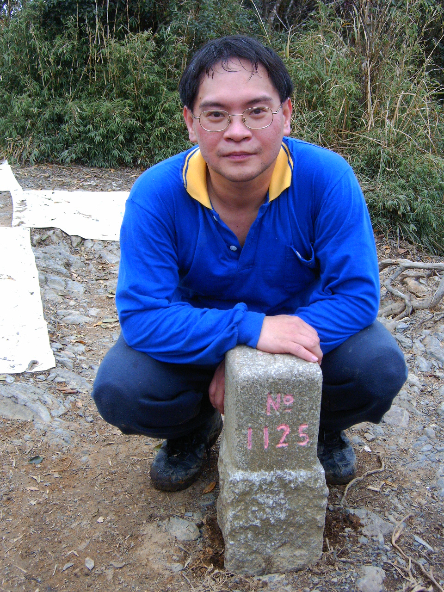

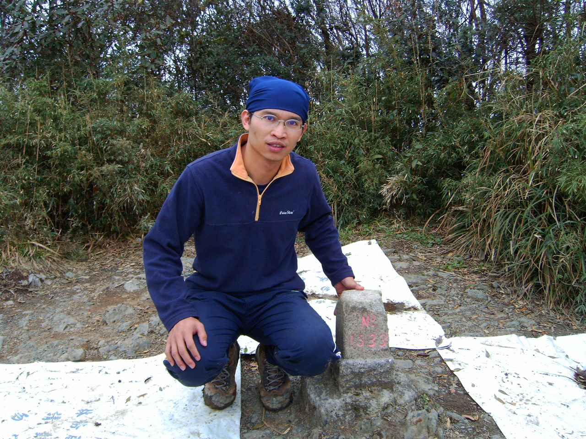

一夜好眠，一個充滿陽光、空氣、水、鳥鳴、歐巴桑叫嚷聲的好天氣把我從睡夢中叫了起來，趕緊整理行裝和夥伴會合。待趕赴集合地點”新埔捷運站”時，板橋集結區的夥伴已幾乎全到齊了，只剩下海軍少校弟兄(註1)尚未到達；不過等了很久仍未見到，以手機聯絡後才知道他走錯路了，看來，海軍到了陸地上還是挺吃憋的，下次活動前，請主辦活動的人員通知海軍弟兄記得帶指北針及羅盤，要不然也得要找一個海軍”陸戰”隊的弟兄同行吧!!唉……….……有此國軍，何愁國家的統一大業不能完成呢?

板橋集結區的人員到齊時，台中幫(註2)的人員早已到滿月圓

的入口在等我們了，真是給他不好意思的啦；待得公務員號、大海

軍號、及老百姓號(註3)三台車會合後，問了一下同行夥伴的背景，才知道此次參與活動的成員成份頗為複雜，有海軍、陸軍、公務員、老師、在職的、待轉職的；有幾個同伴是首次參加活動的，不知道他們為什麼這麼想不開；有些夥伴有好一陣子未見面了，真有恍如隔世的感覺，看到大家都還健在，心裏覺得踏實多了。

整補完後便背包上肩出發了，但是走沒幾步路，社長大人(註4)告訴我，社長夫人及其同伴

(註5)，已先行走了三十分鐘，他怕她們會走錯路，所以希望我和他一起去追她；原本想說山路還蠻簡單的應該不會有什麼問題，不用追了；但是社長大人一副很擔憂的樣子，看到他們如此鰜鰈情深，天地為之動容，木石為之涕泣，在激情中，我接受了社長的要求，隨他一同先趕路追上社長夫人，卻沒想到因此發展出令人意想不到的後續發展。

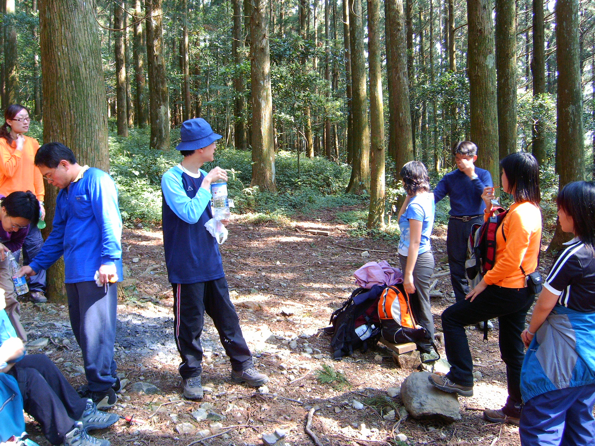

大約過了近30分左右，終於追上了她們。在追人的過程中，已告戒過同行的夥伴，請他們慢慢的走，我和社長有要事要先行趕路，但不知是我們講的番話他們聽不懂，還是這些化外之人聽不懂我們的語言，仍有些人和我們一起趕路；以致於到了營地時，首次參加活動的Darwin(註6)及剛學成歸國的丸子(註7)已經臉色發白、冷汗直流，隨時有………的跡像，再加上嚮導大人及草莓(註8)擔心時間上及大家體能負荷的問題，便提議只走到最後水源地就好，但是有部份以社長為首的人員還是覺得要直接攻頂比較好；因此，便以嚮導及社長為兩大思想中心，硬生生將此次的活動及成員分成了「滿月圓—大板根輕鬆團」(註9)及「北插天—大板根攻頂團」(註10)。

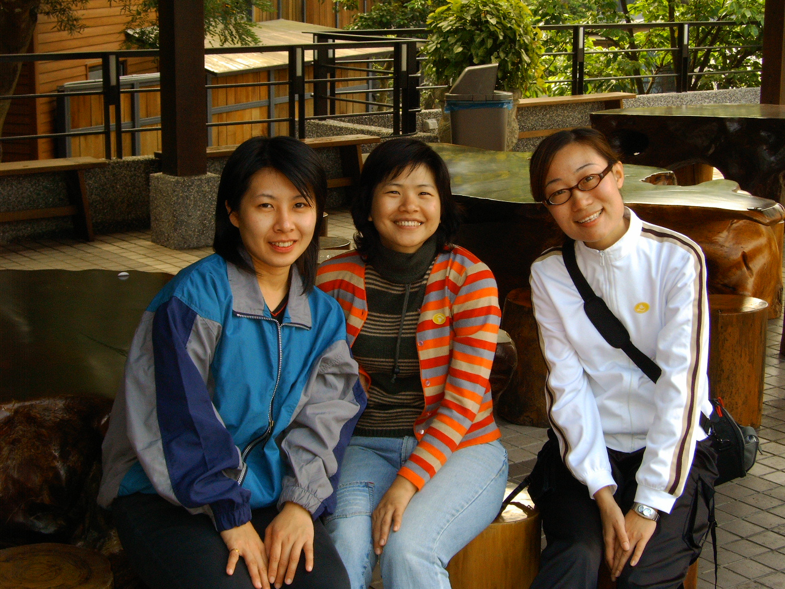

人的一生，是由許多的選擇所組成的，選擇的本身，並沒有對與錯之差別，但所選擇而產生的後果，在旁觀者及下選擇者之間，卻往往有著如人飲水、冷暖自知的天差地別。

【接下頁】

北插天攻頂的成員著實吃了一番苦頭，尤其是最後水源地之後到攻頂的那一段路，去時陡上、

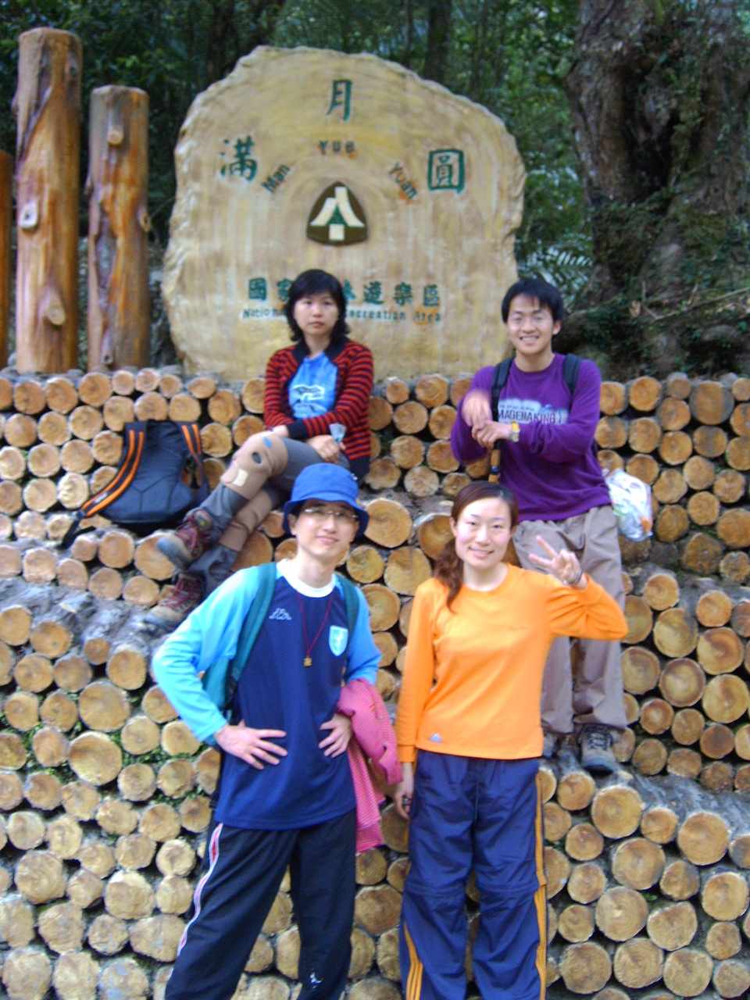

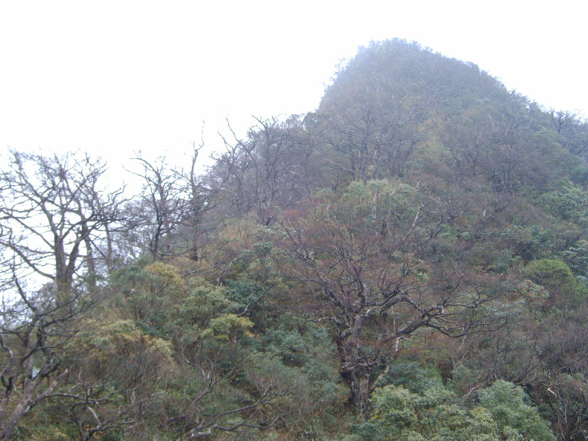

回程陡下、又溼又滑、四肢並用、與時相兢、與天相爭、缺水缺糧、蚊蚋同宴。自最後水源處開始，早上未熱身即趕路的報應開始作用，我的大腿及小腿幾乎是一路抽筋到攻頂；幾度想放棄，但轉念一想，要放棄的話，在營地就該放棄了，怎麼可以為山九仞、功虧一簣，忍著椎心剌骨的痛楚邊休息邊走；待再次遇到小O(註11)及鳟魚(註12)時，她們已攻頂完成且往回走了，我和她們的時間整整差了有半個小時；鱒魚小姐目前在陸總上班，與吉益的海總相輝映，但是這場海、陸之爭，似乎是陸軍較勝出；而她倆也贏得了海軍弟兄欽封的「山中法拉力傳奇—小O號及鱒魚號」的美名 。

到了三角點時，兩隻腳已經痛得我無法再前進一步；這還不打緊，最令人不知該如何反應的是到了北插天山的三角點時，社長問了我一句話 ………..「 Bingo(註13)，我這裏有抹肌肉酸痛的藥膏，你要不要用啊?」；我在想，他這句話如果是在最後水源地的時候就問了，那肯定是功德無量啊。後來我問社長為什麼不早點拿出藥膏，他說他自己也忘了。我想，社長一定是受了社長夫人不和他一起攻頂的剌激及影響，才會做出如此不理性又慘絕人寰的自殘殘人的手段。

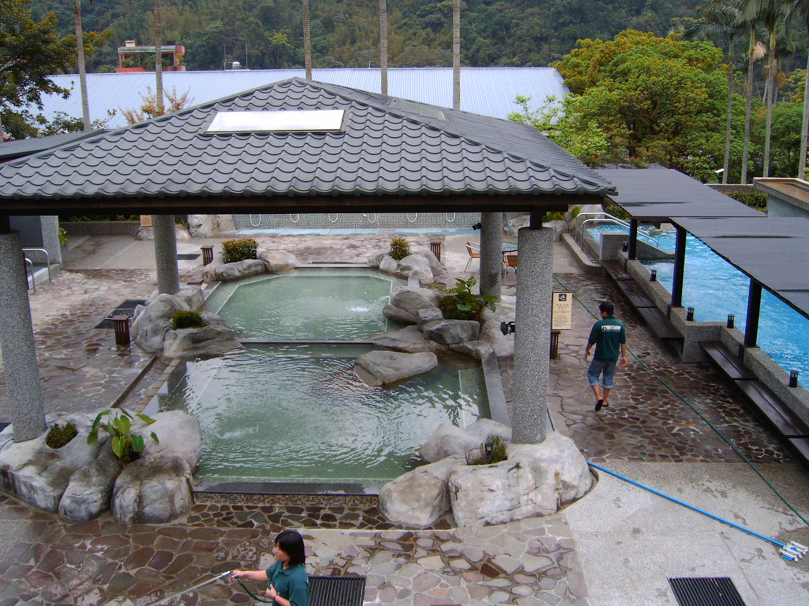

等到攻頂團回程與輕鬆團整體會合後已經是16:00的事了，但是仍未見海軍弟兄到來；在與輕鬆團成員閒聊並等待海軍弟兄到來之時，聽到了他們沒有去到水源地，又聽到他們在營地打屁、哈啦、吃了所有的泡麵，又聽到有人在抱怨攻頂團的人沒良心都不等海軍弟兄到了再一起走；此時心中真是百感交集，腦中所想的仍是「選擇的本身，並沒有對與錯之差別；但所選擇而產生的後果，在旁觀者及下選擇者之間，卻往往有著如人飲水、冷暖自知的天差地別」。終於，看到海軍弟兄出現在有一、兩個MM同行的集團軍，大夥的心情總算是放鬆了。

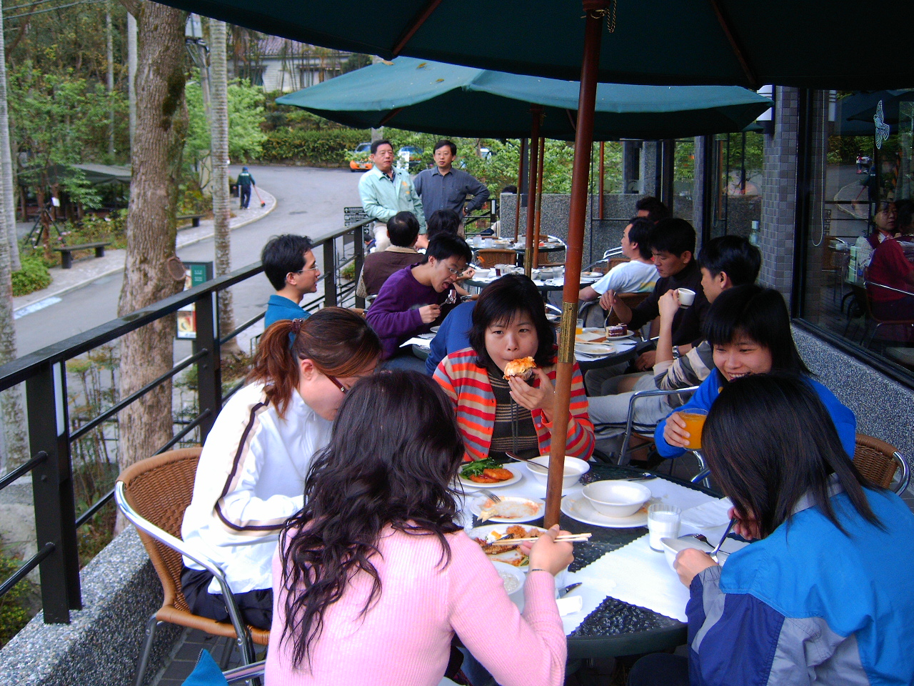

出了滿月圓山區、吃晚飯、大板根Check in、泡溫泉、休息，總算是為疲累了一天的身心尋得了輕鬆的解放。

第二天早餐在大板根園區吃buffet，種類蠻豊盛的、口味也不錯，餐後全員到大板根園區逛逛，看了很有特色的板根植物，邊走邊聊，順便討論下個活動的大槪計劃；也差不多到了要解散的時候了，回到房間整理行李後，一一和同伴互相道別，結束了這次的「北插天—大板根之旅」。

【接下頁】

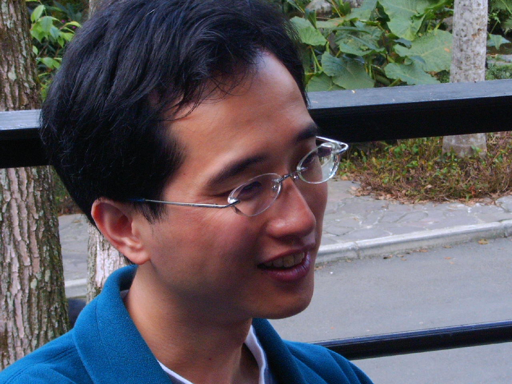

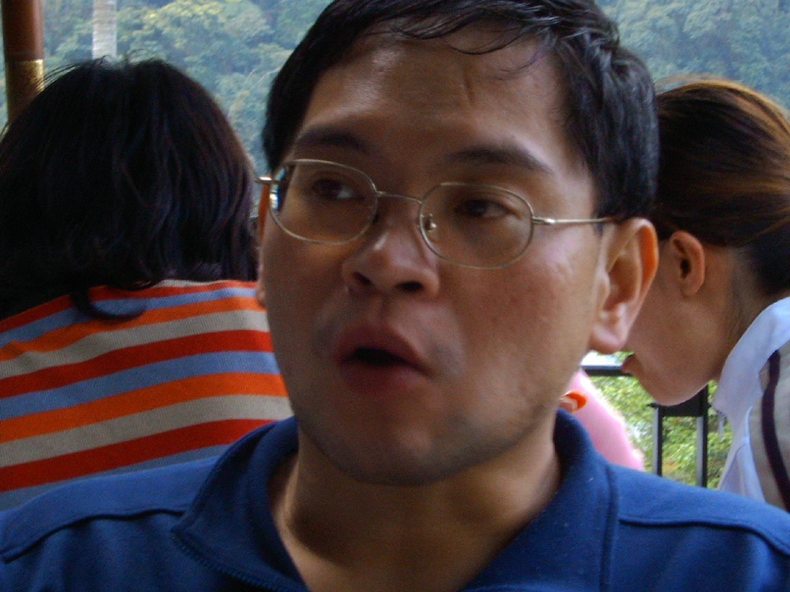

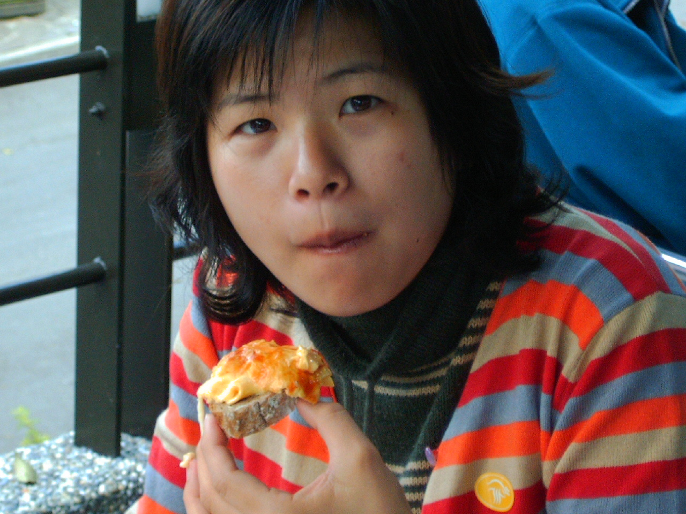

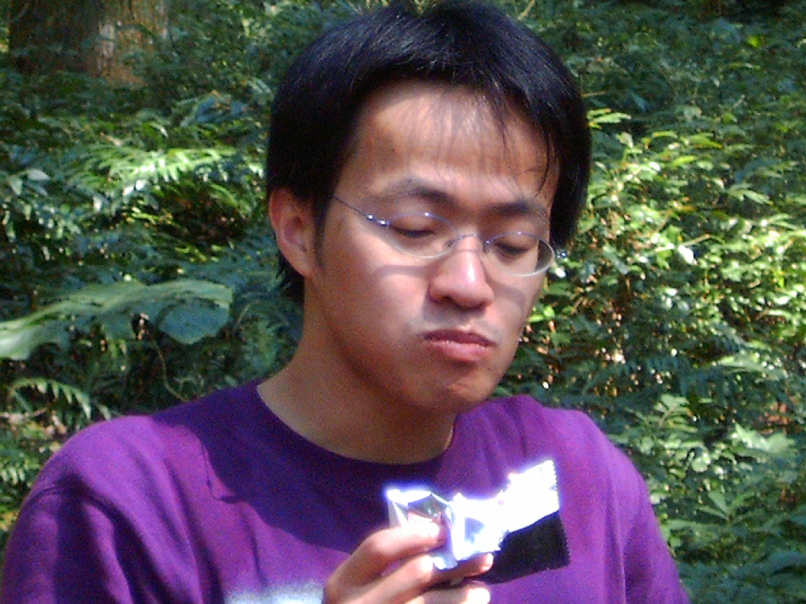

(註1)黃吉益今年剛升少校，預計五月份要上船

  (註2)以社長大人顏彤為首腦、居住於台中之社員，統稱台中幫，基本成員有顏彤、楊婷婷、賴秀玫(秀逗)、廖佩菁(草莓)

(註3)公務員號社長  顏彤為司機，因顏彤目前為公務人員故名之

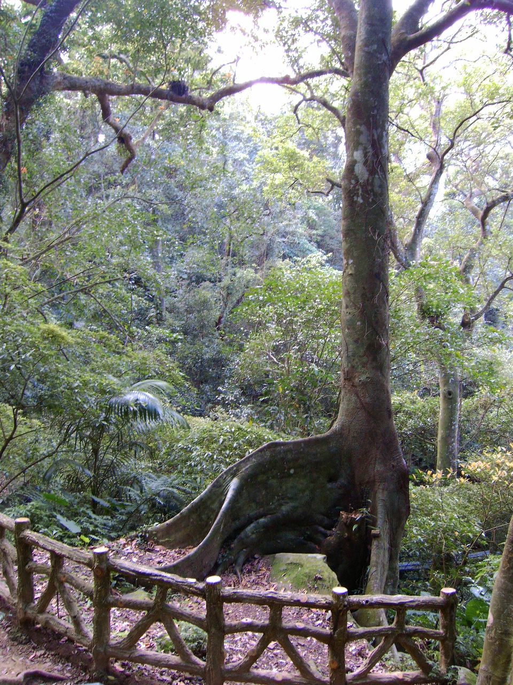

大海軍號海軍少校弟兄  黃吉益為司機

老百姓號本次活動嚮導  謝兆光為司機

(註4)  顏彤

(註5)  楊婷婷(顏彤之妻) 及白君惠

(註6)  Bingo之同事 賴偉明

(註7)  周丸生

(註8)  謝兆光及廖佩菁

(註9)  成員有謝兆光、廖佩菁、楊婷婷、賴偉明、周丸生、白君惠

(註10)成員有顏彤、黃吉益、蔡孝青、周諄怡、林文彬

(註11)蔡孝青

(註12)周諄怡

(註13)林文彬

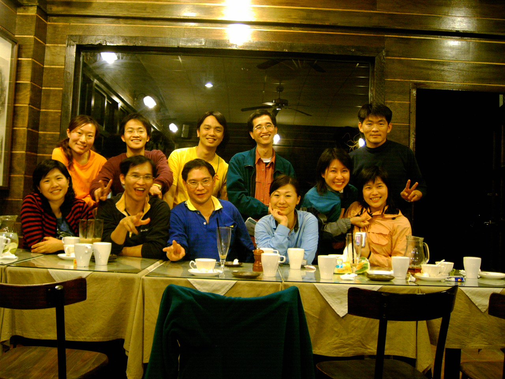
