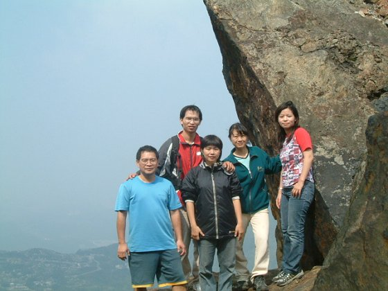
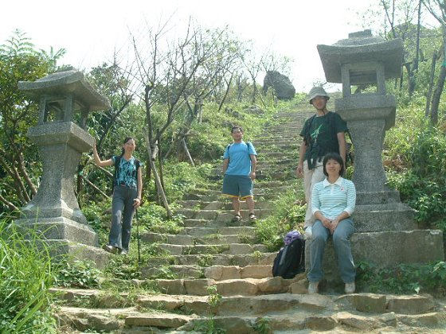
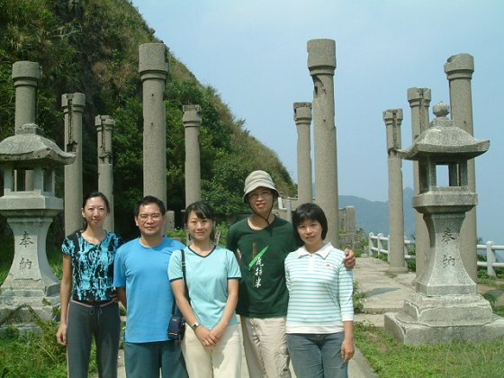

# 學弟妹畢旅之清境合歡之旅

> 民國94年5月

遠遠的在山下，就看到“無耳茶壺山”那神似茶壺的形狀，感到挺有趣的。開始往山上走，先經過一大段的階梯，到了中站，馬上就視野開展的看到一大片海灣景色。今天天氣很好，海天一色的景像，令人心曠神怡的。越往上走，視野就越延展開來，一望無際的感覺，再加上輕風除除吹來，讓人忍不住要大聲說出”啊~~真舒服，好美啊”這種話語來。茶壺山雖不算高，但因為可270度的看到四周的view，所以才登到2/3，就能窺見到對面基隆山的全山美景，往下一望，又可以看到一大片海洋包圍著整座山的那種山高水深的狀闊。登高望遠，越往上走，四目所及的山海景色就越清晰動人，看得也越遠。這時候，心裏真的不禁的為昨日那些先離開不能留到今天的夥伴們感到可惜，可惜錯過了這麼一個美好的地方。

到了山頂底下，哇…驚險的來囉，上山頂的路好像鳶尾山頂上的路，一大片岩石斷壁的，非得要手腳併用，東抓西踩，又拉繩的，有技巧的往上鑽才能爬上山頂的。上了山頂，就身處在一大片的光滑大岩壁裏了，隨便一站起來，就能讓人腳發軟，顫抖不已的。相信有爬過鳶尾山的人應該能感受到那股處在斷厓殘壁頂端上的感覺。怕歸怕，但在這山頂上的感覺，好得沒話說，真的會有天地之大惟我獨尊的那種無以名狀的心情喔!! 在山頂山逗留了一會兒，過沒多久，也有不少其他人爬了上來，山頂上開始顯得有些擁擠了，所以大夥兒只好慢慢的再往回走，下山囉。到了山腰處，遠方看到了以前的黃金神社遺跡，一大片的特別孤立在另一個山頭。因為時間還有一些，所以大夥兒又朝著黃金神社的方向前進。

黃金神社其實保存的算還好，雖然說頂端上的神社本身建築物已不覆存在，但從山腳下，一路往上走的神社之道，兩旁的石製大燈籠和神龕或鳥居，可能因為都是石製的，所以都還有保留下來。到了最上方，神社外形已無，但仍有幾根建物本身的大支柱還聳立在原址上。踏上神社的入口，朝剩下的幾根支柱中往後一看，因為後方就是基隆山和陰陽海灣，這樣的取景看來，反倒很有希臘雅典帕德嫩神廟遺跡的樣子，只是說規模小了很多啦!! 當大家一發現這景色很特別時，照相機就卡嚓卡嚓的拍個不停。站在神社上往四周看，這些個山和海啊，又是一番不同的味道囉。

下了山，才發現金瓜石全區在大整修，進行大規模的觀光景點維修和規劃，黃金博物館也正在趕工中，只可惜，要等到10月底才完工，所以無緣看到整區整頓好的樣子。雖說無法窺得全貌，但已能隱隱約約看出個大概，就已經能感覺這樣的規劃後，金瓜石應該會更有值得觀光和賞玩的價值吧。隨後大家在區內任意的逛了一下，就搭著公車下山回瑞芳。

對於金瓜石，我只能說它真的是會令人流連忘返。很有那種以前看“多桑”這部吳念真拍的感人寫實片，記錄五、六零年代礦工小鎮的質樸生活之風光。等到全區的規劃和黃金博物館及礦工地道參觀處完成，我想，金瓜石應該是一個值得再去探訪的地方。

在瑞芳市區內吃完了中餐，今天的行程就算結束了，大夥兒也準備搭火車南下回去台北和台中。臨行前，還有一個小插曲，那就是再過沒多久，珊綾的婚宴即將到來。所以，趁著今天大家有機會到台北，就在活動結束後，和珊綾約在台北火車站的咖啡店內，小聚一下順便拿帖子和喜餅囉。活動兼會友，讓今天的行程劃下美好的句點…^_^…。

撰稿／草莓　圖片／吉益、草莓、Blue、老昌

**~ 後記 ~**

當我們從茶壺山的茶壺裡鑽出來到茶壺嘴(要攀登像茶壺形狀的山頂並須從茶壺裡鑽出來)，我就一直在尋找往茶壺蓋的路，但始終遍尋不著…。「記得大一時我們頂著風雨攀登茶壺山，應該並不只從茶壺裡鑽出來到茶壺嘴，好像還登到最頂端 (茶壺蓋) 的樣子。」憑著這樣的模糊記憶，終於還是讓我給找到登頂的路，只不過這條路已經沒人在走，實在有些危險，但為了再次感覺大一時登頂的感覺，我跟Bingo決定等婷婷等一班人離去後再自行偷偷攀登。

在茶壺蓋上的感覺真是棒極了，雖然腳下可採的面積不到半坪的大小，但心情卻是莫名的受感動，感覺不只是唯我獨尊而已，覺得自己就像是神、英雄一樣，征服了整個世界，只能用一個「爽」字來形容，我想Bingo跟我應該有同樣的感覺吧。

老昌
