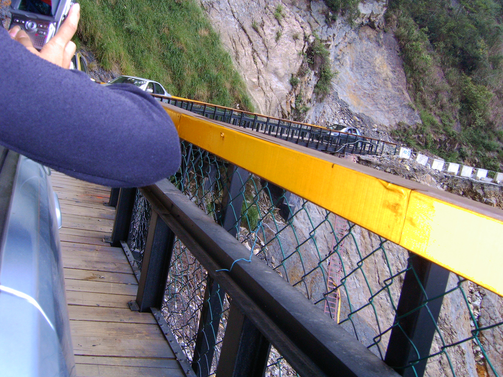
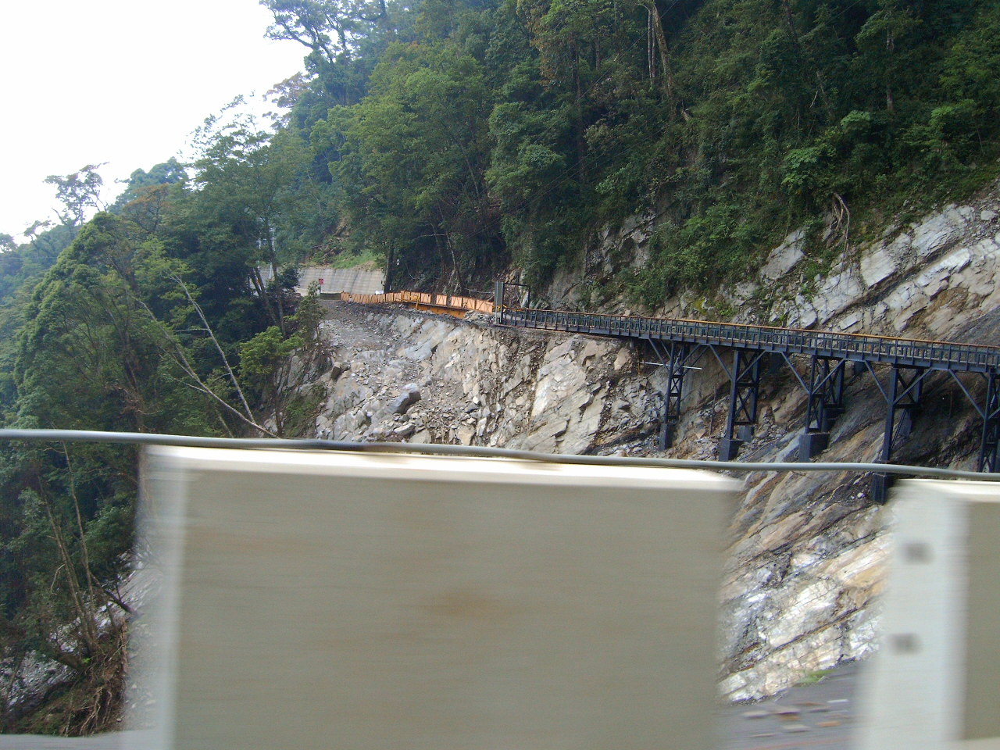
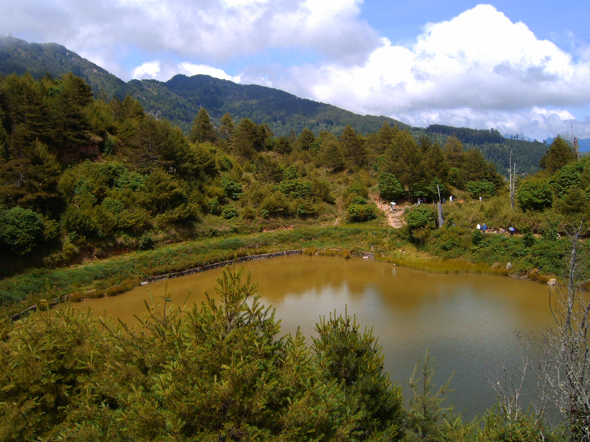
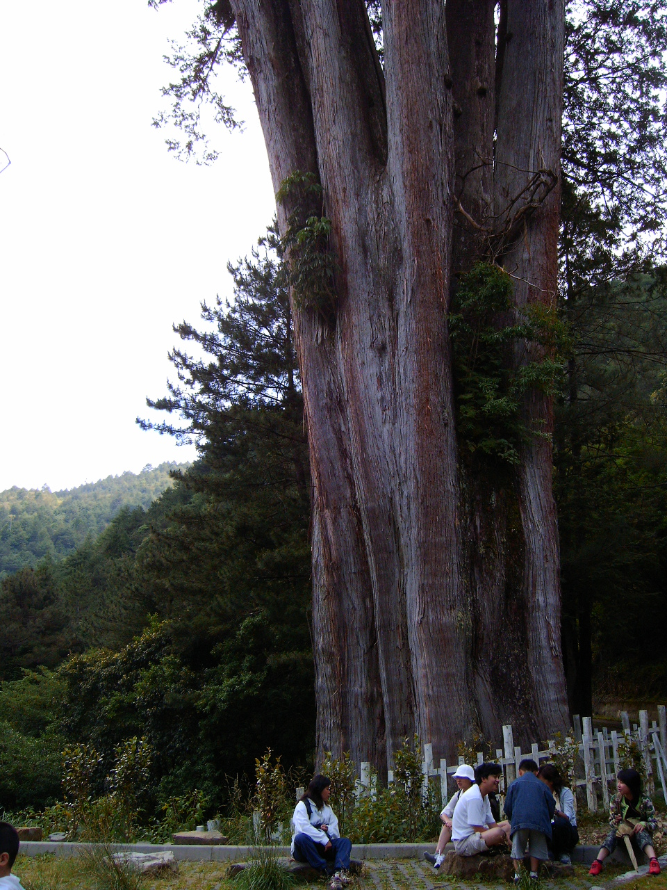
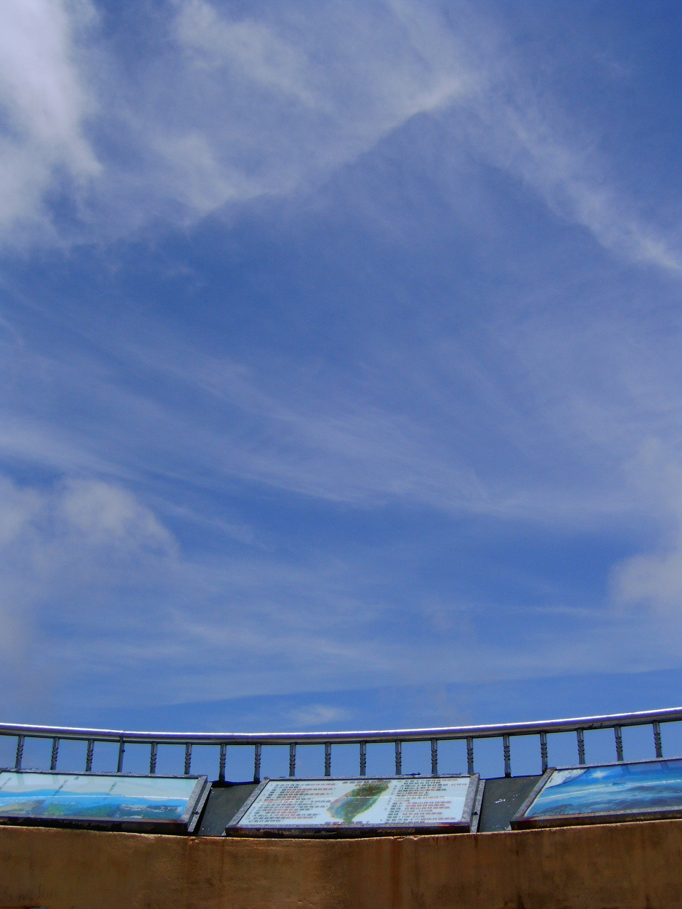
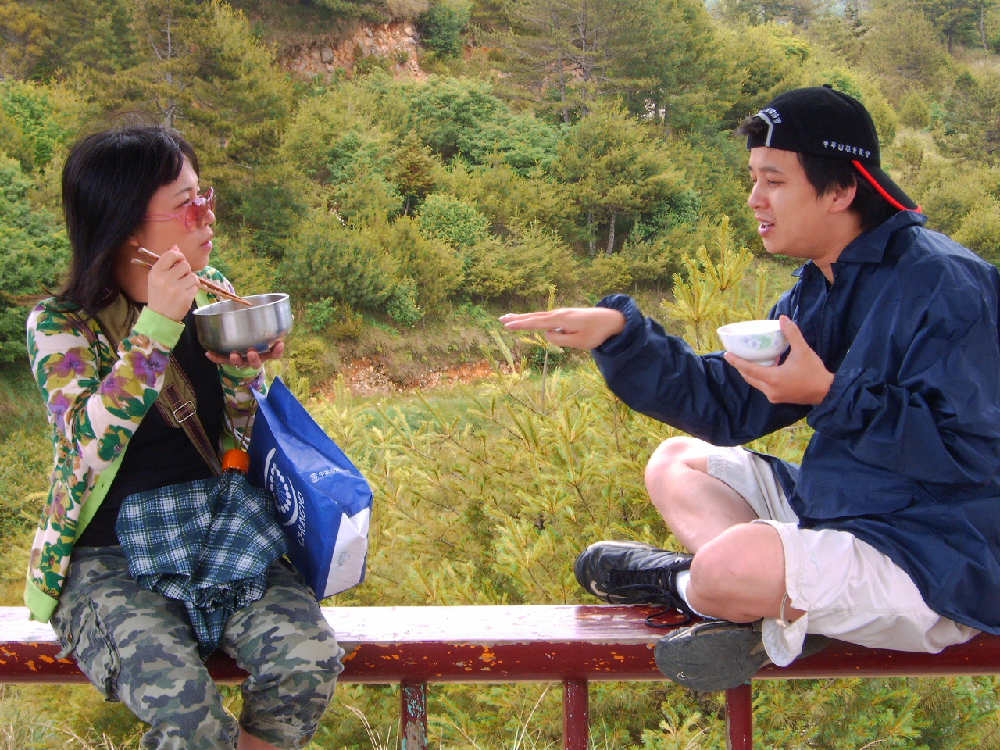
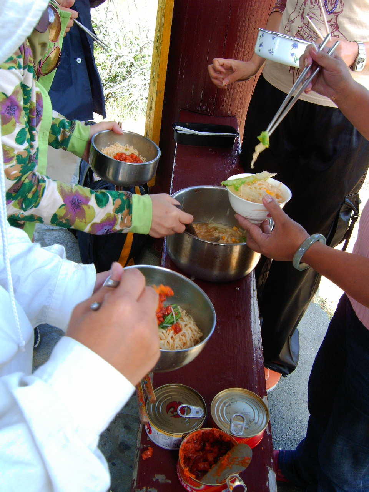
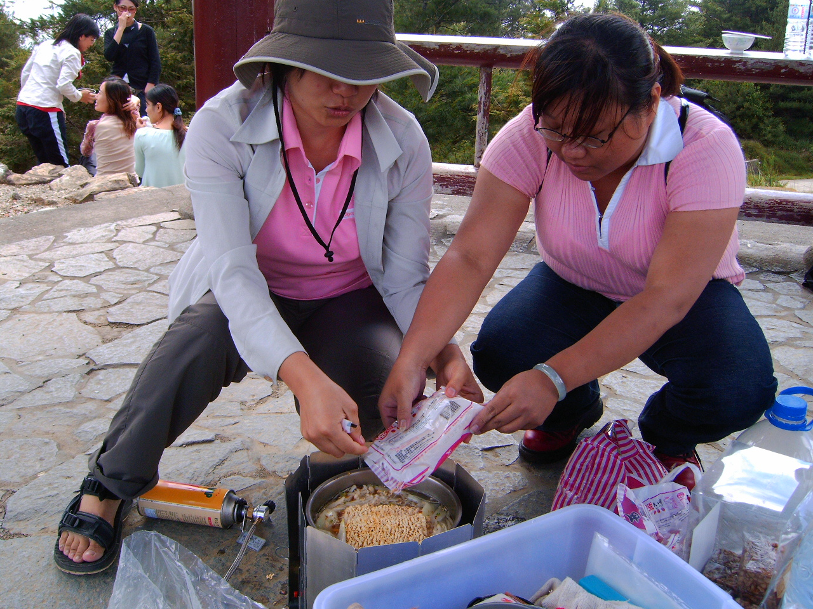
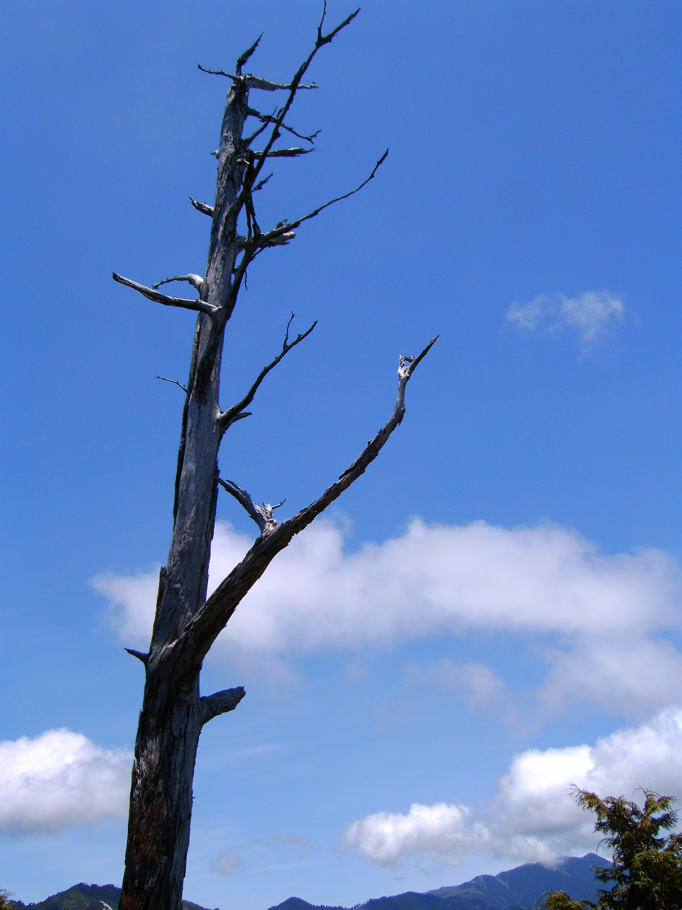
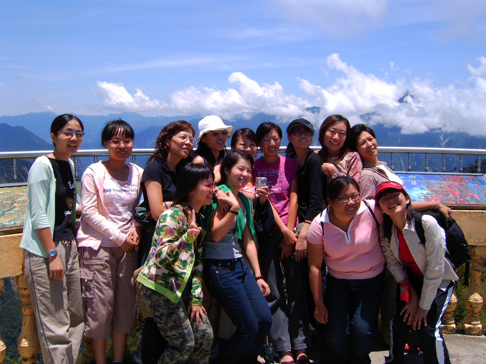

# 大雪山森林遊樂區迎新活動

> 民國94年7月

## 大雪山森林遊樂區迎新活動遊記         簡瑞吟  94/7/9

還記得畢業時，登山社的一個朋友說：「假如我的回憶能用搜尋引擎搜尋，我相信只要打入關鍵字『登山社』一定會有一連串的回憶故事，一幕接著一幕接連不斷的跑出來。」

對於我而言，亦是如此。參加了四年的長榮登山社，好多美好的回億，都在這邊產生，尤其是工作之後，除了工作，下班休息，頂多假日再上進修課程，日子就這樣一天天的過去了，生活圈感覺越來越小，除了固定的好友聚會外，各方的朋友都各奔東西了，有時候真的會想，要這樣一直下去嗎？我一點也不想這樣，開始懷念大學的山社的生活，一直都知道顏彤學長跟草莓學姐們所組的OB存在，但確一直不知道該怎麼聯絡才好，就這樣到了畢業典禮後的一年，才厚著臉皮跟俞方這位準畢業學妹一起參加OB的迎新。

一知道學長姐們要參加大雪山，立刻報名，天哪！我有多久沒參加戶外活動啦！每天加班！加班！加班！出差！出差！出差！雖然這份工作有它的醍醐味，是我熱愛的工作，但還是想出去走走。即使爸爸騙我說有颱風，但我還是持要來。堅持是對的。

清晨五點天空還在泛魚肚白的早晨，差點按掉鬧鐘繼續睡，突然想起早上六點的車時，嚇到從床上跳醒。不敢再摸，深怕錯過了車，迷迷糊糊也到了車站上了車，心中頓時安心不少了，心想：（等我睡醒就到豐原，剛剛好。）當我迷迷糊糊感覺下交流道時，只聞司機說的：「月眉育樂世界到了！各位旅客請快下車。」（我應該是在做夢吧！再閉上眼睛假寐一番）大家一位接一位的下車了！我開始正視這個問題（我該不會坐錯車了吧！但我記得我搭豐原沒錯啊！那為什麼在月眉呢？）正當還在疑惑一切時，另一位媽媽說出了所有的疑惑，還好，還會繞出去，不過到時還是稍稍遲了點，真是對不起大家 >_<”

【接下頁】

到了豐原集合之後，我被分配坐在君惠的車，一上車便自我介紹的我，頓時發現大家的關係真的可以拉~拉~拉~拉~拉~~~~~~~好遠，而我是唯一的一位長榮的學生，另外三位美麗的老師們，也都因為愛山林而一起參與大雪山的活動。讓不禁讓我想到好多女生，『女生都當男生用，男生都當超人用』現在的女生，真是讓我忍不住稱讚一下現在的女生，真的強。當然男生更強。尤其看到顏彤學長的開車方法之後，忍不住再三佩服，那樣的山路還開那麼快，遇到超車，還故意不讓他超，小學妹我甘拜下風，我一定會很卒仔的讓一邊慢慢開，要超車的大哥們請先走，而且那麼多路段還遇到落石坍塌，車道如此狹小，連會車都不行的狀況下，每位大哥大姐都還能神色自若、談笑風生的開過去。（好厲害~）這是幾年下來所練就的功力呢？

到了『大雪山森林遊樂區』真的好開心，空氣中有芬多精的清新，涼涼的空氣讓人搭配著陽光是如此的恰到好處，幾乎讓人忘了這是酷熱的七月天，天氣的藍好清澈，我有多久沒好好好享受這個山林之美，我都快忘了，忍不住一直拿起相機拍照，好美。爬山的美好，就在當一切美景盡收眼底，所有的辛苦一切都值得，每次都是如此，從第一次爬山時，就一直被老師騙，每次都說，快到了~快到了！但明明就才到二分之一。再過兩個彎~再過兩個彎就到了~明明就還兩個山頭吧！再過10分鐘~再過10分鐘~明明就還要半小時！就這樣~被騙了好幾年，後來發現，歷任社長好像都會這樣騙人(顏彤學長我是不知道啦~)就這樣被騙得甘之如貽。在過程中不斷的罵著「我下次不來了啦~」，看到萬里無雲的好天氣，厚厚的雲層堆出的雲海，清涼的空氣吹過臉頰，那種感覺絕對是都市中感受不到的，然後心中就不斷的跑出各種理由來說服自己『其實運動一下也不錯啦~』『其實流一流汗也是幫助新陳代謝~』『其實這麼乾淨的空氣平時真的要爬山才能呼吸的到』『其實……………』『其實……………』其實我爬到山上時早已忘了過程的痛苦了。留下貪婪的美景的心，不斷說服著我，報名下次的旅程。
