# 北埔五指山

> 民國94年8月

北 埔 五 指 山 遊 記           許又文  94/8/13-14

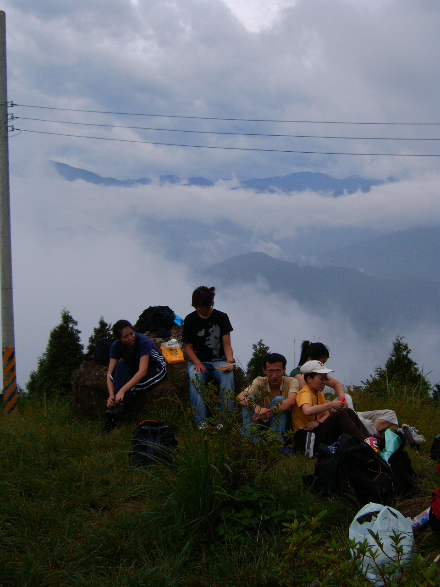

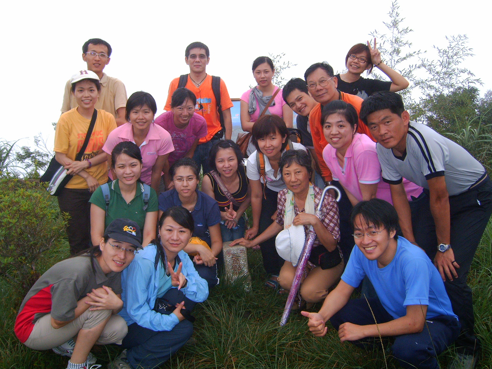

來自各地的校友，為共同興趣而再度相聚，在忙碌競爭的生活空間中，藉由這次的活動，有種偷得浮生半日閒的愜意。從新竹火車站到五指山只需二十分鐘就可以到達，這讓我意外，原以為還有一段路程的呢！受颱風外圍環流的影響，陰天，沒有下雨已經是奇蹟，出門還挺擔心會陰雨而影響行程。

就像是新竹市區的世外桃源，不到半小時的車程，可以嗅出山林的原始面貌。是陰天的關係，遠眺的視野受到影響，但起風時，雲霧、山嵐散去，群山真面目如畫般，跳躍眼前。須臾間，山嵐乍現，像是挽上一層紗，又變得神祕。山林受到雨的洗禮，綠葉顯得更綠，空氣中透露的褥暑難得的清新。閉上雙眼，仔細聆聽大自然的語言，蟲鳴、鳥語傳達的令人舒壓的能量。令人雀躍的是:這是生物教室之旅嗎！我的眼前出現一隻大型毛毛蟲，雖然我不清楚是什麼品種的蝴蝶，但是我很肯定一定是瀕臨絕種的那一類。

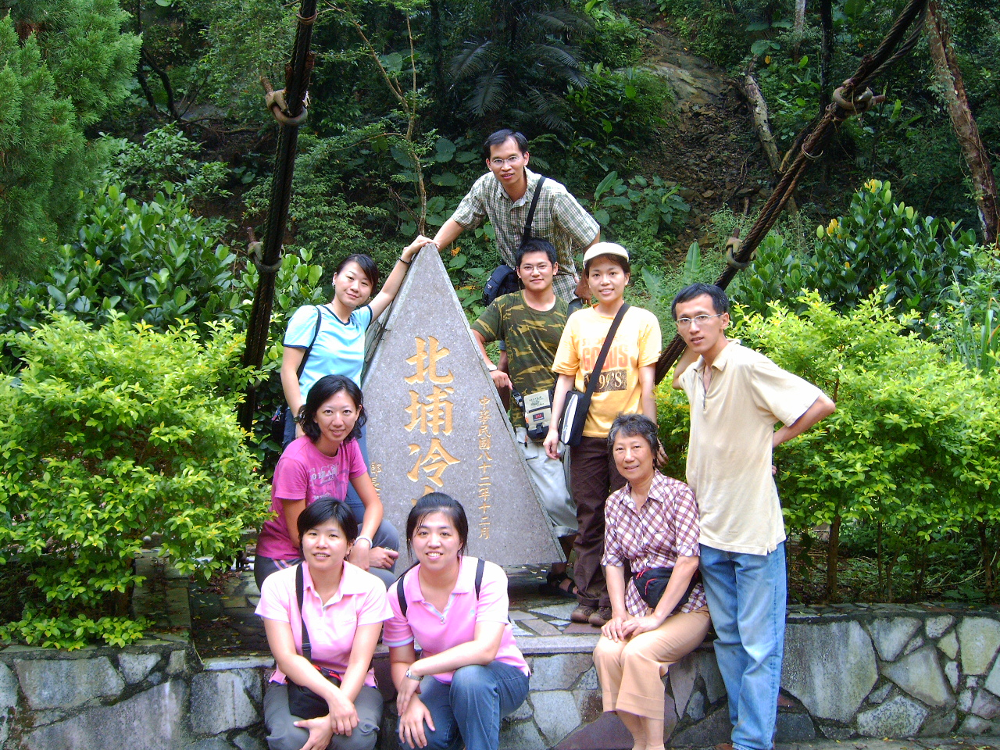

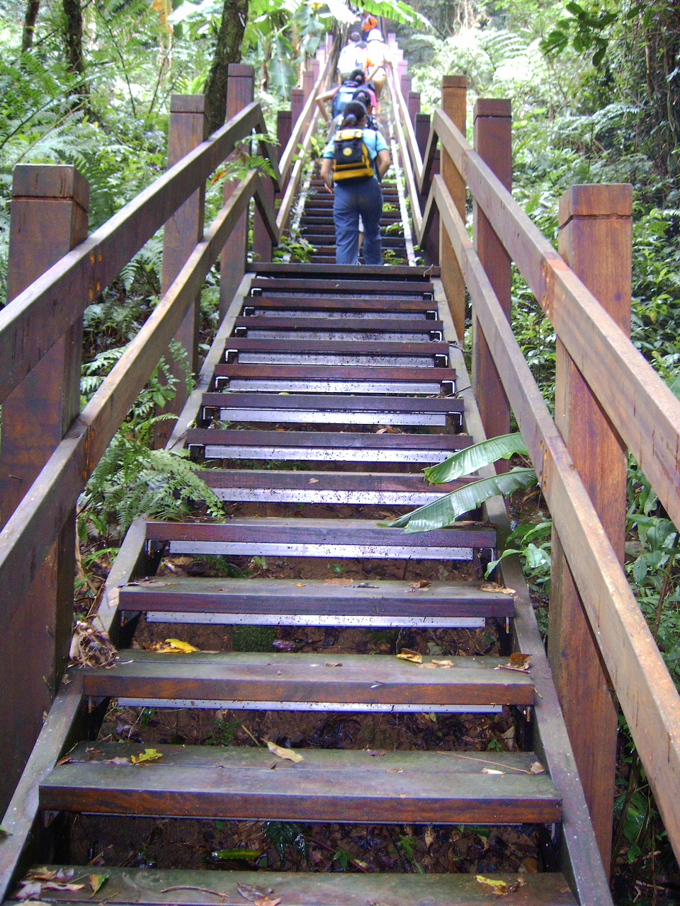

不論是上山或是下山的路程， 整個行程我並沒有氣喘如牛，對我而言走起來都不算輕鬆。因為下山後，我雙腳微微的顫抖，雖然沒有到軟腳的地步，但感覺得出平日我的運動量不足，體力上還得加強勒！不過登山社辦的活動是貼心的，接著的行程是北埔冷泉。泡冷泉的地方經過規劃，假日是不錯的去處，處處可以感覺得出新竹縣的用心。我選擇了一個靠近攔沙壩的位置泡我那雙微微顫抖的雙腳，希望藉著神奇的溫泉療效，能將我的運動傷害降到最低。

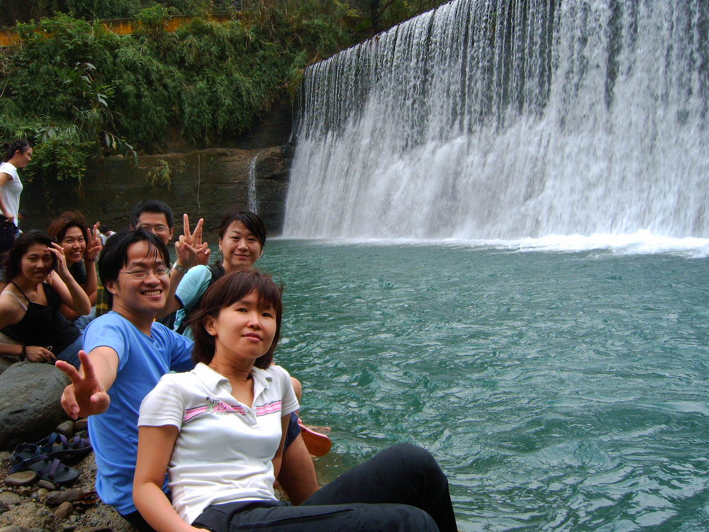

攔沙壩形成寬闊的瀑布，在瀑布附近，我大聲的唱歌也不會吵到別人呢！有別於山林清幽氣息，我再次閉上眼睛，寧靜的能量環繞著我，同樣有不可思議心靈淨空的魔法。

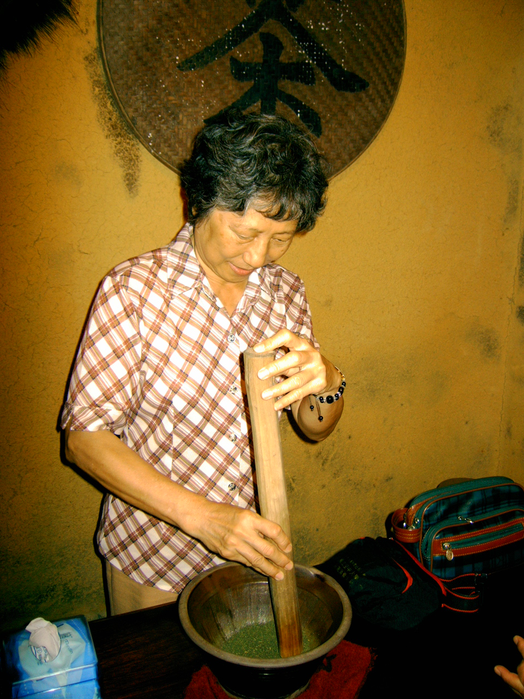

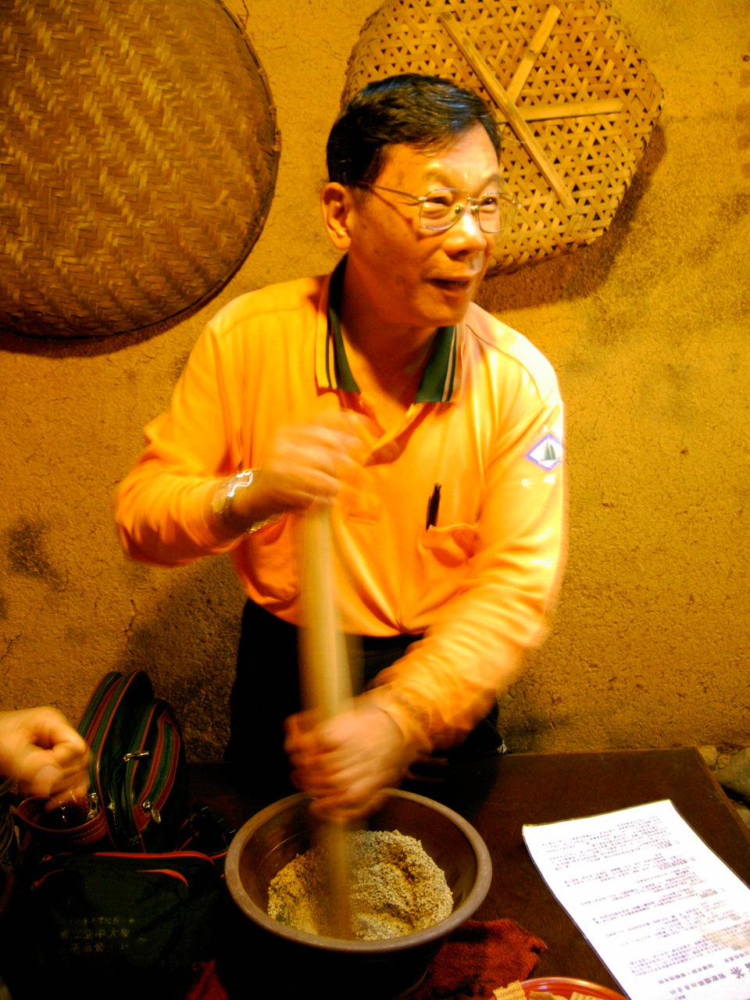

北埔老街，在這可以體驗到傳統的客家飲食習慣。傳統的客家人逢友人來訪時，會呈出平日養身的擂茶；逢重要年節才可能吃到的菜包、草仔粿、粄粽等，沒想到居然能在饑腸轆轆食品嚐到，幸運指數達到滿分。

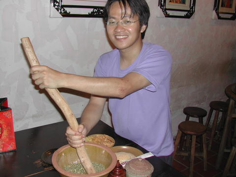

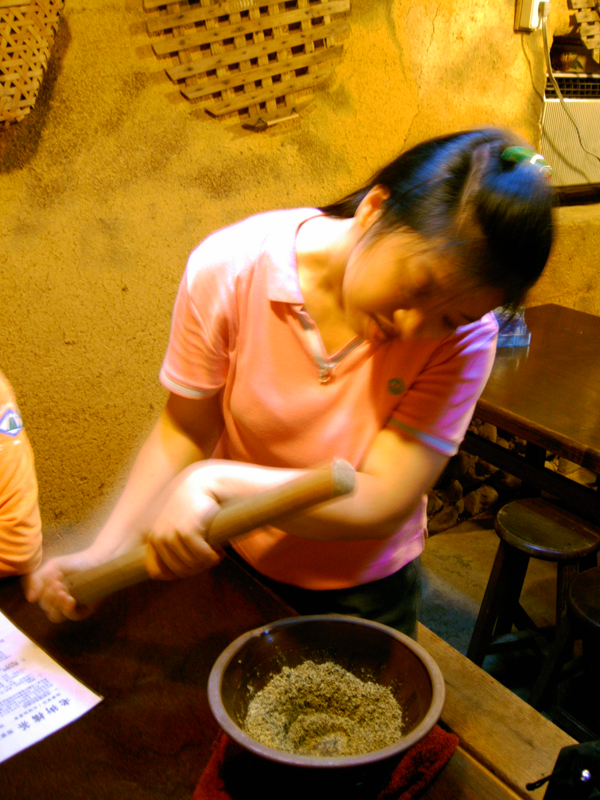

天色漸暗，選擇了當地北埔民宿過夜，因為明天一早還要到峨眉湖附近。意外的發現民宿的主人家十分好客而且對當地特產“東方美人“也十分的了解。更大方的請我們一行人品茗今年新竹縣“膨風茶“比賽評比第三等的茶葉，也向我們細說為什麼“膨風茶“又稱“東方美人“，及原本平凡無奇的蟲害茶葉能夠聲名大噪的緣由。

踏上歸途時細細回想這兩天一夜的收穫，圓滿的微笑曲線是我的答案，這個週末戶外走走也是不錯的選擇，我想。

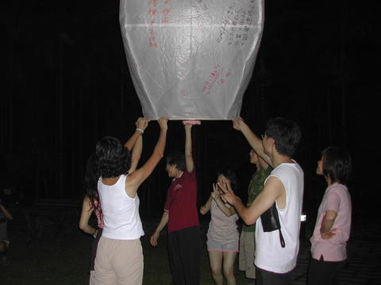

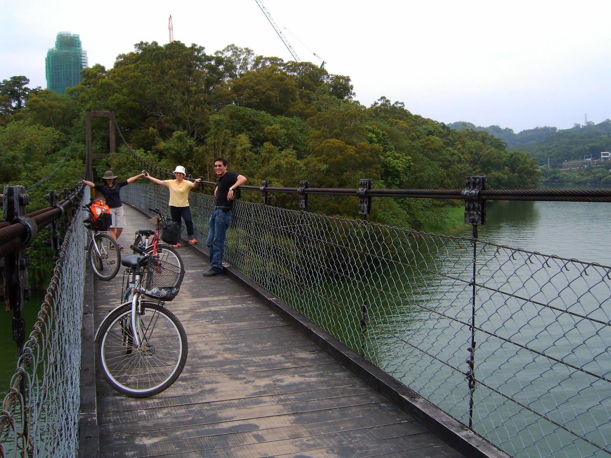

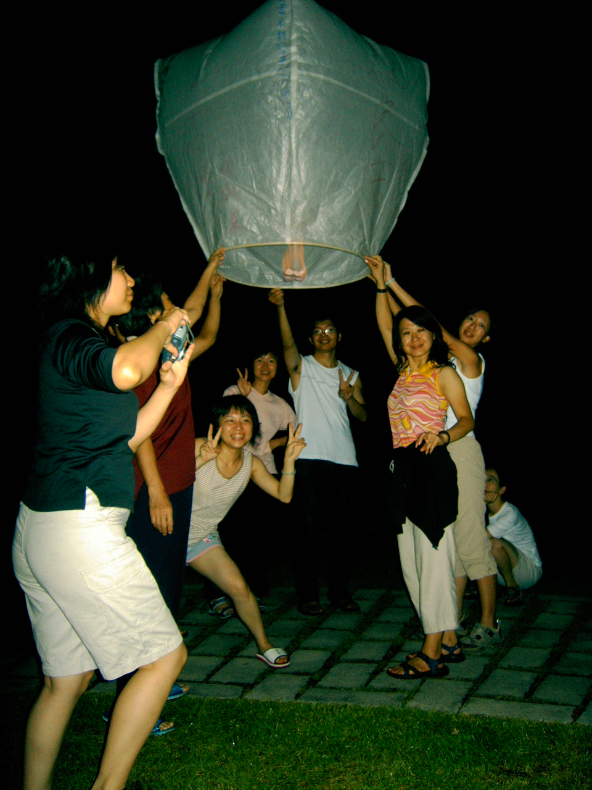

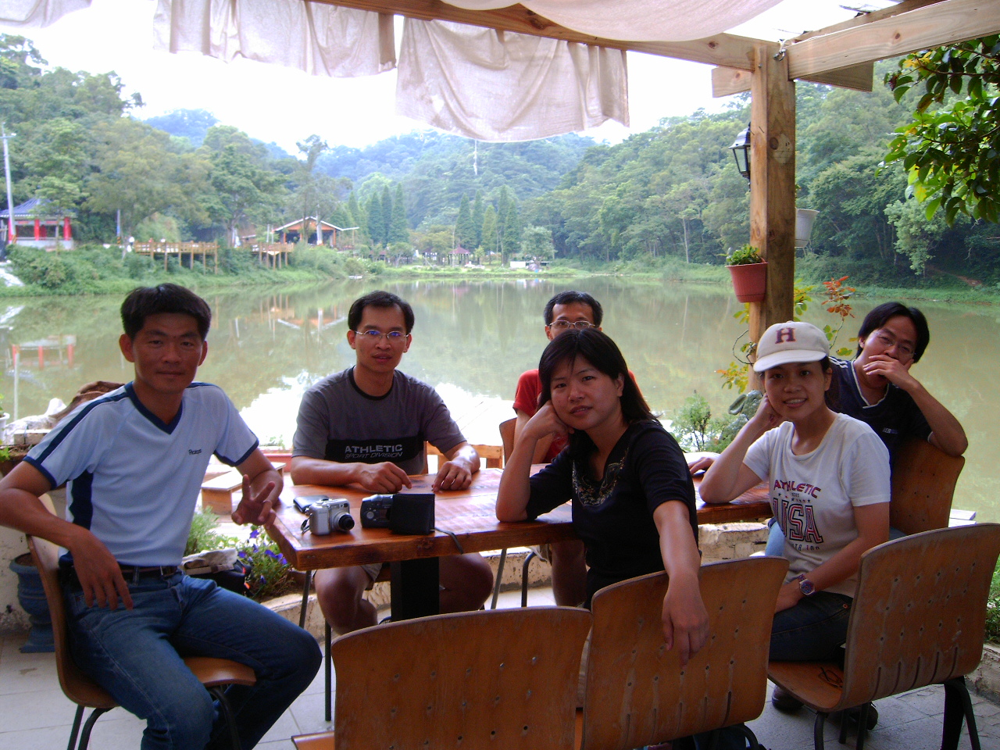
