# 雪山東主峰

> 民國94年10月

## 山行軼事－雪山主峰全記錄      攀登時間：2005/10/08~10/10

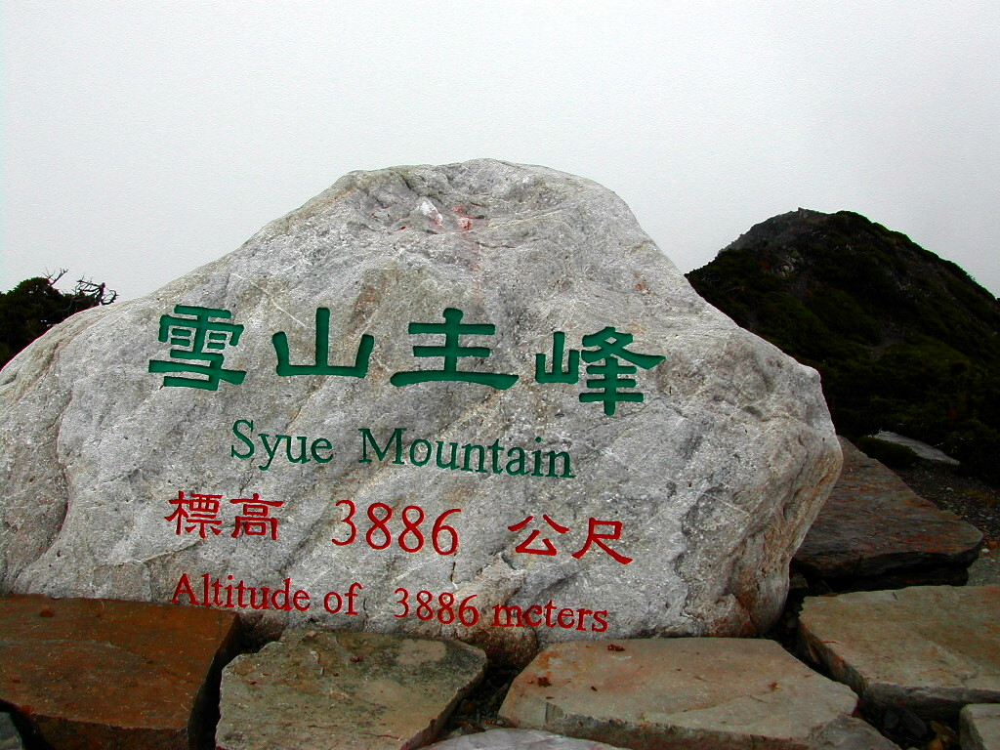

**ＤＡＹⅠ**

那是一個灰濛濛的開始。早在活動開始的前幾天，我們便已透過氣象預報得知，此番的雪山主峰之行，將會是個充滿著秋雨紛飛與泥濘不堪的冒險之旅；雖然此行情況險惡，但卻遏止不了我們向雪山朝聖的決心，一行十六人、分乘五部汽車，浩浩蕩蕩的向此行的首站－武陵農場前進。

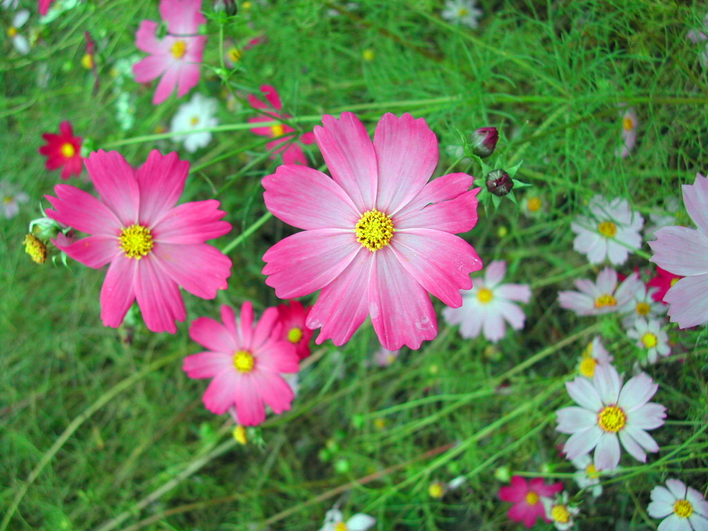

在將近八個小時的車行過程當中，我們翻山越嶺、橫越雲靄裊裊，也曾駛過湍急的陸上瀑布、有驚無險地穿越坍塌崩落的山林縣道，在山窮水盡疑無路時，我們終於抵達了世外桃源－武陵農場。距離我上次初訪此地迄今，已過了十六個年頭，記憶中那充滿山林氣息的武陵農場，如今在有心人士的愛護與用心經營下，已蛻變成兼具渡假、休閒、露營與山行的複合式農場，雖然純樸自然的景緻不在，但卻絲毫不減它在我心目中的地位、以及曾經帶給我的美好回憶。

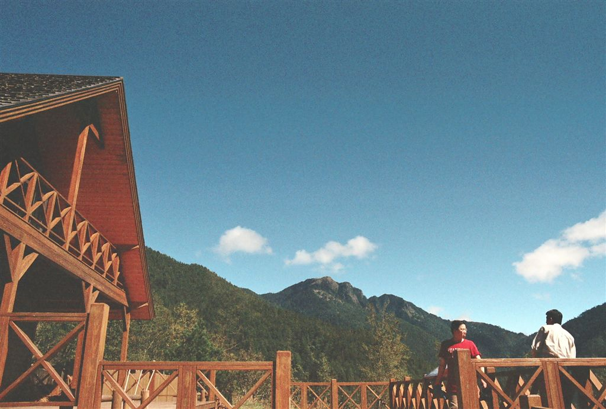

原本在第一天的行程規劃中，是決定要在武陵農場裡夜宿、露營的，但經詢問管理員後得知七卡山莊的風損已經提前修復，便在一成老師等人的提議、夥伴們的決議、以及雪山管制哨帥哥管理員的特別通融下，臨時決定當晚直攻「七卡山莊」；此時天色已暗、夜幕低垂，一場「背負著重裝備」、「與時間賽跑」的冒雨夜行挑戰就此展開！在約莫兩個小時過後，我們終於抵達了七卡山莊，此時飢寒交迫的我們，在「總舖師」阿光以及光嫂的巧手妙藝下，嘗到了今天，噢～不不不，應該說是此生最最令人感動的豐盛晚餐（真是太感謝啦！感動地痛哭流涕ing～）。

**ＤＡＹⅡ**

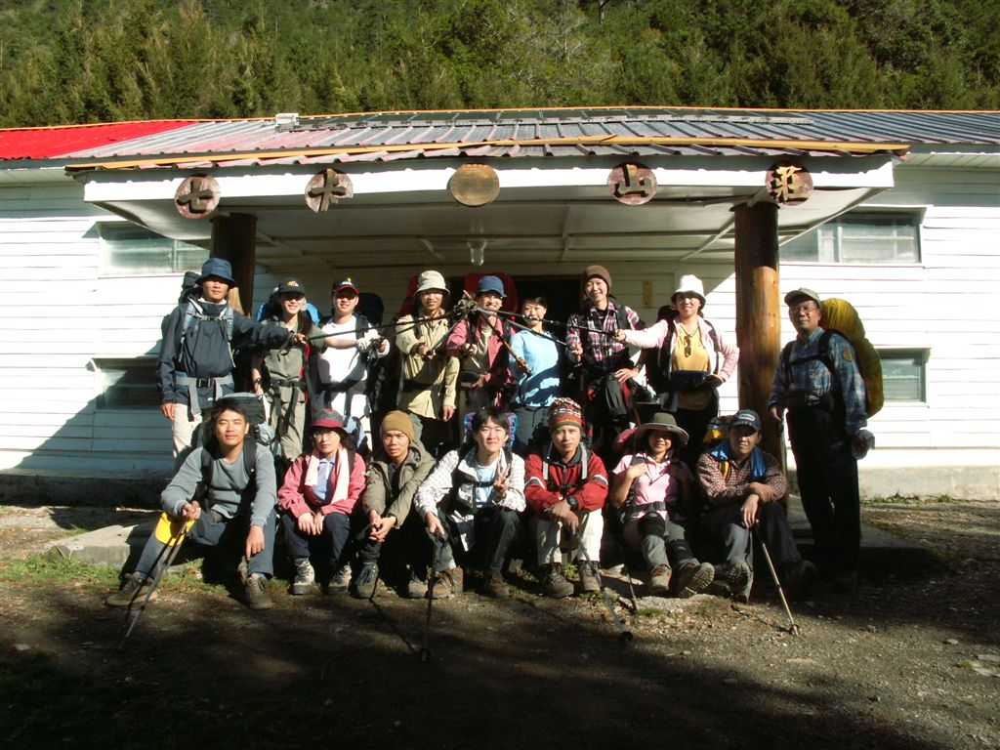

天還沒亮，大伙們便已整裝待發，準備向雪山主峰前進。在用完簡單的早餐之後，一行人便陸續離開尚在沉睡中的七卡，向山莊後的登山小徑出發，此時夜空中仍飄蘯著綿綿細雨，在初晨山嵐的吹拂下，顯得格外寒冷。

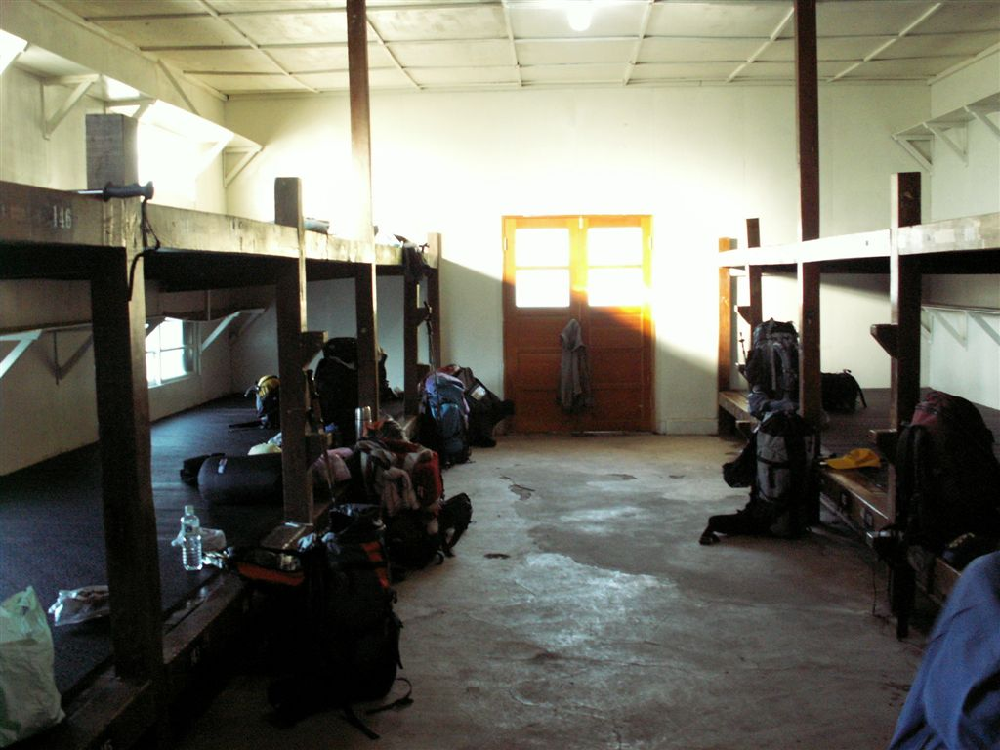

頭頂著夜行燈、摸黑在傳說中「奪命四十九彎」的之字型山徑中前行，是一種很奇特的經驗。雙眼所及的，只有微弱燈光照明之處，其餘的盡是沉默的漆黑，兩旁偶有窸窣聲音作響，總是會引起不小的虛驚；行走在幾近夜黑的山林中，竟有股莫名的惶恐感！好在不一會兒魚肚漸白，天色已漸漸地明亮了起來。

望著前方隱身在雲霧飄渺中的陡峭碎石山徑，心中便已知曉，哭坡到了。哭坡，顧名思義就是形容此山坡坡度之陡峭難行，是會讓人忍不住而感動落淚的（噢～不不不，應該是因極度痛苦而留下心酸的眼淚吧！），不過或許是我心情太亢奮的緣故，行走其間，竟不覺得疲累！

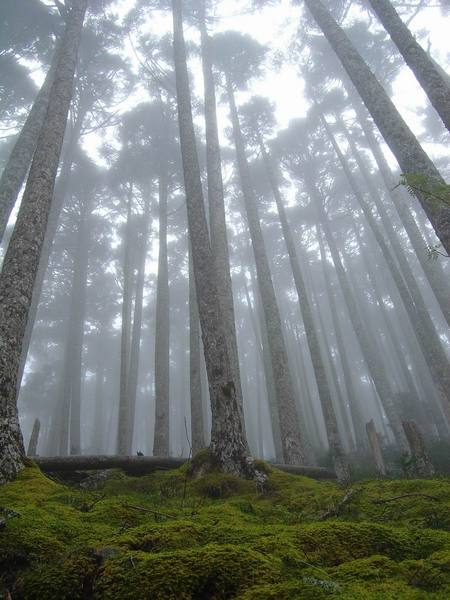

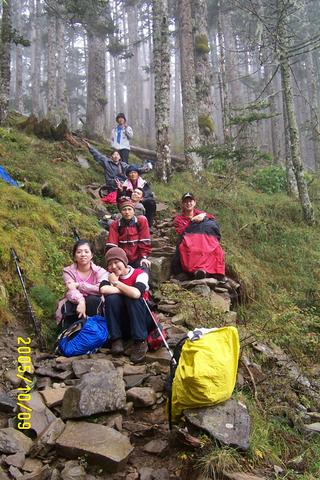

走過哭坡後不遠處，雪山東峰已矗立在眼前。雪山東峰標高3150公尺，是攀登雪山主峰必經之路，也是台灣的百岳之ㄧ；印象中東峰這裡的視野遼闊，是走完哭坡後最佳的休憩、歇息地點，只可惜今天天公不作美，群山美景皆籠罩在煙飛迷濛之中，真讓人直呼可惜呀！

再向前行，經過停機坪後不遠處，三六九山莊已清晰可見。顧不得身上背負的裝備與累的直發抖的雙腿，大伙三步併兩步的、興奮地向三六九奔去，因為我們知道，我們的先遣部隊－社長大人與為理等人，已為我們備妥了熱騰騰的薑母茶與熱可可、以及我最愛的Coffee呀！

今日的三六九山莊，已不若十餘年前記憶中的簡陋與破舊，在雪霸林管局的細心建設下，已頗具規模，而且更難能可貴的是，此地竟然還有廁所耶！（雖然那廁所的味道並不是那麼的好聞啦！）這裡是非常適合觀賞日出美景的地點，試想在清晨時分、曙光乍現，推開門窗，讓秋日的朝陽進駐，肩倚著門廊，品嚐杯香醇可口的拿鐵、與這初晨的晨曦、雲海相陪伴，噢～生命，就應該浪費在如此美好的事物上呀！（只是我們沒有在此夜宿的打算，真是令人惋惜不已哩！）

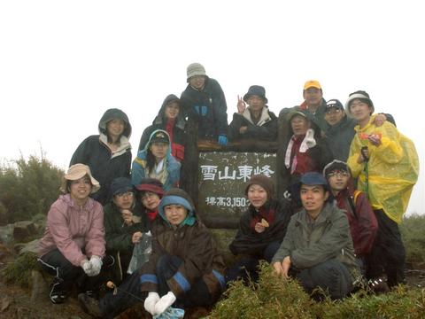

在短暫的休息與午餐過後，我們隨即向雪山主峰出發。帶著尚餘80％的戰鬥力，我們來到了「黑森林」；這裡是個充滿著神秘色彩的國度！在高聳筆直的杉樹林間，光和雲霧在林間游走，倏然間飛奔而至、隨即卻又消失的無影無蹤，像極了頑皮嬉戲的小孩子、自顧自地玩起了捉迷藏的遊戲；藏身于林區間的碎石斷崖，令人驚奇卻又帶點危險的刺激感；不過最令我好奇的是嵌刻在山徑旁的警示牌－「此處有大型動物出沒」，這裡所指的大型動物，該不會是那胸前有著大Ｖ字型標誌的「台灣黑熊」吧？！不知道「裝死」這招還有沒有用哩？－我窮極無聊地自顧自的嘀咕了起來。

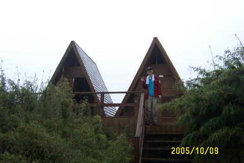

走出了黑森林，雪山主峰已近在眼前。雖然「終極目標」已在不遠的前方，但橫阻在我們與主峰之間的，卻是一段漫長而看似無止盡的陡峭碎石坡呀！（事後我們一致覺得，最後攻頂的這段路程才更應該叫做「哭坡」呀！）

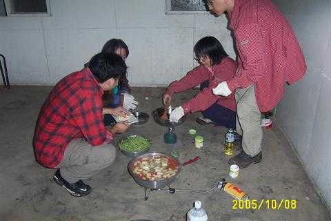

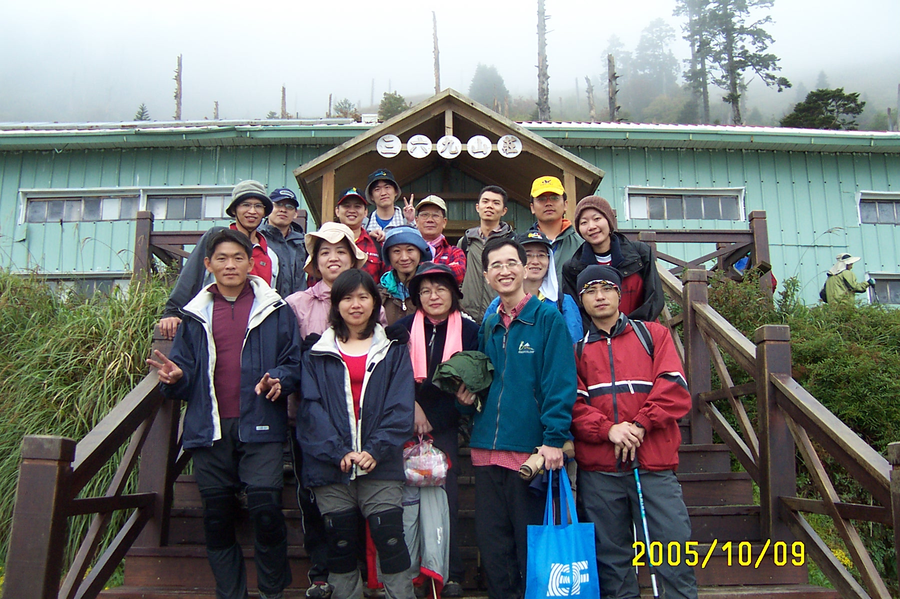

坐落在山徑右側的，則是著名的「圈谷地形與冰斗」，這已存在逾千萬年的冰河時期地形，是造物者的傑作，亦是山岳成長的痕跡；雲霧若聚若離、雪山主峰在若隱若現間，更加顯得神秘而莊嚴。

在眾人們殷切期盼與棄而不捨的努力下，我們終於攻克了雪山主峰。雪山主峰標高3886公尺，是台灣的第二高峰（僅次於玉山主峰），此刻站在主峰山頂，才真正能體會的出「登泰山而小天下」的感受！或許是上蒼被我們不屈不撓的堅強意志所感動，原本雲霧籠罩、能見度不佳的視野，竟慢慢地澄明了起來。遠山層巒，時而清晰可見、時而隱沒在雲霧繚繞中，每每不經意地窺視其壯麗景致，往往讓我們因興奮而不自禁地發出陣陣驚嘆之語。

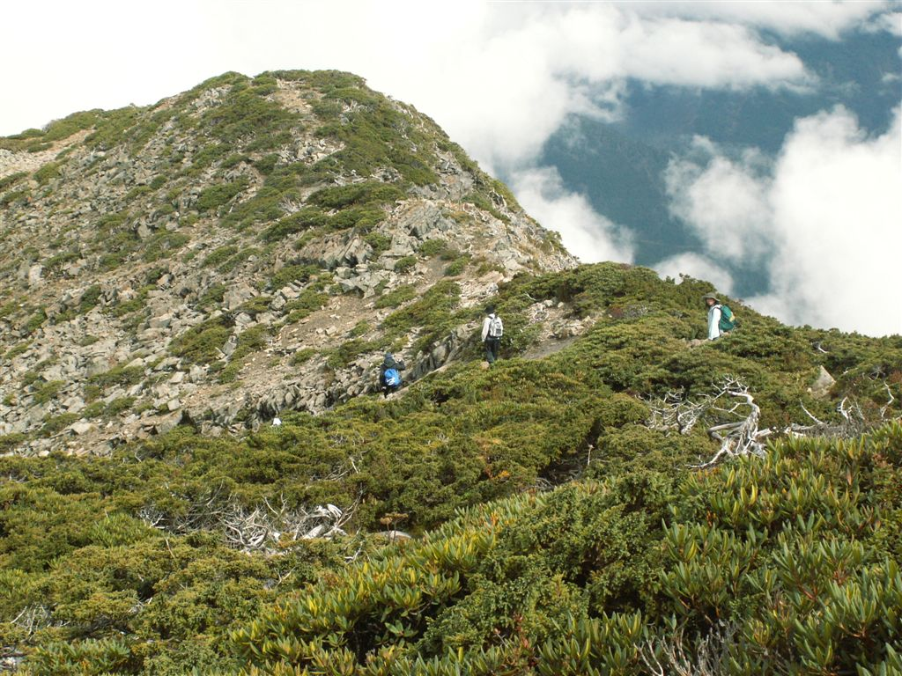

這次成功的攀登上雪山主峰，除了完成了自己的遺珠之憾外（十六年前的攻頂失敗），其實還有著更深層的意涵。這裡是我和婷初識的地方，也是長達十六年友誼的開始，藉著這次攻頂的順利成功，象徵著我倆間的友誼將會更加鞏固而長久！我很珍惜這段得來不易的友誼，謝謝妳這些年來的鼓勵與支持，我一直心存感激！

下山的歸途，由於天色將暗與體力耗損的緣故，我們已無暇欣賞四周的美景，只能以著僅存的意志與體力，拼了命的往七卡山莊前進。在長達十五個小時內的完成上山、攻頂與下山的壯舉後，返回七卡山莊的我們，個個都已疲憊的說不出話來！那一夜，大伙睡的很深沉，那一夜，每個人的夢，很香、很甜。

**ＤＡＹⅢ**

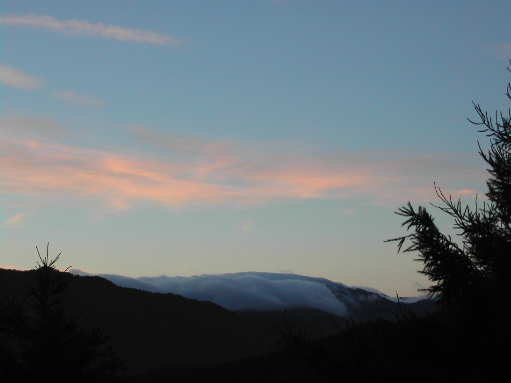

沒有緊湊行程的今天，大伙刻意地放緩腳步、貪戀著被窩溫暖餘溫、硬是賴著不肯早早起床。清晨時分裡的七卡，微涼間參雜著些許的暖意，天空，終於放晴了。整好了行囊，大伙在七卡山莊前留下了最後一次的合影後，便依依不捨地離開了這相處兩天的地方；何時才能再來重遊此地－我問著我自己。

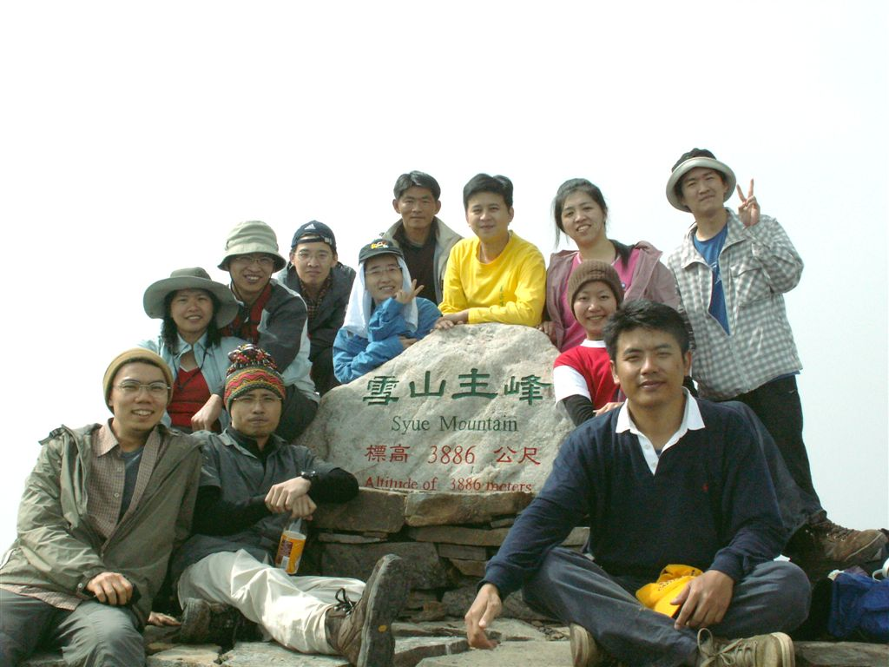

下了山後，歸心似箭的我們，個個是踩足了油門往回家的方向前狂奔；在極速奔馳的剎那，我看見－那留著小平頭、恣意揮灑青春的我，坐在老舊搖晃的台汽客運上，直嚷嚷著我還要再回來時的情景。

**～Ｔｈｅ　Ｅｎｄ～　　　　　**

圖：吉益／玲娟／伯穎等　文：吉益

雪 山 之 行                    陳玲娟   着

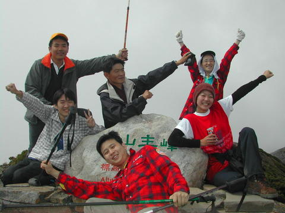

2005/10/8-10

早在8月中旬的新埔五指山峨嵋湖之行，婷婷就已經跟我預告雙十節連假要去攀登雪山，要我開始訓練體能。當時我並不以為意，只想說沒爬過高山可以去試試，便口頭答應了她。爾後收到顏彤的報名資訊，忙得沒空回覆他，直到9月報名截止日過後，婷婷打電話來問我是否確定要參加，才警覺到真的需要趕快訓練體力了，否則到時候無法攻頂可要抱憾終身了！於是開始了為期大約3週的登山特訓，每天晚上下課後就去跑操場，跑跑走走，從5圈開始慢慢增加到了10圈，體力果真進步了。

由於第一次攀登大山，心裡既期待又害怕：期待山上壯闊秀麗的美景；害怕自己體力不夠造成隊友的負擔。轉眼間登山的日子終於來臨了，10/7晚上下班後便搭為理的車下台中，住在我弟家，而老師、吉益、為理、阿光他們都住秀逗家。隔天一早阿光的車到西屯來接我跟草莓，而吉益和為理的車直接從秀逗家出發，最後我們3輛車在埔里的地理中心碑碰頭，再一同前往梅峰農場跟顏彤他們會合。

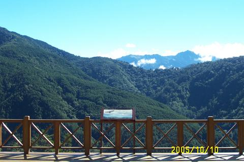

一到梅峰農場，報上顏彤的大名，農場大門便為我們而開了，「顏彤」真是最好用的通行證。進去農場才知道原來弘偉他們那一車已經到達很久了，把梅峰農場都逛一圈了呢，真希望我們也有時間可以逛逛，但是時間已經比預定的時間delay了，只好趕緊上路。我們一行16人，原本預計只開四部車，但由於還有露營用具，每輛車都已經超載，顏彤只好再出動他的老爺車TERCEL。

五部車浩浩蕩蕩往雪山出發了，在合歡山的路段遇到了大塞車，前面的車輛好像有點狀況，大排長龍的車陣停滯了將近20幾分鐘，我們趁機下車拍攝山景，婷婷也開始來回於各車之間，強力推銷分送梅峰出產的水果，其中黃色小蕃茄真是美味極了。過了合歡山來到梨山，已經將近下午2點，大家肚子也都餓了，進了餐廳大快朵頤一翻後，又到超市補充了一些乾糧。來到梨山理所當然要買梨囉！負責我們此次活動的飲食且具備五星級主廚水準的阿光、光嫂為大家買了脆甜多汁的水梨，準備上山時給大家解渴慰勞一下。

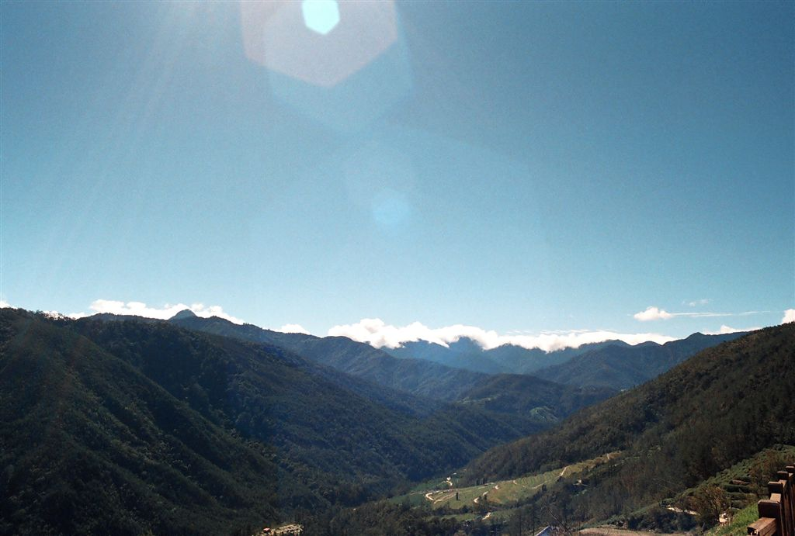

繼續往武陵農場前進，沿途遇到多處坍方，工程人員正在搶修，我們則是戰戰兢兢的通過，真是驚險萬分。經過長達將近8小時的車程，終於到達了雪霸國家公園~武陵農場。顏彤先去辦理入山証，才得知「七卡山莊」已經重新開放了，便決定當晚直接住宿七卡。先前申請住宿七卡時，因為正在整修暫停開放，所以才計劃第一晚要在武陵農場露營。那既然已經開放了，當然要直接上去看看囉。

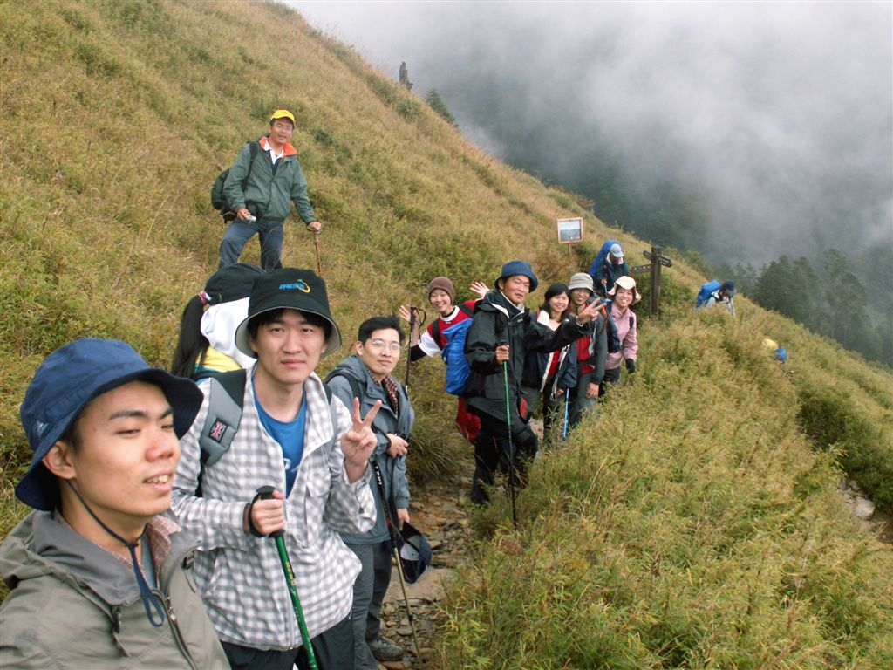

直接驅車到登山口，但由於陡峭坡道加上泥濘路，阿光的車打滑上不去，大家在後面幫忙推車。到了登山口管制哨，看完了行前宣導短片後，管理員突然發現我們原先申請的入山日期是隔天，所以不讓我們提前上去。但是經過再三的協調交涉，最後終於打動了管理員，同意給我們放行了！大伙兒趕緊整裝行囊，分配公糧，男生負責較重的金屬器具和罐頭等，我們女生只背負一些較輕的食物。我拿到一包菜菜還有2顆不知名的瓜瓜，因為瓜瓜有點重而且我的背包比較小塞不下，為理就幫我拿去硬塞到他的背包裡，幸好沒有爛掉。婷婷也幫我背了睡袋，減輕了我不少負重，真是太感謝他們了。

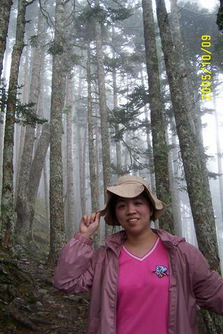

18:20天色已暗，大伙兒重裝出發了，開著頭燈慢慢行進，背包實在很重(應該有20~30公斤吧)，舉步為艱，平均時速只有1公里，到達七卡山莊(距離登山口2公里處)已將近20:00了。在我們之前已經有一支隊伍到達並在休息了，我們盡量降低音量以免打擾到他們。大伙肚子也餓了，放下背包，由阿光、光嫂掌廚，其他人在一旁手忙腳亂的幫忙著，猶如在『辦桌』，不一會功夫一頓豐盛的晚餐上桌了，有梅甘扣肉、香腸、四季豆、青椒炒肉絲、芹菜炒甜不辣，還有青木瓜茍杞雞翅湯(原來那2顆瓜瓜就是青木瓜呀)，原以為登山只能吃吃泡麵或罐頭，沒想到還可以吃得這麼豐盛，真是太感謝阿光、光嫂的用心準備！由於高山上沒有熱水可供洗澡，而且水是冰的，只能將就著點用濕紙巾擦澡。因此用餐過後大家便早早去就寢了，準備隔天早起攻頂的重頭戲。

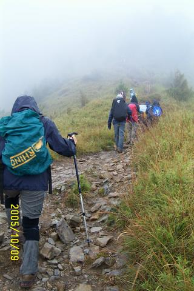

第二天凌晨大地仍在沉睡中，我們便整裝待發，用過稀飯後，4:30由老師帶隊，往雪山東峰前進囉！走在漆黑的山間小徑上，加上綿綿的霧雨，能見度只限於頭燈的照射範圍，還好我們一行16人，人多可以壯膽，否則絕不敢獨自一人夜行山路。

不久後天邊露出曙光，天色漸亮，只可惜因所在方位的關係看不到日出美景。6:30到達有名的「哭坡」前展望臺(距離登山口4公里處)，休息片刻後，便進入了陡峭崎嶇的碎石坡，據說難行的程度讓人直想落淚，故得此名。也不知是因我們興志高昂或是體力充沛，行過「哭坡」竟不覺得艱難疲累。

沿途欣賞著皚皚的雲霧，遠山近樹的濛濛美，不知不覺已經登上了雪山東峰(距離登山口5.1公里處)，征服了我的第一座百岳。東峰標高3150公尺，視野遼闊，可以環視玉山群峰、中央山脈、武陵四秀，只可惜迷霧細雨籠罩，叫我們沒有眼福一窺群山的壯闊秀麗。留影合照後再往前行，經過了救難直昇機停機坪，顏彤和為理便脫隊先行趕往三六九山莊，為我們準備熱飲、食物。我們則踩著輕鬆愉快的步伐慢慢前進，我和婷婷還一路邊走邊聊，我是有點上氣接不了下氣，婷婷卻面不改色，難怪伯穎在一旁直誇她：登山健談的功力是所見識過的人中無人能及的！

穿過無數的箭竹林，踩過了幾段泥濘地，眼前出現了房舍，終於抵達三六九山莊(距離登山口7.1公里處)，馬上就有熱騰騰的咖啡、可可、薑母茶可以喝，真是太棒了。「三六九山莊」有2座小木屋，從外觀看絕不會聯想到廁所，走近聞到了氣味才知道原來是高山廁所。在山莊還巧遇了「無聊社青登山社」的吉祥，原來前一晚比我們早到達七卡山莊的那一隊山友們就是他們呀。簡單的用過餐，休息了將近1小時，9:45在山莊前合影後便換為理帶隊，顏彤押隊，總共12人準備攻頂。而老師因腳傷舊疾複發無法帶領我們完成攻頂，便和阿光、光嫂、草莓他們4人先折返七卡山莊，為我們準備「慶功宴」。

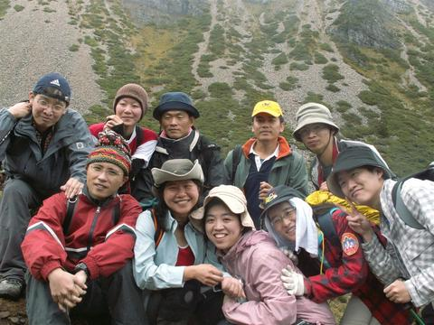

在「三六九山莊」後的之字型山徑上遇到了剛從雪山北峰下來的山友，告訴我們山頂上風雨交加，勸我們不要上去，雖是如此仍不減我們攻頂的決心。雖然沒有晴空萬里，但陰霧的天氣反倒不會太熱也不用擔心紫外線過量。過了大之字形的草原後便進入了「黑森林」，是一大片高聳參天，直立茂密的冷杉純林，猶如進了童話故事裡的夢幻森林，那麼的幽靜清新，聽著悅耳的鳥語，享受著森林的芬多精，感覺舒暢極了。出了黑森林就來到了崩谷地形的底部，往上則是較陡峭的之字型碎石坡，上面便是雪山主峰了。大家反而覺得走這一段比「哭坡」艱難，不過雲霧散去，暫時露出了崩谷，大家興奮的趕緊拿出相機來猛拍照，一點也不覺得累了。

13:10終於登上了雪山主峰，距登山口8.9公里處，標高3886公尺，是全台第二高峰。此時上帝彷彿也在歡慶我們登頂成功，原本彌漫的雲霧即刻散去，大家搶時間趕緊拍下環山美景，也跟主峰地標合影存證。居高臨下，漫步在雲海之上，層層疊疊的山巒，親身感受到了上帝所創造的大自然之美，真是嘆為觀止！心中感到無比的開闊，竟有說不出的感動。一天之內就完成了2座百岳，對第一次攀登高山的我而言真是興奮不已。

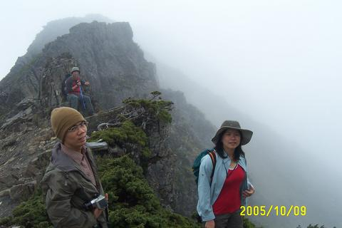

美好時光總是短暫的，為了趕在天黑前能回到七卡山莊住宿，13:50便打道下山了。下山的速度很快，但膝蓋承受的壓力相對較大，回到三六九山莊，我的雙腳已經有點麻木無力了，「上山容易下山難」講得一點也沒錯。休息了片刻，16:20再次出發，12個人很自然的形成了3小隊：為理帶領著腳程比較快的吉益、芝宇、俊瑋飛奔而下；顏彤則押隊，和伯穎、榮春、弘偉走在最後一隊；我則和婷婷、秀玫、佳霖走在中隊，此時我已經感到膝蓋的疼痛了，遇到上坡路段幾乎是用四肢在「爬」的。時近黃昏，天邊出現了一抹彩霞，雲霧飄渺，山下的部落若隱若現，遠山近樹形成一幅美麗的圖畫，吸引住我的目光，趕緊按下相機快門捕抓這美景，竟一時忘了疼痛了。駐足欣賞了好一會後繼續往前行，來到了「哭坡」，上山時覺得這一段蠻容易的，怎麼下坡時變得如此困難，覺得這段路好長ㄛ。謝謝體貼的佳霖幫我揹背包，幫我減輕負重。後來聽見第一小隊的呼聲，便知道哭坡前的展望台就快到了。

由於天色已暗，帶隊的為理決定等大家都到齊後再一起行動比較安全。在展望台休息了片刻，婷婷拿了藥布給我貼在膝蓋，涼涼的感覺減輕了一些疼痛。18:15離開展望台，換成高大強壯的俊瑋幫我揹背包；婷婷、秀玫則走在我前面為我開路、除去障礙物，讓我走得比較輕鬆平穩；大家行進的速度也配合我放得比較慢，非常感謝大家這樣的扶持，讓我可以順利的下山。

19:50終於回到了七卡山莊，老師已經站在門口迎接我們的歸來。而阿光他們也為我們預備好了熱騰騰的佳餚。只是我的腳疼得快斷掉似的，沒什麼味口，只想趕緊躺下來休息。換上了乾淨的衣服，原本想抬腿先睡一下，身體已經疲勞不堪，但精神卻還好得很，一點睡意也沒有，便到廚房去吃點東西。我們的社長大人顏彤，也因全程揹負過重的背包，疲憊得連一句話也不吭，多虧有溫柔體貼的老婆婷婷陪一旁照顧他，幫他塗上擦勞滅，讓他舒服一點。用過晚餐後，大家陸續就寢，我們有些人則繼續留在廚房喝著熱可可，聊一聊山行趣事，想再多把握住在雪山上的時光。

半夜，我睡眼迷矇看到幾位其他夜行的登山客剛到達山莊，進來晃了一下隨即又出去了，之後也睡不著，只想賴在暖暖的睡袋中。晨曦乍現，我就先起床，到廚房先點了火煮紅豆湯，就到山莊外面晃晃，清新的空氣和著山林的芬多精、鳥語輕唱，感覺好舒服。只可惜山莊前廣場的視野被樹林遮擋住了，無法看到晨曦下的青翠山巒。

第三天的行程比較輕鬆。前一天連續15小時密集的「行軍」之後，經過一夜的休息，消除了疲憊，大伙陸續起床，用過早餐後，整裝待發下山回家囉。行囊減輕了一些，但也製造了一些垃圾，必須自行帶下山。在山莊前留下萬「杖」雄心的合影後，8:10出發下山。踩著輕快的步伐，愉悅的邊走邊聊，很快的就下到了登山口，9:10便全員抵達了。

在登山口檢查哨前的廣場，萬里晴空，視野寬廣，俯視武陵農場及七家灣溪的狹長地形，遠眺南湖大山、中央尖山、桃山…等青翠的山巒起伏及蜿蜒的稜線之美，真想多駐足一會，捨不得回家了。將行囊裝載上車，依依不捨的揮別了雪山，踏上歸途，有機會一定要再來造訪。沿途一直望向窗外，只顧著拍攝群山美景，想再多捕捉一些山林之美，也不覺身體不適，待回過神來時，一向不會暈車的我居然「抓兔子」了，可能是因為這2天沒有睡好，加上蜿蜒的山路，我們又在最後一車，為理為了跟上車隊，車速快了點，讓我不知不覺就「抓兔子」了，真難為了同車的老師和為理，實在很不好意思。

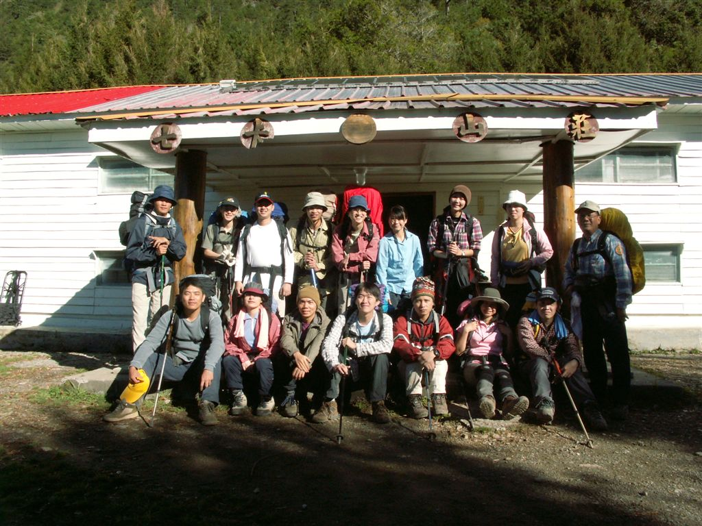

經過梨山時，大伙兒停下來買名產梨子要回家饋贈親友，整箱整箱的梨子差一點裝不上車。車子繼續前行，來到合歡山時突然發現少了一輛車，弘偉的K2000沒跟上車隊，手機也都聯絡不上，擔心他們是否走錯路，開往花蓮的方向去了。等了許久還是沒蹤影，只好繼續往前行。到了武嶺，是台灣公路的最高點，應柏穎的要求下車拍了照後便一路直奔梅峰農場。

回到梅峰農場才發現：原來弘偉他們早就抵達農場了，甚至有充足的時間已經將滿佈污泥的愛車洗得潔白發亮，大伙兒真是瞎擔心了。梅峰農場是臺灣大學的實驗農場，種植落葉果樹、高山蔬菜及溫帶花卉，我們趁機去參觀了室內花園，裡面百花盛開，有些罕見的花卉，讓我們大開眼界。真羨慕顏彤能在這麼清靜優美的環境工作。在農場裡簡單煮了麵吃一吃，互道珍重後便分道揚鑣，各自回家，結束了這趟難忘的雪山之行。

|  | 六(10/8) | 日（10/9） | 一（10/10） |
| --- | --- | --- | --- |
| 早 |  | 吐司  果醬  花生醬  奶油  鮪魚  肉鬆  巧克力醬  奶茶  咖啡 | 稀飯  鮪魚  肉鬆  麵筋  醬瓜 |
| 中 |  | 煮五木拉麵  高麗菜  香菇  神秘香料 | 煮五木拉麵  剩菜 |
| 晚 | 梅干五花肉  菜圃蛋  炒敏豆  黑胡椒洋蔥肉絲  青椒炒肉絲  青木瓜雞湯 | 芹菜炒甜不辣  綠椰汁雞  香腸炒大蒜  素雞炒扁豆  滷味  金針香菇排骨湯  點心：紅豆桂圓湯 |  |
