# 台東太麻里之旅

> 民國94年12月

## 台東太麻里活動遊記               Blue(藍怡秋)   94/12/31~95/1/1

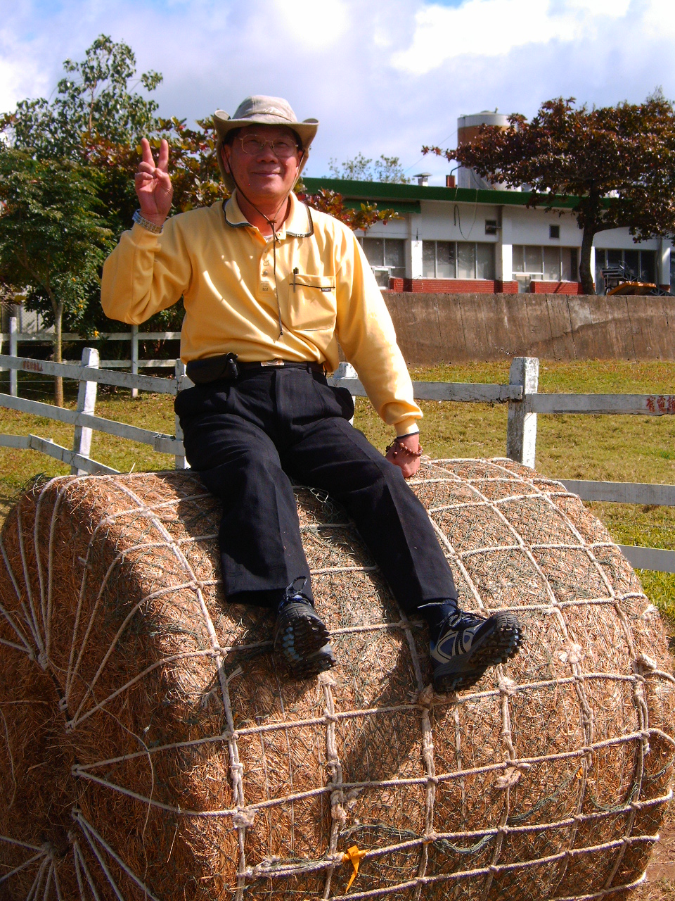

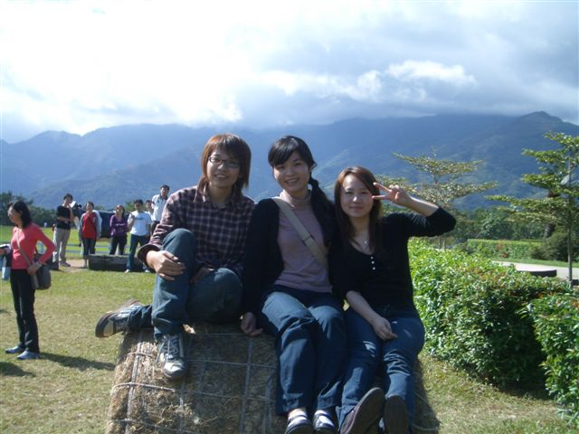

先驅車到台中，半夜兩點半，睡一個半小時，換手繼續飆到台南。早上六點半，撘上遊覽車，往台東方向。十二點，到初鹿牧場，超大的太陽。老師買了兩瓶初鹿鮮乳，開始在路邊「奉奶」；冰涼的鮮奶，真可口。逛到滾草皮區，為理和顏彤跳上草皮捲，兩人逆向拉鋸 ~ 老師也佔上半個人高的草皮捲，調皮的學弟推動草皮捲，老師一個重心不穩摔了下來，嚇壞所有人。老師拍拍屁股站起來，連說：「沒事、沒事。」但背後沾滿泥土。

吃完台東火車站的池上便當，驅車往紅葉國小，參觀紅葉博物館。破落的球棒、球衣和獎座，令人不勝唏噓。感嘆政府不但沒有好好照顧球員之外，也沒有好好保存紀念文物。

順道經過紅葉溫泉，大夥摩拳擦掌準備好泳衣，下去泡溫泉。害羞的學弟妹，則跑去喝香純的咖啡。滾燙的溫泉，泡得大家臉紅心跳，一陣血路暢通，工作的疲勞暫時消除。

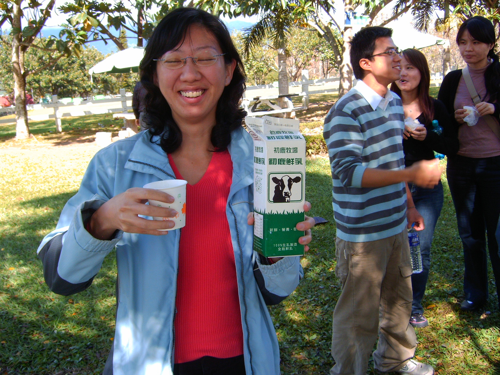

奔向金針山的[青山農場]，等待晚餐。民宿的晚上，準備了搗麻糬的活動，接著解說金針山的金針花、一日美人、台灣百合…，可惜花期已過。

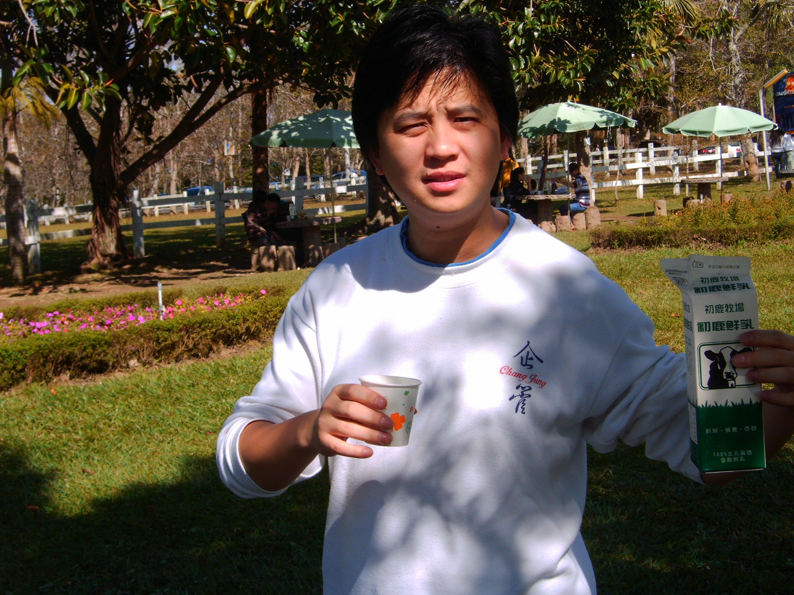

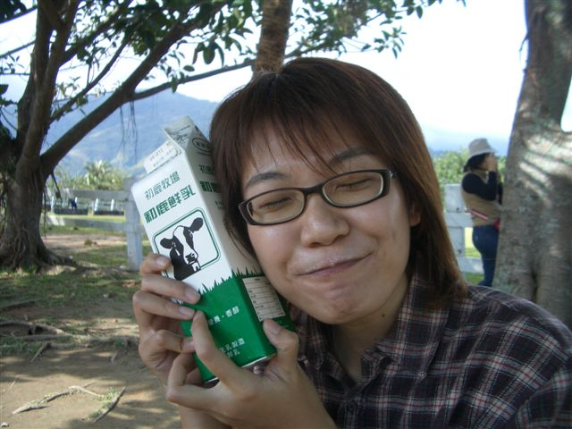

晚間，大家聚集在餐廳，將蠟燭點上，準備幫老師慶生。紅酒與高粱齊備，學弟妹屏息以待；待老師一進場，開始唱生日歌，而蠟燭卻一直熄滅，大家重複唱了好幾次，終於點好蠟燭，讓老師許願吹熄。

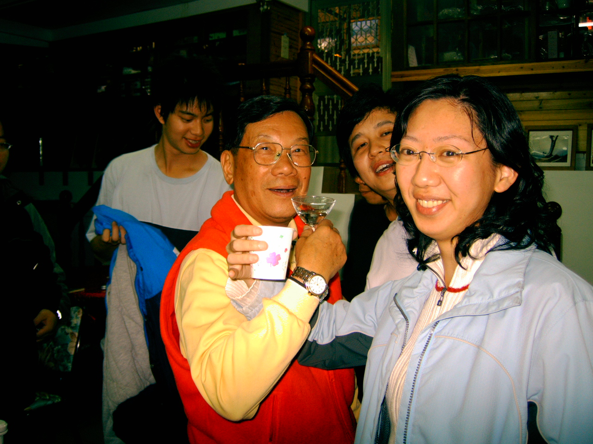

開始每年慣例的老師與登山社員拼酒大戰，許多聰明的學弟妹，喝了兩杯之後，就尿遁了。剩下我們這些OB和當期幹部，開始玩起大考驗。大家輪流出題，有選擇、填充、比大小、連連看，考老師聖稜線上的山名、高度。某些童年失歡的學弟妹，趁機考老師超難題。老師薑還是很辣，答錯就開始亂盧，果然還是老樣子啦 ~

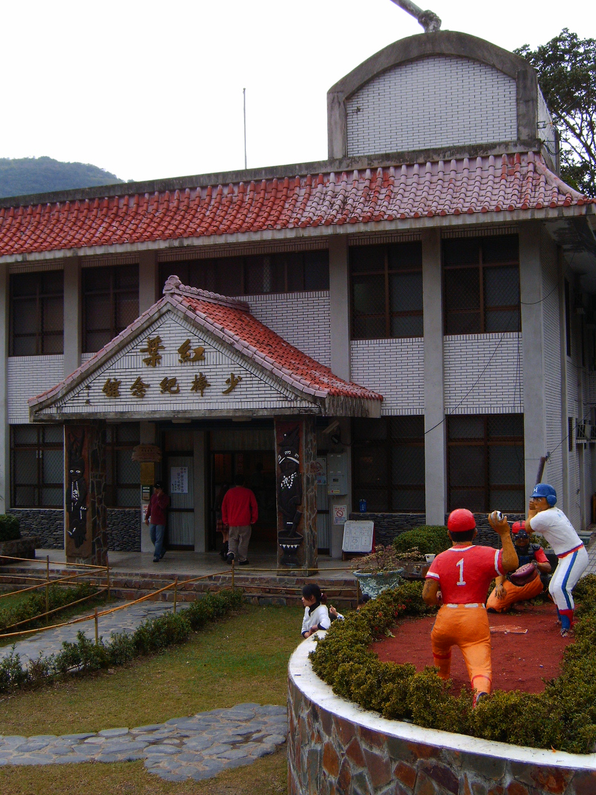

一陣酒酣耳熱之後，老師又玩興大發，拖著大夥去[迎曦亭]跨年倒數。接近午夜的時間，外面漆黑不見五指，帶著兩三支手電筒，二三十人戰戰兢兢的冒著霧雨、寒風，登上什麼都看不見的涼亭，準備倒數，才發現已經過了午夜；於是，大家自動將時間倒轉，...五四三二一，新年快樂!

開心最好。

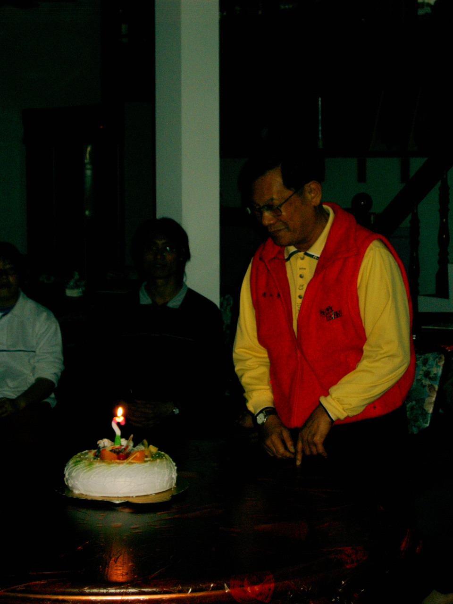

早上五點的晨喚電話，喚醒全部的人。想起昨天下著雨，毫不掙扎的轉身繼續補眠。老師怎麼可能來旅遊不出去亂逛！果然吃完早餐，帶著大夥準備登上標高1340m的雙乳峰--真是令人害羞的山名。

一路上陸陸續續有人放棄，掉頭。兩個半小時上到一等三角點，山頂分別有兩座涼亭(。)(。)

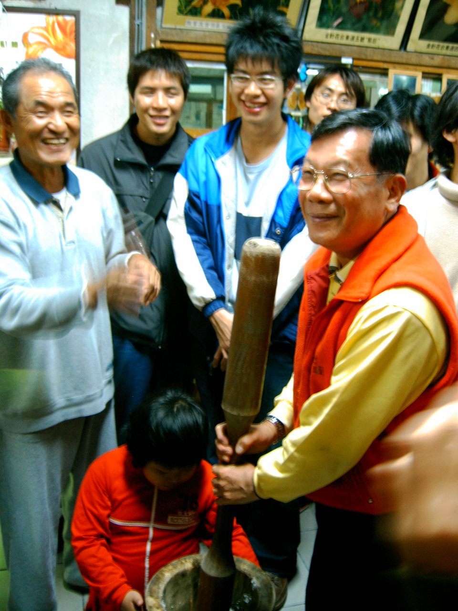

下午，前往[陳媽媽琉璃工坊]，參觀原住民的琉璃珠燒製，並學習編打單平結、雙平結、人字結。一夥人像小學生一樣，帶著自己的作品愉快的離開。

晚上八點終於抵達解散地—長榮大學。去參觀了一下學弟妹的社辦，令人難忘的資料一一映入眼簾。學弟妹拿出新設計的社服，開始拍賣，老師一開價就上千，想要順便幫社團募款，雖然以高價買了polo衫，第一次以校友的身分捐款，感受很奇特，不過比起哈佛校友一捐就是一棟大樓，我們只有九牛三毛。

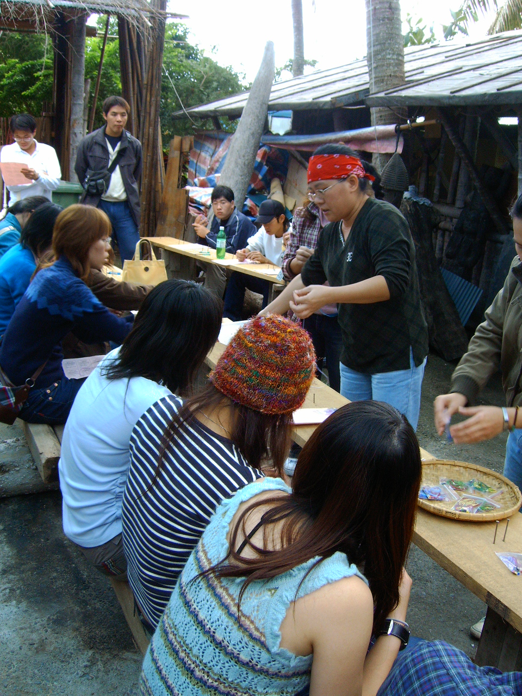

非常疲累的飛奔回台北，已經半夜三點。

倒床後隨即不醒人事。

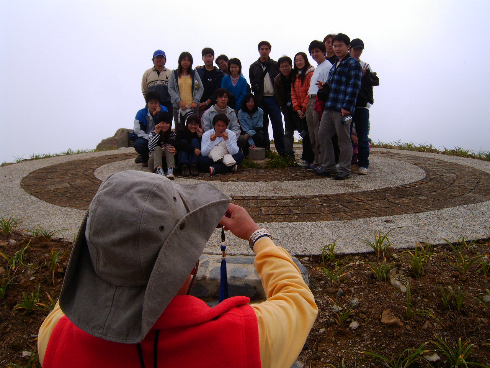
