# 溪頭杉林溪步道健行

> 民國95年3月

杉林溪－－溪頭健行**               **陳玲娟   95/3/11~95/3/12

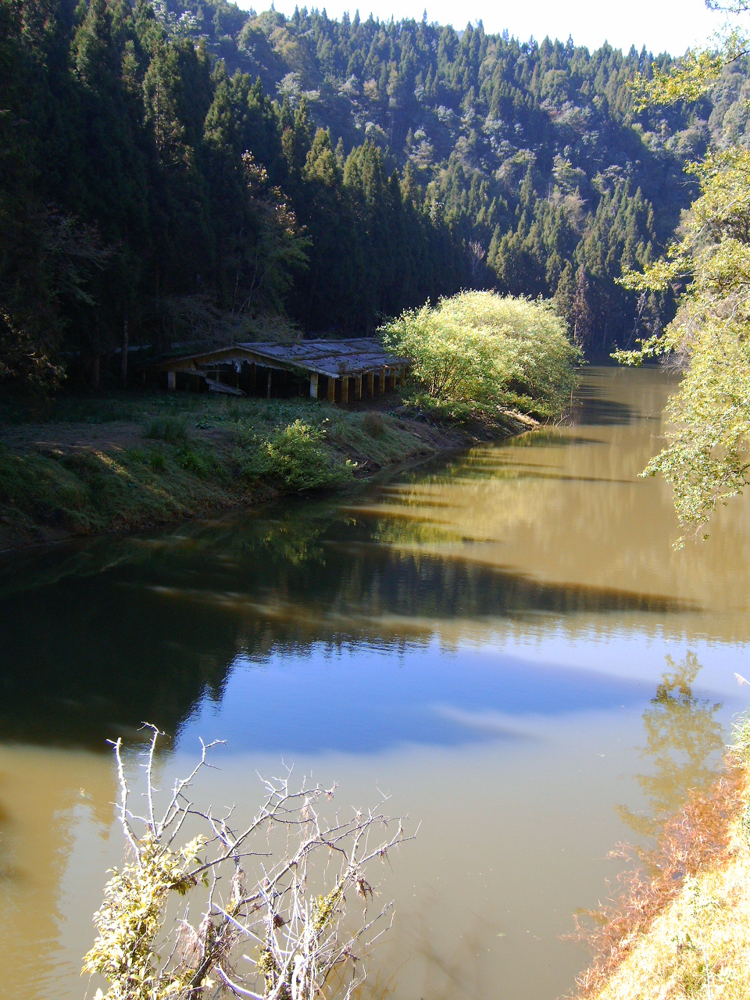

杉林溪、溪頭同在151號省公路上，大多數的人都到過溪頭卻很少繼續往上到達杉林溪，所以婷婷這次擔任總召，特別規劃了杉林溪、溪頭兩地的健行活動，讓我們一次享盡兩種不同的森林風貌。

3月11日一早大伙在台中統聯車站集合，一行9人2部車便浩浩蕩蕩朝杉林溪出發。延途一邊吃著早餐和吉益帶來的愛心草莓，一邊東家長西家短，很快的便到達了杉林溪。

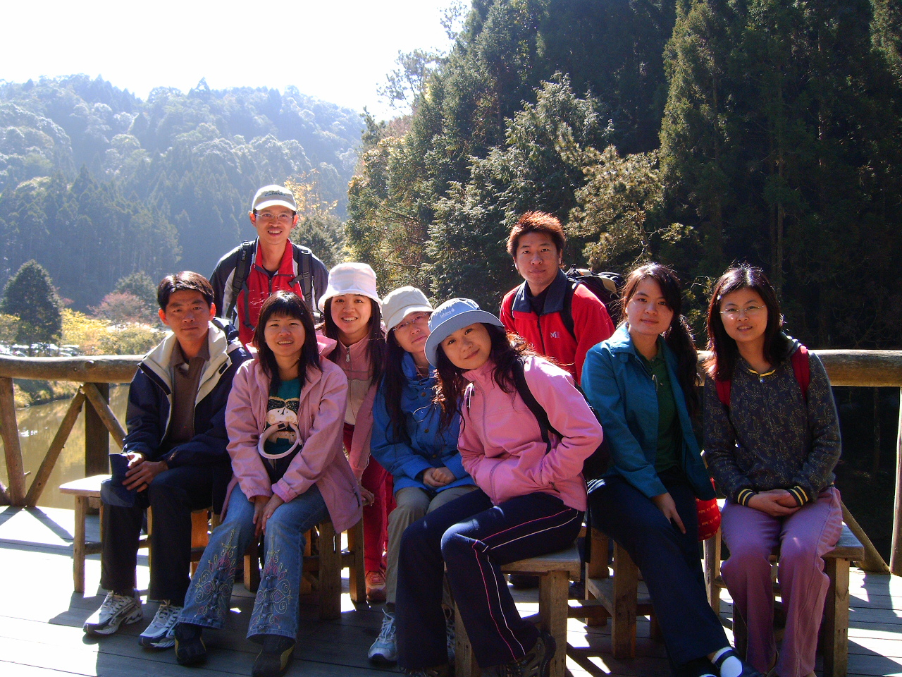

一下車便呼吸到山林的清新空氣，放眼一片綠意盎然，感覺非常舒服，帶著愉悅的心情展開了健行活動。延途很多景點：「能屈能伸」、「石井磯」、「青龍瀑布」，再再顯現出自然界的神奇力量，真是巧奪天工。走過了「越領古道」和「穿林棧道」，中午來到了「藥花園」，我們就在牡丹花盛開的園中野餐了起來，真是愜意呀。下午繼續往前來到「松瀧岩瀑布」，由於是枯水期間，只見一涓涓細流從上而下。經過了「千古紅檜」便來到杉林溪最高點的「天地眼」，只見山壁上兩個大凹槽，猶如一雙大眼睛，故名。聽說在此有特別的磁場呢！突然間顏彤發現了山壁上方有難得一見的「一葉蘭」，大伙兒驚喜的猛拍照。

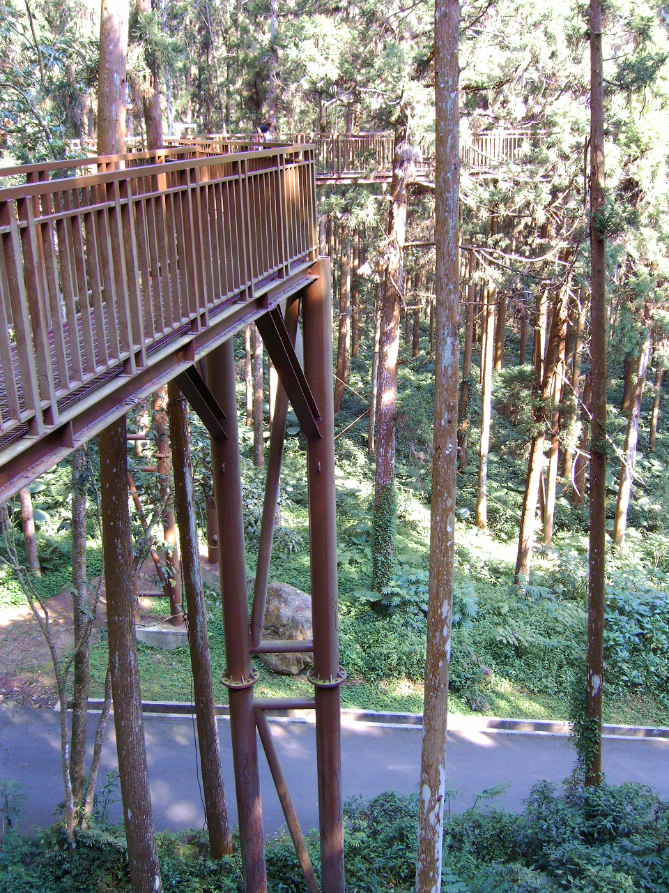

步行至此已經有點累了，正當我們要搭遊園車折返「藥花園」時，居然巧遇了婷婷的二姊一家人，真是姊妹同心呀。我們又步行到「燕庵」、「森林公園」，健行了應該有7~8公里吧，腳也酸了，結束了第一天的行程，驅車前往位於「十二生肖彎」的牛彎段的「溪阿餐廳」享用大餐，好好犒賞一下大伙兒。

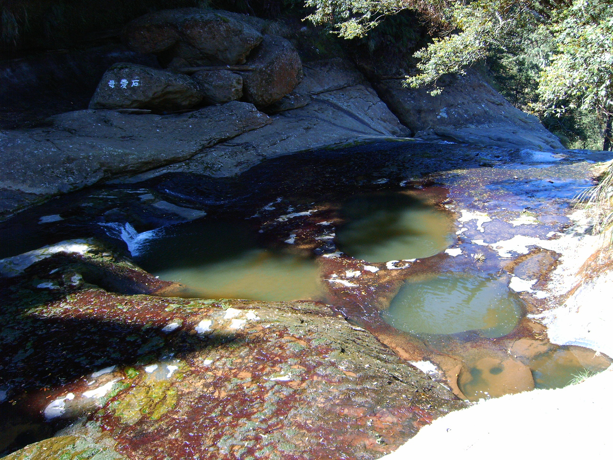

晚上住宿於溪頭內的「台大實驗林教育中心」，原本吉益還提意要出去夜遊，但大家都累攤了，學妹們早早就睡了，我們則在房內打牌，只有吉益一人出去尋找他美好記憶中的石板廣場。

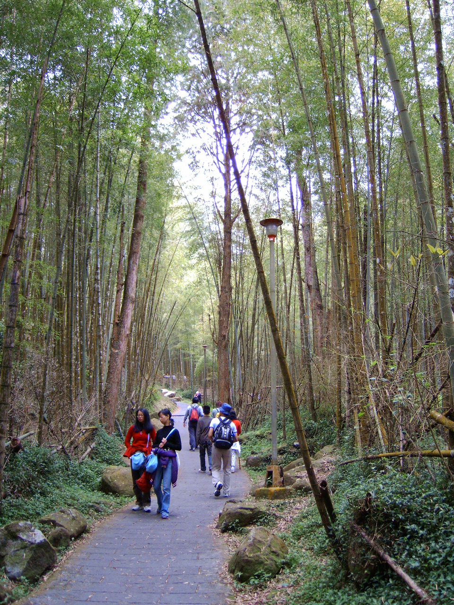

隔天一早便起床，7點便步行到青年活動中心用早餐，一大清早走在森林步道上，悅耳的鳥語、清新的空氣、翠綠的視野，舒暢極了。用過早餐來到「大學池」勾起了我國小參加女童軍團的美好回憶，哇！將近20年了，真是歲月不饒人呀！接著來到觀察林冠層生態的「空中走廊」，走在上面視野很不同，感受也全然不同。走著走著便看到了「神木」，合影留念後順著「延溪步道」來到了「銀杏林」、「竹類標本園」。春天真的適合出來踏青，看看百花綻放，林木吐新芽，感受萬物的蓬勃朝氣。最後我們造訪了座落於孟宗竹林中造型別致竹材裝璜的「竹廬」及風格獨特的「筠屋」，若能投宿於此，山林之勝、清心自在。

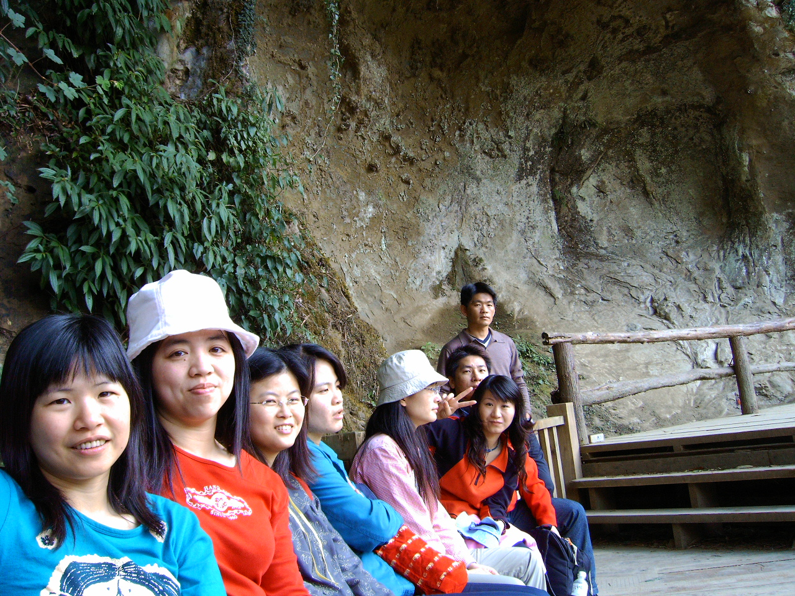

溪頭是最佳的避暑勝地，氣候舒適，有多條的森林步道及豐富的天然景觀，住宿選擇也很多樣化，有機會一定還要再造訪，走遍每一塊土地。

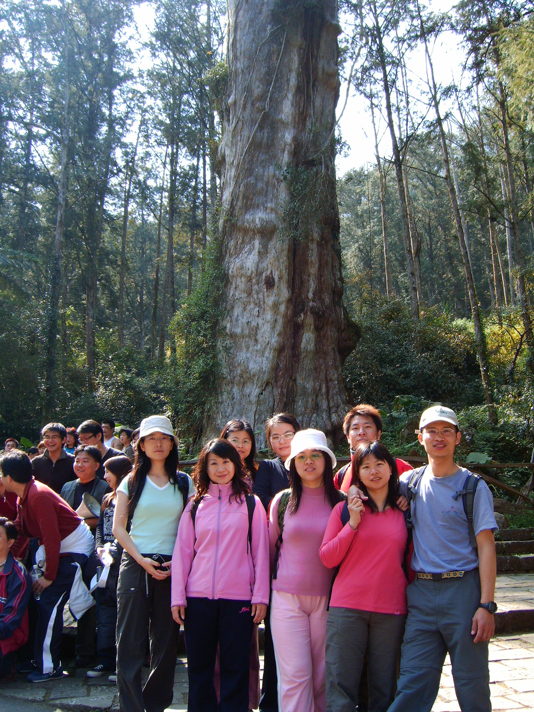

溪之旅                楊婷婷   95/3/11~95/3/12

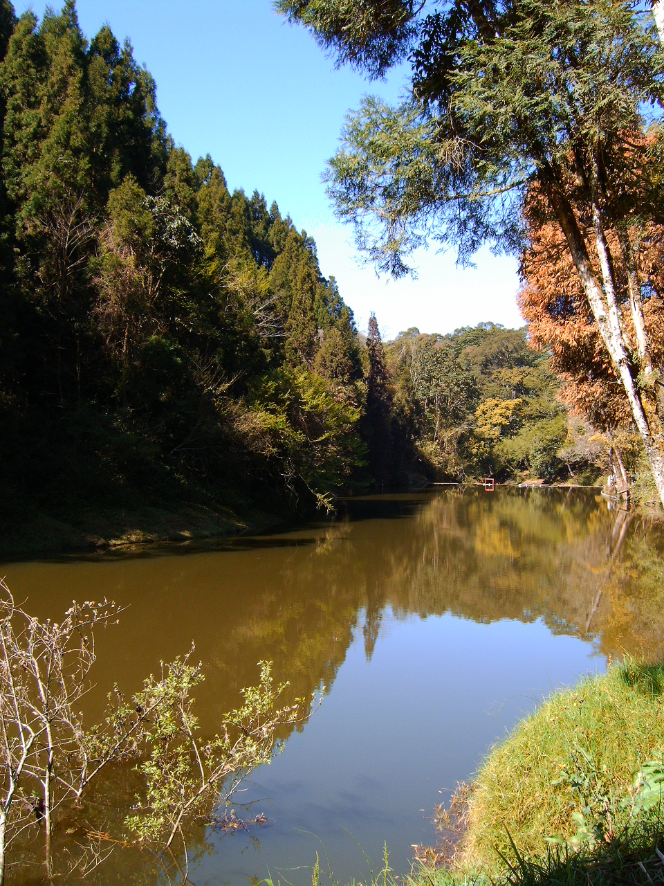

春天的氣息已在空氣中瀰漫，生活在都市中的你，可曾從人行道旁的行道樹上嗅到那春的氣息。我現在身處在偏遠的山區教書，每星期往返於崎嶇難行的力行產業道路，觸目所及都是原始的山林；當我發覺週遭的山林已悄悄換上鮮嫩的綠衣，遠觀這春之新衣我仍不滿足，我熱切的企盼能走入春神的懷抱，擁抱這久違的暖陽。早已久聞溪頭之綠竹與杉林溪之綠溪十分迷人，那我更要趁這春暖花的的時節來造訪，充分享受這綠之精靈的魔法。

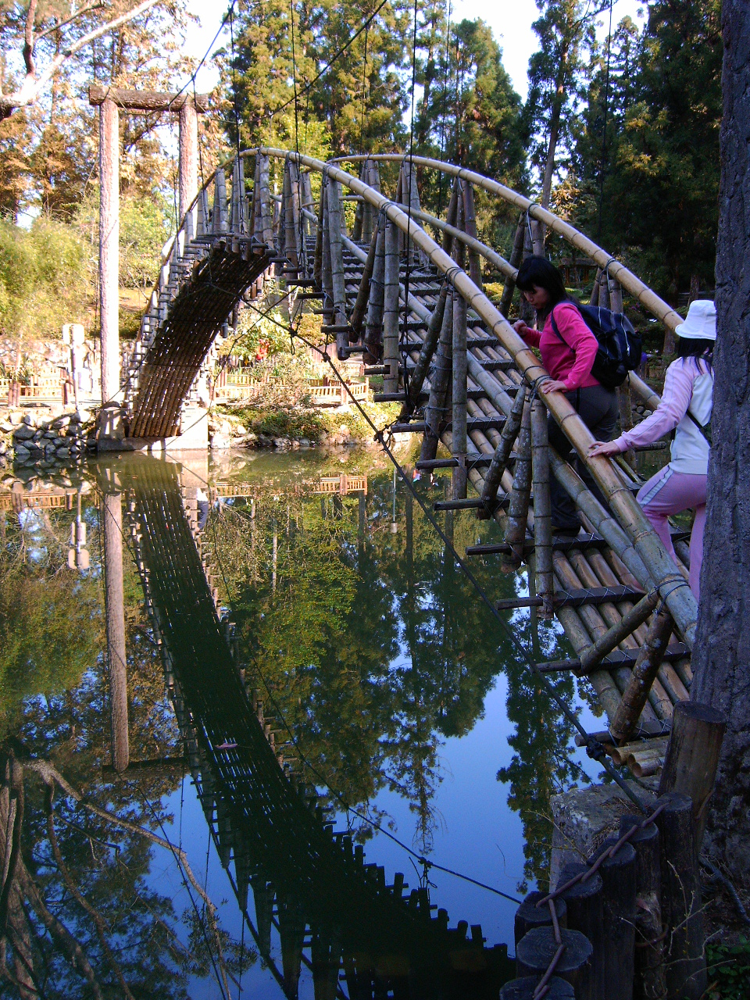

一大清早，大夥在朝馬車站集合OK後就直奔今天行程的第一站─杉林溪。雖然今天要造訪的是森林遊樂區，但是身為登山社一份子的我們，可不能因此怠惰閒散，今天的目標『杉林溪走透透』，因此這一整天我們大夥得憑著雙腳的堅忍不拔走完這杉林溪所有的步道和各個著名的景點。

走在杉林溪的林間，有時在步道會發現落櫻鋪地，抬頭一看才發現山櫻害羞的躲在一大群綠樹的懷抱，笑顫顫的抖落一身粉紅花瓣，我拾起地上的花瓣感覺到春的艷麗就在我的掌心。

在天地眼我們發現到野生的一葉蘭，一葉蘭可愛清麗的模樣實在忍人憐愛，而能在這懸崖峭壁間看到因人們的貪婪而幾乎絕跡一葉蘭的身影，在在令我們興奮不已。

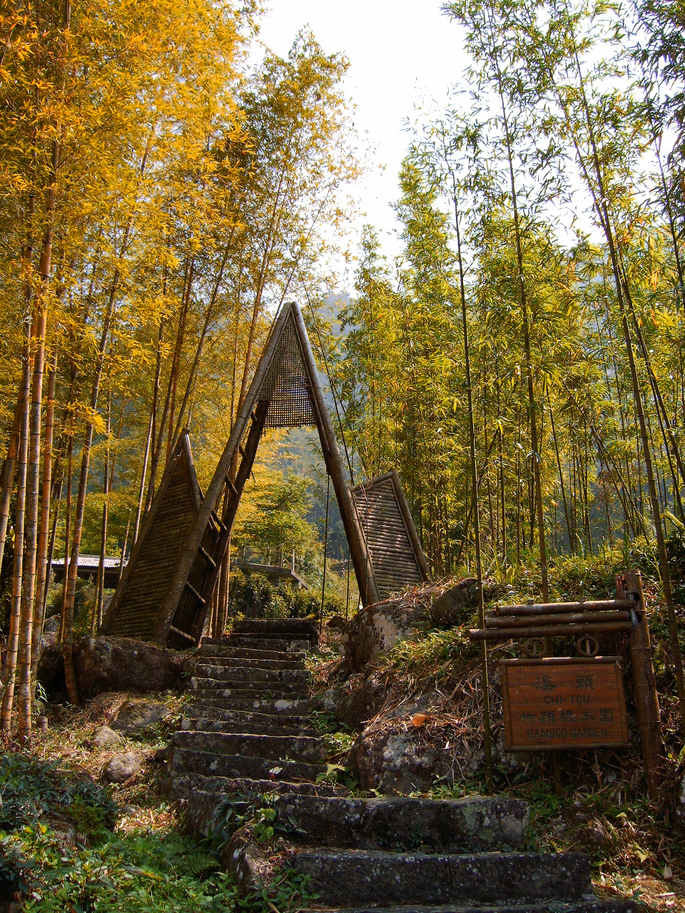

記得第一次到杉林溪遊玩時，看到這高山上的綠溪蜿蜒在這挺拔的山林間感覺是那樣的深遠幽靜，我真想撐一葉扁舟在這綠溪中飄盪，我想起再見康橋詩篇中的一段『在康河的柔波裡，我甘心做一條水草！那榆蔭下的一潭，不是清泉，是天上虹，揉碎在浮藻間。沉澱著彩虹似的夢。尋夢？撐一支長篙，向青草更青處漫溯，滿載一船星輝，在星輝斑斕裡放歌。』，可惜在杉林溪我在這綠水上所看到的是一艘艘的天鵝船，而不是我想要的扁舟。

杉林溪因為是私人企業向政府租地經營，所以在園區內也可見許多與這大自然格格不入的人造設施，例如；土雞城、卡拉OK、電子遊戲區、人造滑雪場。真是不懂為何來到這純淨的山林還要把俗世庸俗的氣息帶到這山林野地，是經營者的庸俗還是遊客有這樣的休閒需求？有一次我在太魯閣露營，還發現有一組人馬把家裡巨大的電視音響特地帶到溪谷旁的營地，快樂的大聲高歌直到晚上10點多，難道要讓森林裡的所有生物都知道他們的歌聲有多難聽，這才甘心嗎？來到大自然，不是為了要聆聽那蟲鳴鳥叫嗎？算了！還是少發些牢騷吧！杉林溪除了這些礙眼的人工設施，其他景緻還是值得一遊的。

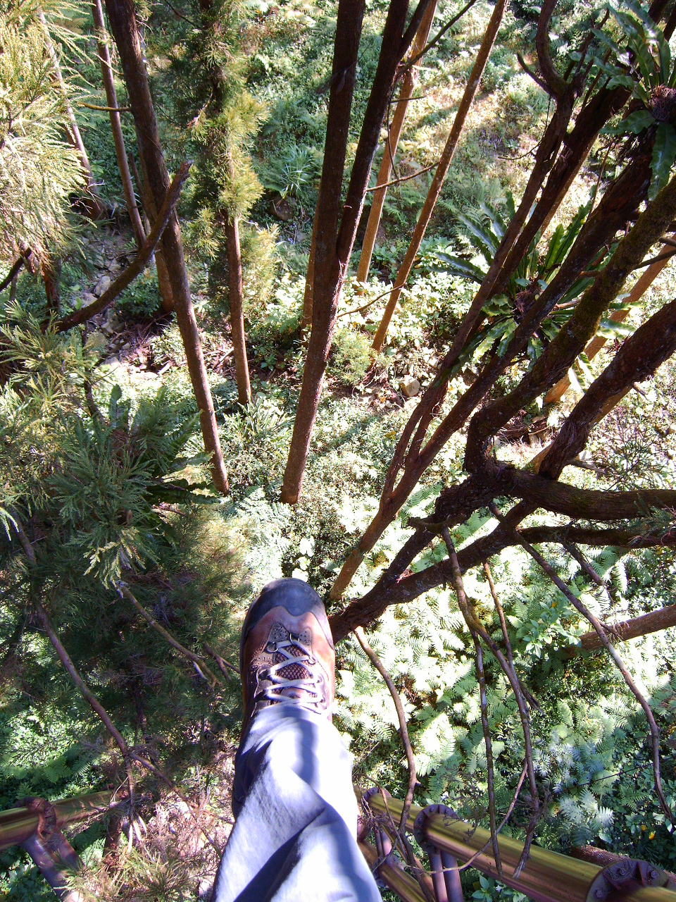

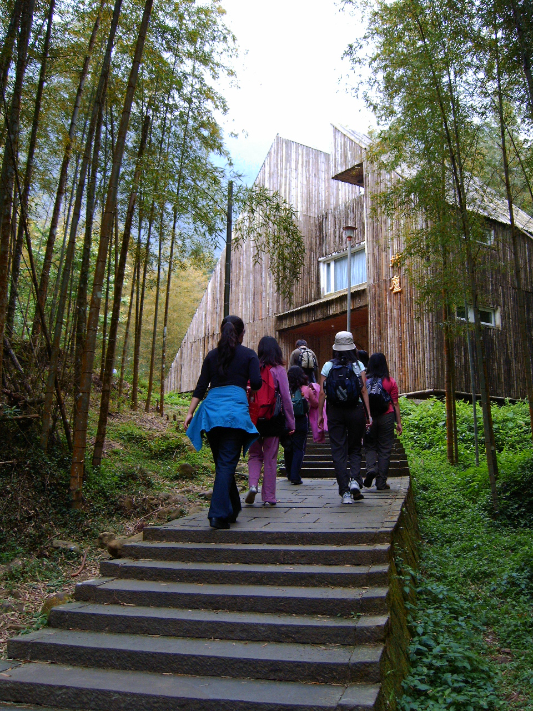

到了下午五點時，因為大夥已走了一整天的路，早已飢腸轆轆，我們又一路殺到溪阿餐館。吃完了豐盛又美味的大餐，大夥就來到今晚下榻的地方溪頭教育中心的學生宿舍。隔天一早醒來看到外面陽光普照，心想今天真是個適合踏青的好天氣。走在溪頭的步道，遊客熙熙攘攘好不熱鬧；雖然人聲雜沓，但是耳邊仍不時從樹林間傳來鳥鳴聲，從林間灑落下的陽光，溫煦的照在背上，大夥邊走邊聊天，如此美景與好友共遊談笑心情感到特別暢快。『空中走廊』是目前溪頭紅不讓的景點，所以我們當然一定得造訪這個新景點。走在『空中走廊』，若是將頭一直往下看，手不扶著扶手，快步向前走，會令人有在半空中走路的錯覺。走到最後，一向自誇大膽的我也不禁有些腿軟，不敢再往下看了。

最後吉益帶我們來到了竹蘆，我終於看到了溪頭的一大片竹林，一直以為溪頭聞名的綠竹是指從竹山鎮延著公路一直到溪頭兩旁種植的竹林，直到走進了竹蘆，才驚嘆溪頭綠竹的出俗清新。以前我也曾到溪頭遊玩過，卻粗心的不曾走進這條通往竹蘆的步道，今日得以見到坐落在這被綠竹環抱的蔣公行館─竹蘆，也明白他為何有此榮幸得到我們蔣公的寵愛了。

中午大夥到至膳園飽餐一頓後，又到顏彤家喝咖啡聊是非，一邊觀賞草莓熱呼呼剛出爐的德國之旅的VCD〈草莓剛從德國回來不到一星期〉，一邊神遊德國的古堡，心中盤算著何時才有機會踏上歐洲大陸看看王子與公主幸福生活的古堡。

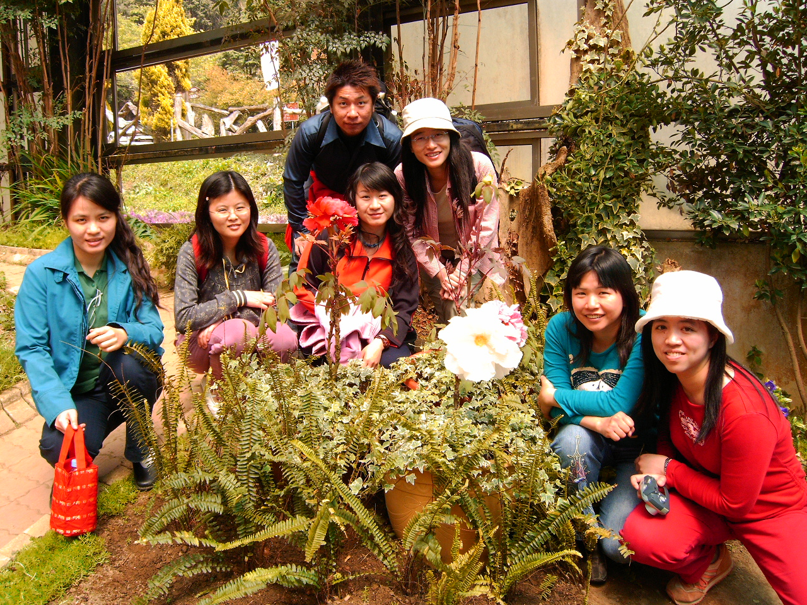
