# 茶壺山與金瓜石

> 民國95年9月

金瓜石&茶壺山之旅**                 **謝婷夙   95/9/23~24

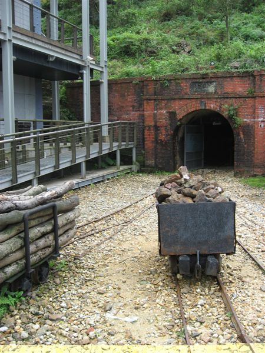

基隆，好久不見的地方，大學室友育瑩的家，為了見老同學一面以及熱切的想擁抱大自然的慾望，趁主管跟不知名的妹聊天聊的正起勁的時候從他眼皮底下扛著大行李溜走，很剛剛好的跳上火車，補完票坐上很剛剛好沒人坐的空位，算準時間很剛剛好的跟另一個大學室友冠君在新竹車站碰面，坐上很剛剛好看準的那班電車來去基隆借住育瑩家，打算明天很剛剛好的大家一起去健康的從事戶外活動。深刻的覺得，人生不能在一直泡在電腦螢幕跟電視螢幕跟電影院大螢幕前面，當看到學長寄來的行程的時候，腦袋瞬間閃過一個念頭：「就是這個了！」吃好住好又輕鬆，簡直就是為了從學校畢業後除了爬樓梯上三樓幫阿母收衣服之外再也沒做過其他運動的我量身打造的行程，帶著這個念頭一路到基隆車站，經過廟口小吃，再到育瑩家舒服的睡一覺，然後隔天快樂的到達瑞芳車站跟大家會合。

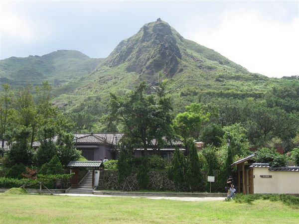

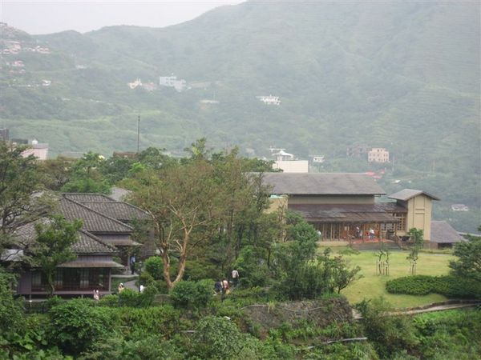

台灣真是個地狹人稠的地方，這點從瑞芳往金瓜石的公車上得到了最大的印證，很少有機會撘到公車的我第一次親眼目睹原來課本說在公車上要讓位給老弱婦孺的美德是真的^^。體驗到公車司機可以媲美電影頭文字D一般整路的山路狂飆，就在剛下肚的早餐快要像噴泉一樣湧出的前一剎那終於到了金瓜石博物園區，雖然沒看到金也沒看到瓜，但是綠油油的山巒襯著白茫茫的煙嵐真的一級棒，導覽員很認真的解說，但其實當個老土觀光客猛拍照比起聽文鄒鄒的歷史課來得有趣得多，所以沿著山坡蓋的紅紅綠綠的城鎮、夫妻樹、漂亮到像偶像劇場景的太子賓館、外頭印的大金字的黃金博物館、感覺像住著史前生物的外九份溪、笑到臉都僵了的礦工代表阿金伯、買便當送便當盒的古早味礦工便當還有最佳拍照場景的鐵支路，金瓜石真是個好吃又好玩的休閒旅遊好去處。

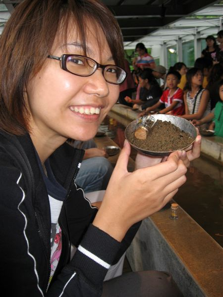

體驗到基隆午後雷陣雨的威力後，大家等著被博物館裡光芒萬丈的黃金工藝品閃到張不開眼睛；一邊讚嘆藝術家們鬼斧神工的創作、一邊發著舉起大金磚的白日夢。帶著發財夢來到金瓜石的最後一個行程淘金體驗，大家像小學生一樣乖乖坐好聽老師講怎麼淘出亮晶晶的礦石來，大家都深怕自己不小心洗掉手中那一盤說不定會靠它大發一筆的礦泥，小心翼翼的連個閃著小亮點的渣渣都不敢放過，不過後來發現人生有捨才有得，豪邁的在水裡轉圈圈洗掉盤裡的泥沙後出現了亮著銀色光澤的大物，想必以前的人也曾經被這誘人的光澤騙得團團轉吧！不過為了當個襯職的觀光客，我們還是興高采烈的把淘出來的亮晶晶礦石裝進小罐子裡帶回家，好玩！

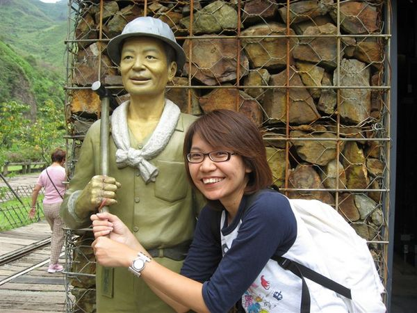

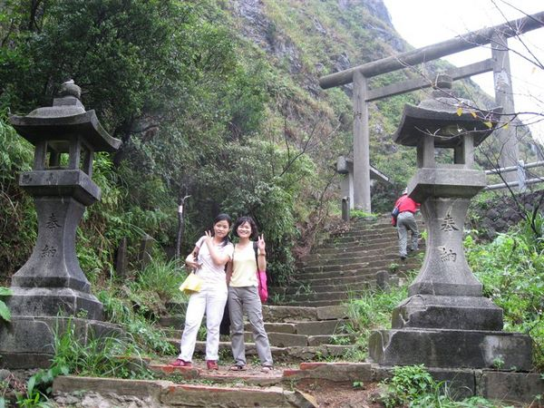

金瓜石以前曾經住著日本人，有日本人的地方就有神社，古早的神社現在變成了遺跡，所以大家就來去看遺跡；金瓜石的一切都要跟黃金扯上關係，所以這座神社就很順理成章的被叫做黃金神社。雖然它現在只剩拍照的功能，不過想必以前他也曾經香火鼎盛過，所以抱一下柱子也許神明還可以感受到我想發財的宏願吧，阿們！

晚上住在九份老街，民宿很有江湖味的取名叫龍門客棧，跟整個九份”應該”要有的古早味很配，跟秀逗學姊領了晚餐錢來去九份找食物吃，應該要玩一下十字路口的食物接龍，在滿滿都是削爆了的攤位裡挑食物其實還挺困難的，吃了鹹的想吃甜的，吃了熱的想吃冰的，我們這群發育中的青壯年人口食量真的很驚人，加上很會找好吃東西在哪裡的又文真是到了種所向無敵的境界。餵飽了五臟廟開始挑起了紀念品，什麼都有什麼都賣什麼都不奇怪，除了拼命蒐集名片用宅急便寄名產回家之外，還在一家店找到一組明信片，用黑白底片拍了幾十年前九份的樣貌，看來那才是侯孝賢心目中的戀戀風塵吧。

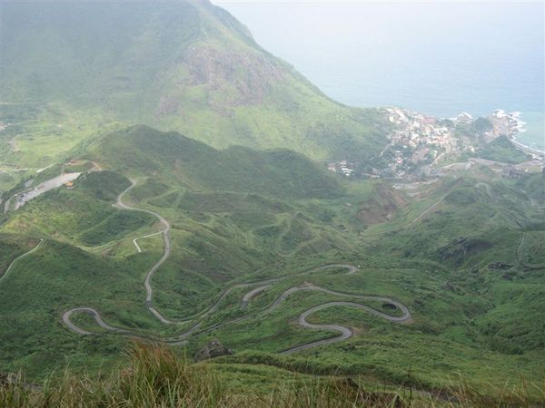

2006/9/24 天氣晴時多雲偶爾陰

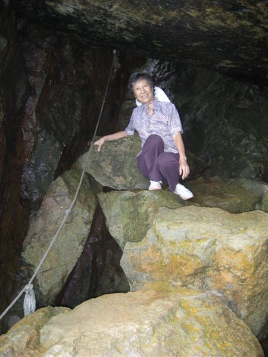

登山社一定要來爬個山，起了個睡到自然醒的大早，前進茶壺山。很好運的坐上學長昨夜奔馳到九份山頂的車子，省去一大段徒步上茶壺山的路程，再次證明這趟旅程真是輕鬆郊遊路線，實在是太適合不知多久沒有汗流浹背的我了。不過雖然是輕鬆郊遊路線，走過輕輕鬆鬆的階梯之後還是有一小段路有登山的感覺，受過專業訓練的學長學姊一個健步摸上了峭壁，其他老弱婦孺就乖乖過岩洞到茶壺山的壺(哪一部位其實很難界定= =a)，不過老師跟學長們果真有MAN的感覺，輔助我們這些大姑娘小姑娘上下岩洞，拉繩上下山，雖然是輕鬆路線但下山還是意思意思要腿軟一下，只能說坐在椅子上的感覺真好。

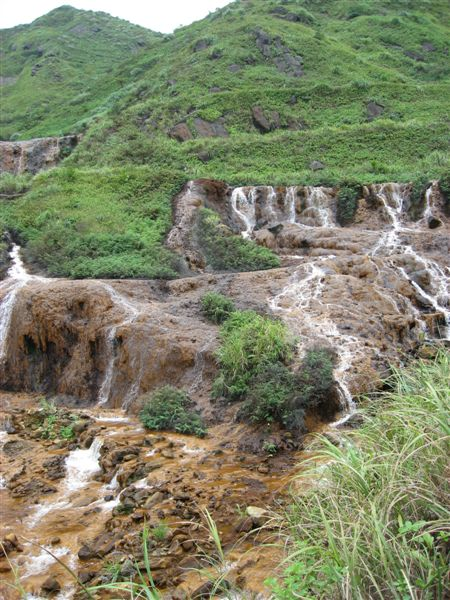

經過連續N個髮夾灣下山來到黃金瀑布，遠遠還可以看到剛剛爬的茶壺山，心裡還是有點小驕傲，瀑布流過紅銅色的土壤造就了黃金瀑布絡繹不絕的遊客，後方遠遠站著兩棟羅馬式建築風格的舊煉礦場跟陰陰的天空看來有些憂鬱，以前爐火鼎盛的景象已經不再，靠著採礦謀生的居民也轉型到下一代發展出成功的觀光業，台灣這塊土地真的愛拼就會贏。

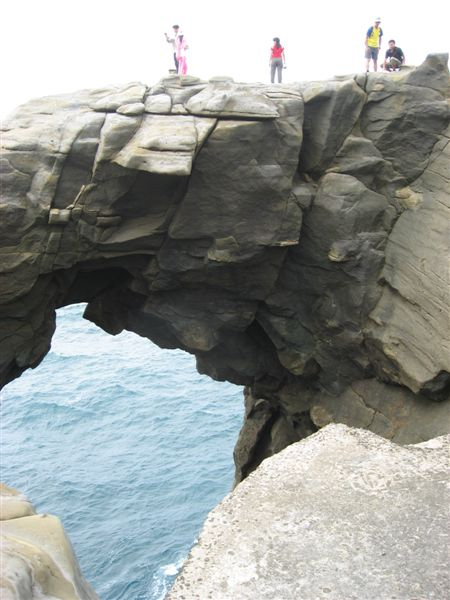

再更前進一點到採礦場的遺址，壯觀的排氣管一路從山頂延伸到海邊，在海口形成一片陰陽兩色的海面，赫然發現飄過天際的拖曳傘，鬧著會不會掉近海裡的把戲，不過也只有我們在一旁玩別人吃麵在一旁喊燙的遊戲，不過還算挺有趣的小插曲^^

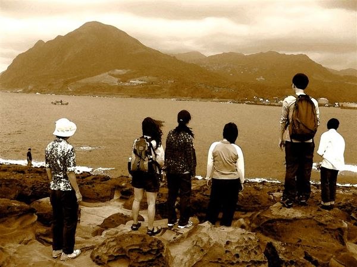

聽說本來是要到學長在九份的阿媽家洗把臉上個洗手間，結果變出滿漢全席來，流汗過後的食物真是美味，掃光了桌上的食物帶著感恩的心跟學長的家人說掰掰，之後又加了一個神秘行程，抱著跟維理學長走應該會有好康的想法大家毫不猶豫的上路，來到了一個小漁港，藏在半邊臉後面的山壁後面竟然有個世外桃源，一個好像地理課本介紹海蝕地形的景象竟然在眼前通通出現了！走在海蝕洞跟海蝕崖邊邊真的有腳底毛毛的感覺，阿娘喂~~~往下看真的會腿軟，不過我們是鐵掙掙的漢子，要腿軟也不能被發現，就在海風呼呼吹還有吉益學長驚呼又刮到愛車底盤的同時結束了快樂的旅程，除了辛苦舉辦活動的草莓學姊外，要謝的人太多了，就謝天吧~~~不管幾年希望大家還可以在一起快樂的爬山。
